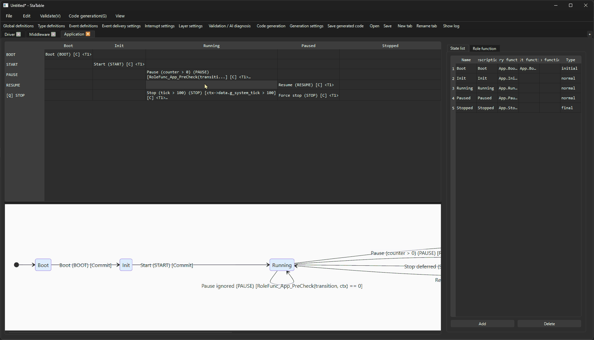

```markdown
# StaTable

**MISRA C:2012-aware state machine design and C code generation for embedded systems.**

[](LICENSE)
[]()
[]()
[]()
[]()

---

## Why StaTable?

Most open-source state machine tools ignore **MISRA C:2012** compliance,
which is a hard requirement in automotive, industrial, and medical
embedded software.

StaTable is built for embedded teams that need **MISRA C:2012-aware
C code generation** without hand-writing state machines or building
custom tooling from scratch.

### Key Features

- ✅ **MISRA C:2012-aware C code generation** — validated with `cppcheck` + official MISRA addon (10 suppressed hits, all documented)
- ✅ **Multi-layer state machines** — Driver / Middleware / Application with priority-ordered execution
- ✅ **35 validation rules** across 11 categories with AI-assisted diagnostics
- ✅ **Marker-based user code preservation** — regenerate without losing your custom code
- ✅ **Cell-level actions and relations** — pre/post actions, sequential/exclusive/group relations
- ✅ **Pure Python** — easy to integrate into your CI/CD pipeline
- ✅ **14 test suites, 576 PASS / 0 FAIL / 2 SKIP**

---

## Demo



*Design state machines in a table-driven editor, visualize them as Mermaid
diagrams, and generate production-ready C code with a single click.*

---

## Platform Support

| Platform | Status | Notes |
|----------|--------|-------|
| **Windows 10/11** | ✅ **Tested** | Manual GUI verification + automated tests |
| **Ubuntu 22.04+** | ⚠️ **Auto tests pass on CI** | GUI not yet manually verified — feedback welcome |
| **macOS** | ⚠️ **Not tested** | Community testing welcome |

**Note for Linux users**: The automated test suite (13 suites, 551 tests)
passes on Ubuntu via GitHub Actions, but the GUI has only been manually
verified on Windows. If you try it on Linux, please report your experience
via [GitHub Issues](https://github.com/akashi-hideki/StaTable/issues).

---

## Quick Start

### Requirements

- Python 3.12
- PySide6 (Qt 6)

### Installation

```bash
git clone https://github.com/akashi-hideki/StaTable.git
cd StaTable/code
pip install PySide6 pycparser
```

### Run the GUI

From the `code/` directory:

```bash
python -m statable
```

Or, equivalently:

```bash
python gui_main.py
```

### Run the Test Suite

```bash
cd code
python tests/test_v2_2_p1.py
# ... 11 other suites
python tests/test_v2_3_p1.py
```

Expected: **576 PASS / 0 FAIL / 2 SKIP** across 14 suites.

---

## What StaTable Generates

From a single state machine design, StaTable produces **14 C files**
ready to integrate into your firmware:

| File | Purpose |
|------|---------|
| `statable_types_common.h` | Common structs, enums, logging macros |
| `statable_types.h` | Per-layer enums, `TransitionContext_<Layer>_t` |
| `statable_transitions.h` | `StateMachine_Process_*` prototypes |
| `statable_transitions.c` | Cell functions, transition tables |
| `statable_role_functions.h` | Role function declarations |
| `statable_role_functions.c` | Role function implementations + call sites |
| `statable_init.c` | `SystemContext_Init` |
| `statable_event_queue.c` | Event queue implementation |
| `statable_interrupt.c` | ISR implementations |
| `statable_timer.c` | Timer struct + `Timer_Init` / `Timer_Update` |
| `osal.h` / `osal.c` | OS abstraction (NonRTOS / FreeRTOS / ThreadX) |
| `statable_all.h` | Super include |
| `{project}_run.c` | Super loop |

### Sample Generated Code

```c
/* Cell function for (Idle, START) */
static STATE_Driver_t t_Idle_START(
    const Transition_t* transition,
    TransitionContext_Driver_t* ctx)
{
    STATE_Driver_t next_state = STATE_Driver_Idle;

    /* Cell actions (before_transitions) */
    (void)RoleFunc_Driver_PreCheck(transition, ctx);

    if (cond_A) {
        next_state = STATE_Driver_Active;  /* [Commit] */
    } else {
        next_state = STATE_Driver_Error;   /* [Commit] */
    }

    /* Cell actions (after_transitions) */
    (void)RoleFunc_Driver_Cleanup(transition, ctx);

    return next_state;
}
```

---

## Architecture

```
┌──────────────────────────────────────────────────────────────┐
│                        StaTable                              │
│  ┌────────────────────────────────────────────────────────┐  │
│  │                  statable_gui/                         │  │
│  │  MainWindow / StateMachineTab / MatrixTableWidget      │  │
│  │  transition_editor_direct/ (Drag & Drop editor)        │  │
│  │  libcntrl/ (Shared libraries)                          │  │
│  └────────────────────────────────────────────────────────┘  │
│                            │ calls                           │
│                            ▼                                 │
│  ┌────────────────────────────────────────────────────────┐  │
│  │                    codegen/                            │  │
│  │  CCodeGenerator + 15 sub-generators                    │  │
│  │  validate/ subsystem (35 rules, 11 validators)         │  │
│  └────────────────────────────────────────────────────────┘  │
│                            │ reads                           │
│                            ▼                                 │
│  ┌────────────────────────────────────────────────────────┐  │
│  │                    statable/                           │  │
│  │  StateMachine / GlobalDefinitions / XML I/O            │  │
│  └────────────────────────────────────────────────────────┘  │
└──────────────────────────────────────────────────────────────┘
```

**Dependency direction**: `statable_gui` → `codegen` → `statable`. No reverse dependency.

### Project Structure

```
StaTable/
├── .github/
│   └── workflows/
│       └── check.yml
├── code/
│   ├── gui_main.py              ← Alternative entry point
│   ├── statable/                ← Data model layer
│   │   ├── __main__.py          ← `python -m statable`
│   │   ├── model.py
│   │   ├── state_machine.py
│   │   └── ...
│   ├── statable_gui/            ← GUI layer
│   │   ├── main_window.py
│   │   ├── widgets.py
│   │   └── ...
│   ├── codegen/                 ← Code generation
│   │   ├── c_code_generator.py
│   │   └── validate/
│   ├── tests/                   ← Test suites
│   ├── tools/                   ← Dev tools
│   └── docs/                    ← Specifications
├── .gitattributes
├── .gitignore
├── LICENSE
├── NOTICE
└── README.md
```

---

## Use Cases

### Embedded Firmware Teams

Tired of hand-writing state machines and struggling with MISRA
compliance? StaTable automates both.

- Design in a visual editor
- Generate MISRA-aware C code
- Preserve your custom code across regenerations

### Tool Vendors / OEM

Want to add state machine support to your IDE or development tool?
StaTable's architecture is modular and can be integrated as a library.

- Python API for code generation
- Customizable templates
- **Commercial / OEM licenses available** (see Contact)

### Automotive / Industrial / Medical

Where MISRA C:2012 compliance is non-negotiable.

- 35 validation rules covering state, event, transition, role function, cell, variable, flag, queue, interrupt, timer, and custom types
- Documented MISRA suppressions
- XML-based project persistence for audit trails

---

## Documentation

| Document | Language | Description |
|----------|----------|-------------|
| [SPEC_OVERVIEW_en.md](code/docs/SPEC_OVERVIEW_en.md) | English | Complete architecture specification |
| [SPEC_OVERVIEW_ja.md](code/docs/SPEC_OVERVIEW_ja.md) | 日本語 | 全体仕様書 |
| [SPEC_SCREENS_en.md](code/docs/SPEC_SCREENS_en.md) | English | GUI screen specification |
| [SPEC_SCREENS_ja.md](code/docs/SPEC_SCREENS_ja.md) | 日本語 | 画面仕様書 |
| [SPEC_CODEGEN_v3.md](code/docs/SPEC_CODEGEN_v3.md) | English | Code generation details |
| [IMPLEMENTATION_PLAN_v2_3.md](code/docs/IMPLEMENTATION_PLAN_v2_3.md) | English | v2.3 implementation plan |

---

## Roadmap

### v2.4.1 (Current — Released 2026-09-22)

- ✅ Merge idempotency fix (`code_merger.py` v2.1)
- ✅ False-positive warning fix (`role_function_generator.py` v3.3.1)
- ✅ New test suite: `test_v2_4_p1_merge.py` (9 groups / 25 assertions)
- ✅ 14 suites / **576 PASS / 0 FAIL / 2 SKIP**

### v2.4 (Released 2026-09-22)

- ✅ UI cleanup: State list 5 columns, Role function 4 columns
- ✅ Namespace combo box listing all project layers
- ✅ Reserved fields hidden from UI (State.do, RoleFunction signature)
- ✅ XML round-trip preserved for reserved fields (empty `used_*` attributes suppressed)
- ✅ Role function Edit path restored (button + row double-click)
- ✅ **551 PASS / 0 FAIL / 2 SKIP**

### v2.3 (Released 2026-09-21)

- ✅ New Project feature (Ctrl+N)
- ✅ Unsaved-changes dialog (Save / Discard / Cancel)
- ✅ Window title modified marker (`*`)
- ✅ `StateMachineTab.dataModified` signal
- ✅ Logger guard against deleted TraceBall widgets (C-40)
- ✅ **551 PASS / 0 FAIL / 2 SKIP**

### v3.0 (Planned — SDK Foundation)

- ⏳ **Headless CLI** (`statable build project.xml`)
- ⏳ **Python SDK** (pip installable)
- ⏳ **Custom template support**
- ⏳ **Chinese-language documentation**
- ⏳ **Evaluation binary distribution** (Windows / Linux)

### v3.1+ (Exploring)

- 🔍 OEM / white-label licensing
- 🔍 Enterprise features (SSO, audit logs)
- 🔍 Partner program

---

## License

- **Core**: [Apache License 2.0](LICENSE) — free for commercial and personal use
- **Commercial / OEM**: Custom licensing available

Apache 2.0 allows:
- ✅ Commercial use
- ✅ Modification
- ✅ Distribution
- ✅ Patent use
- ✅ Private use

Requires:
- 📋 License and copyright notice
- 📋 State changes

---

## Contributing

Contributions are welcome!

1. Fork the repository
2. Create a feature branch (`git checkout -b feature/your-feature`)
3. Commit your changes (`git commit -m 'Add your feature'`)
4. Push to the branch (`git push origin feature/your-feature`)
5. Open a Pull Request

### Areas We Need Help With

- 🐧 **Linux GUI testing** — Ubuntu / Fedora / Arch verification
- 🍎 **macOS testing** — Apple Silicon / Intel
- 🌏 **Translations** — Chinese, Korean, German, etc.
- 📚 **Documentation** — tutorials, examples, best practices
- 🐛 **Bug reports** — edge cases, platform-specific issues

### Development Setup

```bash
git clone https://github.com/akashi-hideki/StaTable.git
cd StaTable/code
pip install PySide6 pycparser
python -m compileall statable statable_gui codegen
```

### Running Tests

```bash
cd code
python tests/test_v2_2_p1.py
python tests/test_v2_3_p1.py
# ...
```

All 13 suites should pass (551 PASS / 2 SKIP).

---

## Contact

- **GitHub Issues**: [Report a bug or request a feature](https://github.com/akashi-hideki/StaTable/issues)
- **Email**: akashi.hideki@gmail.com

**For OEM licensing, custom development, or commercial inquiries**,
please email me directly with a brief description of your use case.

---

## Acknowledgments

StaTable uses:

- [PySide6](https://www.qt.io/qt-for-python) — Qt 6 for Python
- [Mermaid](https://mermaid.js.org/) — State diagram rendering
- [cppcheck](https://cppcheck.sourceforge.io/) — MISRA C:2012 verification

---

If StaTable helps you or your team, please consider giving it a ⭐ —
it helps others discover the project.

---

*Built with ❤️ for embedded engineers who care about quality.*
```