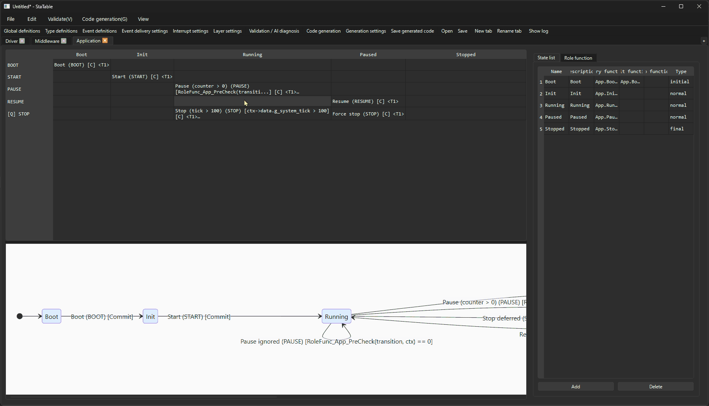

# StaTable

**MISRA C:2012-aware state machine design and C code generation for embedded systems.**

[](https://pypi.org/project/statable/)
[](https://pypi.org/project/statable/)
[](https://pypi.org/project/statable/)
[](LICENSE)
[]()
[]()
[]()
[]()

---

## What's New in v3.4.0

**StateActionsDialog: combo-based editing + role/event management**

- **Target column is now a QComboBox** (Type-dependent)
  - `role`       -> `qualified_name` from `RoleFunctionLibrary` + `state_machine`
  - `fire_event` -> `EVENT_<Layer>_<Name>` from `state_machine.events`
  - Eliminates typos and makes generated C code deterministic
- **Role function management buttons**: `+ New` / `Edit` / `Delete`
  - Uses `RoleFunctionDialog` (same UX as `ActionEditorDialog`)
  - Registers into `state_machine.role_functions` on the fly
- **Event management buttons**: `+ New` / `Edit` / `Delete`
  - Uses `EventEditDialog`
  - Reference check before delete (transitions must be removed first)
- **Condition column**: `QLineEdit` + `[...]` button
  - Opens `ConditionBuilderDialog` (same as `ActionEditorDialog`)
- **New constructor args**: `role_function_library`, `literal_library`,
  `condition_library`, `layer_names_provider`, `global_defs`
- **Test**: `test_v3_4_0_state_actions.py` (30 PASS)

See [SPEC_STATE_ACTIONS_v1_en.md](code/docs/SPEC_STATE_ACTIONS_v1_en.md) or
[SPEC_STATE_ACTIONS_v1_zh.md](code/docs/SPEC_STATE_ACTIONS_v1_zh.md) for details.

## What's New in v3.2.0

> **New Project Wizard + Chinese i18n** — Released 2026-10-03

### New Project Wizard

Create a new project in 4 steps (`Ctrl+N` / **File → New Project...**):

1. **Project Info** — name and output folder
2. **Template** — choose from 3 templates:
   - **3-Layer** (Driver / Middleware / Application) [Recommended]
   - **Basic** (Single Layer)
   - **Empty Project**
3. **Customize Names** — rename States, Role Functions, Events, Interrupts, Variables, Flags, Queues
4. **Preview** — review before generation

Each non-empty template generates per layer:

- **5 states** (Init / Idle / Active / Error / Recover)
- **5 events** (INIT / START / STOP / ERROR / TIMEOUT)
- **5 role functions** (HwInit / Start / Stop / HandleError / Cleanup)

Plus globally:

- **5 interrupts**, **5 variables**, **5 flags**, **5 event queues**

**All elements are placeholders** — rename them in the GUI after creation.

### Chinese i18n for Wizard

The New Project Wizard is fully translated to **简体中文**.

### Test Coverage

- **+58 new tests** (`test_v3_2_s1_wizard.py`): templates, generation, rename, menu cleanup
- Total: **1749 PASS / 0 FAIL / 2 SKIP** across 47 suites

---

## What's New in v3.1.0

> **PyPI Release + Chinese Language Support** — Released 2026-10-03

### Now Available on PyPI

StaTable is now a pip-installable package:

```bash
pip install statable           # core (zero dependencies)
pip install statable[gui]      # + PySide6 GUI
pip install statable[dev]      # + pytest, pycparser
```

- **Zero dependencies** for the core (Python API + CLI)
- **CLI**: `statable-cli generate/validate/version`
- **Python API**: `import statable` (21 public symbols)
- **Apache-2.0 license** — free for commercial use
- **PyPI**: https://pypi.org/project/statable/

### Chinese Language Support

StaTable now supports **简体中文 (Simplified Chinese)** in the GUI.

- **Language menu** — switch between English and 简体中文
- **Auto restart** — click "Restart now" to apply the new language
- **97.4% translation** (485 / 498 strings)
- **Unified startup** — `python -m statable` and `python gui_main.py`
  both apply the saved language

To switch:

1. Menu bar: **Language / 语言** → **简体中文**
2. Click **Restart now / 立即重启** in the dialog
3. StaTable restarts with the Chinese UI

## What's New in v2.8.0

> **AI Diagnosis Refresh** — Released 2026-09-27
> See the [full release notes](https://github.com/akashi-hideki/StaTable/releases/tag/v2.8.0).

The AI diagnosis workflow in `codegen/validate/` has been completely
rewritten for reliability and transparency.

| Area | Before | After |
|------|--------|-------|
| **Prompt** | Flat `[Task]` text | 10 XML sections, full `<context>` (role_functions / cells / global_definitions) |
| **Response** | Undefined schema | `id` / `evidence` / `priority` / `confidence` fields |
| **Parser** | Fragile brace matching | `<response>...</response>` marker, all **17 actions** |
| **Validation** | None | `ResponseValidator` — schema / params / references checked **before** applying |
| **GUI** | 4-column list | **7-column** list with Priority, Confidence, Status; excluded rows clearly marked |

**Test status:** 4 new suites (+311 assertions), CI green.

**⚠️ Operational testing pending.** The AI features are design- and
unit-test complete, but end-to-end testing with a real LLM has not
been performed yet. AI proposals should be treated as review aids
only until OT completes. See the [v2.8.0 section](#v280--ai-diagnosis-refresh-design--unit-test-complete-operational-testing-pending)
below for details.

## Why StaTable?

Most open-source state machine tools ignore **MISRA C:2012** compliance,
which is a hard requirement in automotive, industrial, and medical
embedded software.

StaTable is built for embedded teams that need **MISRA C:2012-aware
C code generation** without hand-writing state machines or building
custom tooling from scratch.

### Key Features

- ✅ **MISRA C:2012-aware C code generation** — validated with `cppcheck` + official MISRA addon (10 suppressed hits, all documented)
- ✅ **Multi-layer state machines** — Driver / Middleware / Application with priority-ordered execution
- ✅ **State actions (Entry / Exit / Do)** — per-state entry / exit / do activity with table-driven dispatch and user-code markers
- ✅ **35 validation rules** across 11 categories with AI-assisted diagnostics
- ✅ **Marker-based user code preservation** — regenerate without losing your custom code
- ✅ **Cell-level actions and relations** — pre/post actions, sequential/exclusive/group relations
- ✅ **Pure Python** — easy to integrate into your CI/CD pipeline
- ✅ **47 test suites, 1749 PASS / 0 FAIL / 2 SKIP**

### v2.7 Highlights

- ✅ **State actions (Entry / Exit / Do)** — every state can define Entry (on enter), Exit (on leave), and Do (every super-loop iteration) actions, generated as C89-compatible dispatch tables with `NULL` guards (Phase 3)
- ✅ **`StateActionsDialog`** — 4-tab GUI editor (Entry / Exit / Do / Preview) launched by double-clicking the **state name in the transition matrix header** or the **Name column in the SettingsPanel state list** (Phase 4)
- ✅ **ActionStep extensions** — `condition`, `action_type` (`role` / `fire_event`), `event_name`; backward-compatible with legacy `List[str]` and `<Action name="..."/>` XML (Phase 1+2)
- ✅ **`<Do>` XML element** — per-state do-activity persistence; legacy files load with empty list (Phase 2)
- ✅ **`StateMachine_Process_<Layer>` calls Entry / Exit** on state change (Phase 3d)
- ✅ **`{project}_run.c` calls `<Layer>_Do(...)`** at loop top, before event processing (Phase 3)
- ✅ **SettingsPanel state list simplified** — 5 columns → **3 columns** (Name / Description / Type); entry / exit are edited only via `StateActionsDialog`
- ✅ **GUI signal-wiring test suite** — `test_v2_7_p4.py` (52 PASS) covers matrix header / cell double-click, `SettingsPanel` Name-column dispatch, dialog OK/Cancel, preview generation
- ✅ **Codegen test suite** — `test_v2_7_p3.py` (81 PASS) covers generator internals, table structure, integration, idempotency
- ✅ **Fully backward compatible** — projects without `do_actions` load and regenerate unchanged

### v2.6 Highlights

- ✅ **Structured event trigger** — `<Trigger>` child element with 6 types (manual / edge / polling / timer / call / comparison); GUI collapsible section with Source candidates from GlobalDefinitions (C-51 Step 3)
- ✅ **Condition builder integration** — comparison-type triggers launch the existing `ConditionBuilderDialog`
- ✅ **GUI integration test** — `test_v2_6_p3.py` runs a full XML-load → edit → save → reload workflow with 50 assertions
- ✅ **Tutorial 3-language sync** — TUTORIAL_ja / en / zh updated to v1.1

### v2.5 Highlights

- ✅ **User-editable (void) suppression** — all `(void)` lines for generated locals now live inside the user-code marker, so you can delete them once you start using the variable (R-10)
- ✅ **Namespace all-tabs wiring** — the Role function dialog lists every layer in the project, not just the current tab (R-6)
- ✅ **Inline library creation** — `+ New Literal` inside RoleFunctionDialog (R-7), `+ New Template` inside ConditionBuilderDialog (R-8)
- ✅ **ARM link verification without hardware** — `verify_arm_link.py` links the generated framework with `arm-none-eabi-gcc` and produces `firmware.elf` / `firmware.bin` (R-13B)
- ✅ **OSAL porting guide** — `docs/OSAL_PORTING_GUIDE_ja.md` describes the OSAL contract and shows how to add a new OS or bare-metal target (R-14)
- ✅ **Strict CI** — gcc + ARM compilation with `-Werror`, cppcheck + MISRA addon, ARM link verification (7 CI jobs total)
- ✅ **Event trigger field** — `Event.trigger` records when / from where an event fires as free text (C-51 Step 2)
- ✅ **Per-layer event queues** — `SystemContext_t` gains a per-layer ring buffer; `GetNextEvent_<Layer>` drains it, so `delivery_type="queue"` events actually work (C-52)
- ✅ **ISR-safe queue operations** — `STATABLE_ENTER/EXIT_CRITICAL` hooks protect queue RMW; `dropped` counter makes overflow visible (C-54)
- ✅ **Per-layer `pending_event` slots (F-3 resolved)** — each layer owns its own `pending_event_<Layer>` / `pending_event_valid_<Layer>`, eliminating the read-then-clear race and cross-layer ID collisions (C-55)

---

## Demo



*Design state machines in a table-driven editor, visualize them as Mermaid
diagrams, and generate production-ready C code with a single click.*

---

## Platform Support

| Platform | Status | Notes |
|----------|--------|-------|
| **Windows 10/11** | ✅ **Tested** | Manual GUI verification + automated tests |
| **Ubuntu 22.04+** | ⚠️ **Auto tests pass on CI** | GUI not yet manually verified — feedback welcome |
| **macOS** | ⚠️ **Not tested** | Community testing welcome |

**Note for Linux users**: The automated test suite (47 suites, 1749 tests)
passes on Ubuntu via GitHub Actions, but the GUI has only been manually
verified on Windows. If you try it on Linux, please report your experience
via [GitHub Issues](https://github.com/akashi-hideki/StaTable/issues).

---

## Quick Start

### Requirements

- Python 3.12
- PySide6 (Qt 6)

### Installation

#### Option A: Install from PyPI (recommended for users)

```bash
pip install statable           # core (Python API + CLI)
pip install statable[gui]      # + PySide6 GUI
pip install statable[dev]      # + pytest, pycparser (for development)
```

#### Option B: Install from source (for developers)

```bash
git clone https://github.com/akashi-hideki/StaTable.git
cd StaTable/code
pip install -e .[gui,dev]
```

### Run the GUI

From the `code/` directory:

```bash
python -m statable
```

Or, equivalently:

```bash
python gui_main.py
```

### Language / 语言

StaTable supports English and Simplified Chinese (简体中文).

To change the language:

1. Menu bar: **Language / 语言**
2. Select **English** or **简体中文**
3. Click **Restart now** in the dialog

The setting is saved and applied on the next startup.

### CLI Usage

The `statable-cli` command is available after `pip install statable`:

```bash
# Show version
statable-cli version

# Generate C code from a design XML
statable-cli generate --xml design.xml --out generated/ --format json

# Validate a design XML
statable-cli validate --xml design.xml --format json --exit-on-error
```

| Subcommand | Description |
|---|---|
| `generate` | Generate C code from XML design |
| `validate` | Validate XML design (exit code 1 on error with `--exit-on-error`) |
| `version`  | Print version |

**Exit codes**: `0` success / `1` validation error / `2` internal error

**Output**: stdout = JSON (default) or plain text / stderr = logs

### Run the Test Suite

```bash
cd code
python tests/test_v2_2_p1.py
# ... 29 other suites
python tests/test_v2_7_p4.py
```

Expected: **1749 PASS / 0 FAIL / 2 SKIP** across 47 suites.

---

## What StaTable Generates

From a single state machine design, StaTable produces **C files**
ready to integrate into your firmware.

**Single-layer project: 16 files. Three-layer project: 30 files.**

| File | Scope | Purpose |
|------|-------|---------|
| `statable_types_common.h` | common | Common structs, enums, logging macros |
| `statable_types.h` | per layer | Per-layer enums, `TransitionContext_<Layer>_t` |
| `statable_transitions.h` | per layer | `StateMachine_Process_*` prototypes |
| `statable_transitions.c` | per layer | Cell functions, transition tables |
| `statable_role_functions.h` | per layer | Role function declarations |
| `statable_role_functions.c` | per layer | Role function implementations + call sites |
| `statable_state_actions.h` | per layer | **v2.7** Entry / Exit / Do declarations |
| `statable_state_actions.c` | per layer | **v2.7** Entry / Exit / Do dispatch tables + user-code markers |
| `statable_init.c` | common | `SystemContext_Init` |
| `statable_event_queue.c` | common | Event queue implementation |
| `statable_interrupt.c` | common | ISR implementations |
| `statable_timer.c` | common | Timer struct + `Timer_Init` / `Timer_Update` |
| `osal.h` / `osal.c` | common | OS abstraction (NonRTOS / FreeRTOS / ThreadX) |
| `statable_all.h` | common | Super include |
| `{project}_run.c` | project | Super loop (calls `<Layer>_Do` per iteration) |

### Sample Generated Code

#### Cell function (event-driven)

```c
/* Cell function for (Idle, START) */
static STATE_Driver_t t_Idle_START(
    const Transition_t* transition,
    TransitionContext_Driver_t* ctx)
{
    STATE_Driver_t next_state = STATE_Driver_Idle;

    /* Cell actions (before_transitions) */
    (void)RoleFunc_Driver_PreCheck(transition, ctx);

    if (cond_A) {
        next_state = STATE_Driver_Active;  /* [Commit] */
    } else {
        next_state = STATE_Driver_Error;   /* [Commit] */
    }

    /* Cell actions (after_transitions) */
    (void)RoleFunc_Driver_Cleanup(transition, ctx);

    return next_state;
}
```

#### State action (Entry / Exit / Do, v2.7)

```c
/* Per-state Entry / Exit / Do functions (v2.7) */
static void Driver_Entry_Waiting(SystemContext_t *ctx)
{
    /* --- GUI-edited actions (regenerated) --- */
    (void)RoleFunc_Driver_ClearHwFault(NULL, ctx);
    /* --- end GUI-edited actions --- */

    /* --- user custom code (preserved) --- */
    /* [[STABLE_USER_CODE_START:Driver_Entry_Waiting_custom]] */
    (void)ctx;
    /* [[STABLE_USER_CODE_END:Driver_Entry_Waiting_custom]] */
}

/* Super loop calls Do per iteration */
void VendingMachineTutorial_Run(void)
{
    while (1) {
        /* [v2.7.0] State actions (Do) */
        Driver_Do(g_Driver_state, &g_ctx);
        Middleware_Do(g_Middleware_state, &g_ctx);
        Application_Do(g_Application_state, &g_ctx);

        /* Existing event processing */
        { EVENT_Driver_t evt = StateMachine_GetNextEvent_Driver(&g_ctx); ... }
        ...
    }
}
```

---

## Architecture

```
┌──────────────────────────────────────────────────────────────┐
│                        StaTable                              │
│  ┌────────────────────────────────────────────────────────┐  │
│  │                  statable_gui/                         │  │
│  │  MainWindow / StateMachineTab / MatrixTableWidget      │  │
│  │  transition_editor_direct/ (Drag & Drop editor)        │  │
│  │  state_actions_dialog.py (Entry/Exit/Do editor, v2.7)  │  │
│  │  libcntrl/ (Shared libraries)                          │  │
│  └────────────────────────────────────────────────────────┘  │
│                            │ calls                           │
│                            ▼                                 │
│  ┌────────────────────────────────────────────────────────┐  │
│  │                    codegen/                            │  │
│  │  CCodeGenerator + 16 sub-generators                    │  │
│  │  state_actions_generator.py (Entry/Exit/Do, v2.7)      │  │
│  │  validate/ subsystem (35 rules, 11 validators)         │  │
│  └────────────────────────────────────────────────────────┘  │
│                            │ reads                           │
│                            ▼                                 │
│  ┌────────────────────────────────────────────────────────┐  │
│  │                    statable/                           │  │
│  │  StateMachine / GlobalDefinitions / XML I/O            │  │
│  │  EventTrigger / ActionStep / State.do_actions (v2.7)   │  │
│  └────────────────────────────────────────────────────────┘  │
└──────────────────────────────────────────────────────────────┘
```

**Dependency direction**: `statable_gui` → `codegen` → `statable`. No reverse dependency.

### Project Structure

```
StaTable/
├── .github/
│   └── workflows/
│       └── check.yml
├── code/
│   ├── gui_main.py              ← Alternative entry point
│   ├── statable/                ← Data model layer
│   │   ├── __main__.py          ← `python -m statable`
│   │   ├── model.py
│   │   ├── state_machine.py
│   │   └── ...
│   ├── statable_gui/            ← GUI layer
│   │   ├── main_window.py
│   │   ├── widgets.py
│   │   ├── matrix_table.py
│   │   ├── state_actions_dialog.py   ← v2.7
│   │   └── ...
│   ├── codegen/                 ← Code generation
│   │   ├── c_code_generator.py
│   │   ├── state_actions_generator.py   ← v2.7
│   │   └── validate/
│   ├── tests/                   ← Test suites
│   ├── tools/                   ← Dev tools
│   └── docs/                    ← Specifications
├── .gitattributes
├── .gitignore
├── LICENSE
├── NOTICE
└── README.md
```

---

## Use Cases

### Embedded Firmware Teams

Tired of hand-writing state machines and struggling with MISRA
compliance? StaTable automates both.

- Design in a visual editor
- Generate MISRA-aware C code
- Preserve your custom code across regenerations

### Tool Vendors / OEM

Want to add state machine support to your IDE or development tool?
StaTable's architecture is modular and can be integrated as a library.

- Python API for code generation
- Customizable templates
- **Eclipse External Tools integration** ([guide](code/docs/ECLIPSE_INTEGRATION_ja.md))
- **Commercial / OEM licenses available** (see Contact)

### Automotive / Industrial / Medical

Where MISRA C:2012 compliance is non-negotiable.

- 35 validation rules covering state, event, transition, role function, cell, variable, flag, queue, interrupt, timer, and custom types
- Documented MISRA suppressions
- XML-based project persistence for audit trails

---

## Documentation

| Document | Language | Description |
|----------|----------|-------------|
| [SPEC_OVERVIEW_en.md](code/docs/SPEC_OVERVIEW_en.md) | English | Complete architecture specification |
| [SPEC_OVERVIEW_ja.md](code/docs/SPEC_OVERVIEW_ja.md) | 日本語 | 全体仕様書 |
| [SPEC_SCREENS_en.md](code/docs/SPEC_SCREENS_en.md) | English | GUI screen specification |
| [SPEC_SCREENS_ja.md](code/docs/SPEC_SCREENS_ja.md) | 日本語 | 画面仕様書 |
| [SPEC_CODEGEN_v3.md](code/docs/SPEC_CODEGEN_v3.md) | English | Code generation details |
| [SPEC_STATE_ACTIONS_v1_en.md](code/docs/SPEC_STATE_ACTIONS_v1_en.md) | English | **v2.7** State actions (Entry/Exit/Do) specification |
| [SPEC_STATE_ACTIONS_v1_zh.md](code/docs/SPEC_STATE_ACTIONS_v1_zh.md) | 中文 | **v2.7** State actions (Entry/Exit/Do) specification |
| [SPEC_STATE_ACTIONS_v1_ja.md](code/docs/SPEC_STATE_ACTIONS_v1_ja.md) | 日本語 | **v2.7** State actions (Entry/Exit/Do) specification |
| [OSAL_PORTING_GUIDE_ja.md](code/docs/OSAL_PORTING_GUIDE_ja.md) | 日本語 | OSAL 移植ガイド（R-14） |
| [IMPLEMENTATION_PLAN_v2_3.md](code/docs/IMPLEMENTATION_PLAN_v2_3.md) | English | v2.3 implementation plan |
| [ECLIPSE_INTEGRATION_ja.md](code/docs/ECLIPSE_INTEGRATION_ja.md) | 日本語 | Eclipse External Tools 連携ガイド |

---

## Breaking Changes

### v2.5.6: `FIRE_EVENT` → `FIRE_EVENT_<Layer>`

The generic `FIRE_EVENT(ctx, evt)` macro has been **removed** and replaced
by per-layer macros to eliminate cross-layer pending-event collisions.

If your project used `FIRE_EVENT` directly, update as follows:

```c
/* Before (v2.5.5 and earlier) */
FIRE_EVENT(ctx, EVENT_Middleware_RESET);

/* After (v2.5.6) */
FIRE_EVENT_Middleware(ctx, EVENT_Middleware_RESET);
```

Available macros:

| Macro | Target slot |
|-------|-------------|
| `FIRE_EVENT_Driver(ctx, evt)` | `pending_event_Driver` |
| `FIRE_EVENT_Middleware(ctx, evt)` | `pending_event_Middleware` |
| `FIRE_EVENT_Application(ctx, evt)` | `pending_event_Application` |

The queue-based API (`FIRE_EVENT_QUEUE_<Layer>`) is unchanged.

**v2.7.0 is fully backward compatible with v2.6.0** — projects without
`<Do>` elements or `do_actions` load and regenerate unchanged.

---

## v2.8.0 — AI Diagnosis Refresh (design + unit-test complete, operational testing pending)

### Summary

The AI diagnosis workflow in `codegen/validate/` has been substantially
rewritten. The old `[Task]` / `[Output format]` prompt has been replaced
by a full XML-tagged specification (`SPEC_AI_PROMPT_v1.1`) with a
matching response schema, a stricter parser, and a new validation layer
between parsing and application.

### What changed

| Area | Before | After |
|------|--------|-------|
| Prompt structure | Flat `[Task]` text | 10 XML sections (`<system>`, `<workflow>`, `<task>`, `<output_schema>`, `<examples>`, `<constraints>`, `<context>`, `<validation>`, `<actions>`, `<response_format>`) |
| Context sent to AI | States / events / transitions only | + role_functions / cells / global_definitions, full ActionStep detail, EventTrigger |
| Output schema | Undefined | `version` / `summary` / `changes[]` with `id` / `evidence` / `priority` / `confidence` |
| Response extraction | Fragile brace matching | `<response>...</response>` marker first, `<json>...` legacy fallback |
| Action coverage | 10 legacy actions | All 17 actions (10 legacy + 7 cell-level) |
| Pre-apply validation | None | `ResponseValidator` (schema / params / references) |
| GUI change list | 4 columns | 7 columns (Selection / Action / Parameter / Reason / Priority / Confidence / Status), excluded rows shown as `EXCLUDED: <reason>` |

### New / updated files

| File | Status |
|------|--------|
| `codegen/validate/data/prompt_templates.py` | Rewritten |
| `codegen/validate/prompt_generator.py` | Rewritten (`_format_data`, `_format_validation`, `_format_actions` extended) |
| `codegen/validate/change_actions.py` | `ChangeRequest` extended (id / evidence / priority / confidence) |
| `codegen/validate/response_parser.py` | `<response>` marker priority, 17-action mapping |
| `codegen/validate/response_validator.py` | **New** |
| `codegen/validate/validation_dialog.py` | ResponseValidator integration, 7-column change tree |
| `tests/test_v2_8_p1_ai_prompt.py` | **New** (123 assertions) |
| `tests/test_v2_8_p2_response_parser.py` | **New** (106 assertions) |
| `tests/test_v2_8_p3_response_validator.py` | **New** (56 assertions) |
| `tests/test_v2_8_p4_gui_integration.py` | **New** (26 assertions) |
| `docs/SPEC_AI_PROMPT_v1.md` | **New** (v1.1, design spec) |
| `tools/gui_smoke_v2_8.py` | **New** (headless GUI smoke test) |

### Test status

| Suite | Result |
|-------|:------:|
| `test_v2_8_p1_ai_prompt.py` | 123 assertions |
| `test_v2_8_p2_response_parser.py` | 106 assertions |
| `test_v2_8_p3_response_validator.py` | 56 assertions |
| `test_v2_8_p4_gui_integration.py` | 26 assertions |
| Regression `test_v2_2_p12_6.py` | 55 assertions |

### ⚠️ Operational testing status of the AI features

The AI diagnosis workflow has been **designed, implemented, and
unit-tested**, but **end-to-end operational testing with a real
LLM is still pending**. In particular:

- The prompt has not yet been validated against a wide variety of
  LLM providers / models in real sessions.
- The `evidence` / `priority` / `confidence` fields are advisory;
  they have not been calibrated against measured outcomes.
- The GUI change-list integration is unit-tested but has not been
  exercised in a sustained multi-user workflow.
- The few-shot examples shipped in `prompt_templates.py` reflect
  the intended response shape but have not been tuned on
  production-scale designs.

Until operational testing is complete, **AI proposals should be
treated as review aids only** and every proposed change should be
examined by a human before applying it. If you observe a parsing
or validation failure, please capture:

- the raw AI reply,
- the entries shown in the `Change list / apply` tab,
- the log lines from `logs/validate_*.log`.

These will drive the next iteration of the prompt and validator.

## Roadmap
### v3.5.0 Released (2026-10-11)

**Status:** Released

GUI output-directory hygiene: prevent stale files from a previous
generation causing undefined-symbol link errors.

**Highlights**

- **Public API** `statable.output_utils.find_orphan_files()`:
  recursive scan; returns files not written by the current run.
- **codegen** `CCodeGenerator.last_orphans`: recorded after every
  `save_generated_code()` call (API-compatible: return value unchanged).
- **GUI warning** `show_orphan_warning()`: dialog with
  `[Clean && Regenerate] [Ignore]`; wired into both the main-window
  toolbar/menu and the CodeGenerationDialog save flow.
- **Robust delete** `fs_cleanup.robust_rmtree()`: `chmod S_IWRITE`
  + 3 retries; resolves WinError 5 on Windows/OneDrive (PINNED /
  REPARSE_POINT attributes).
- **New UI** main-window `clean_generate_code()`: toolbar / menu
  `Clean generate` action, also used as the warning dialog callback.

**Also in this release**

- Phase 1b: mypy baseline 218 -> 58 errors (informational).
- S-4: Python 3.10-3.13 test matrix + coverage artifacts.
- S-5: GitHub Actions upgraded to Node.js 24 versions.
- S-1: frozen-exe smoke tests expanded to 4 levels.

**Verification**

- 47 test suites / **1749 PASS** / 0 FAIL (Python 3.10-3.13).
- gcc + ARM Cortex-M4 syntax + link verification: **PASS**
  (firmware.bin 28540 bytes, identical to v3.4.3).
- GUI end-to-end: WinError 5 resolved; Clean && Regenerate flow
  verified on Windows.

**Remaining (v3.5.1+)**

- Phase 1c: residual 58 mypy errors (`statable/xml_io.py`).
- S-3 Step 2: ubuntu-26.04 preview job (2026-10-19 onwards).


### v2.8.0 — AI Diagnosis Refresh ✅ Released (2026-09-27)

**Status:** Released

Complete refresh of the AI diagnosis workflow in `codegen/validate/`.

**Highlights**

- **Prompt**: XML-tagged structure (10 sections) replacing the legacy
  `[Task]` / `[Output format]` text. `<context>` now includes
  role_functions, cells, and global_definitions.
- **Schema**: `ChangeRequest` extended with `id` / `evidence` /
  `priority` / `confidence`. Round-trip safe.
- **Parser**: `<response>...</response>` marker is the primary
  extraction path. All 17 actions (10 legacy + 7 cell-level) covered.
- **Validator** (`response_validator.py`, new): schema / params /
  references checks before application.
- **GUI**: `ValidationDialog` change list extended to 7 columns
  (Selection / Action / Parameter / Reason / Priority / Confidence /
  Status). Excluded rows show `EXCLUDED: <reason>` and are non-checkable.
- **Tests**: 4 new suites (P1-P4, +311 assertions), all green in CI.
- **CI**: `.github/workflows/check.yml` registers the 4 new suites.

**⚠️ Operational testing pending**

The AI features are design- and unit-test complete, but end-to-end
operational testing with a real LLM has not yet been performed.
Until OT is complete, AI proposals should be treated as review aids
only. See the `## v2.8.0` section above for details.


### v2.7.0 (Released 2026-09-26)

- ✅ **State actions (Entry / Exit / Do)** — per-state entry / exit / do-activity with C89-compatible dispatch tables (`Phase 3`)
- ✅ **`StateActionsDialog`** — 4-tab editor (Entry / Exit / Do / Preview) launched from the transition matrix header or the SettingsPanel Name column (`Phase 4`)
- ✅ **`ActionStep` extensions** — `condition` / `action_type` / `event_name`; backward compatible with legacy `List[str]` and `<Action name="..."/>` (`Phase 1+2`)
- ✅ **`<Do>` XML element** — per-state do-activity persistence
- ✅ **SettingsPanel state list simplified** — 5 columns → 3 columns (Name / Description / Type)
- ✅ **CI updated** — `test_v2_7_p3.py` (81 PASS), `test_v2_7_p4.py` (52 PASS), `test_v2_5_p8.py` registered
- ✅ **1147 PASS / 0 FAIL / 2 SKIP** across 30 suites

### v2.6.0 (Released 2026-09-25)

- ✅ **C-51 Step 3: structured event trigger** — `<Trigger>` child element with 6 types (manual / edge / polling / timer / call / comparison)
- ✅ **GUI Trigger section** — collapsible `QGroupBox` in `EventEditDialog`; Source dropdown populated from GlobalDefinitions (interrupts / timers / role functions)
- ✅ **Condition builder integration** — comparison-type triggers launch the existing `ConditionBuilderDialog`
- ✅ **Backward compatible** — projects without `<Trigger>` still load (`trigger_detail=None`)
- ✅ Tests: `test_v2_6_p1.py` (62 PASS), `test_v2_6_p2.py` (35 PASS), `test_v2_6_p3.py` (50 PASS)
- ✅ Tutorial JA/EN/ZH updated to v1.1 (Trigger section)

### v2.5.6 (Released 2026-09-25)

- ✅ **F-3 fully resolved**: per-layer `pending_event_<Layer>` slots (C-55)
- ⚠️ **Breaking change**: `FIRE_EVENT(ctx, evt)` removed; use `FIRE_EVENT_<Layer>(ctx, evt)`
  - Migration: `FIRE_EVENT(ctx, EVENT_Middleware_RESET)` → `FIRE_EVENT_Middleware(ctx, EVENT_Middleware_RESET)`
- ✅ Atomic read-then-clear protected by `STATABLE_ENTER/EXIT_CRITICAL` hooks (default no-op)
- ✅ `SystemContext_InitQueues()` resets all per-layer pending slots
- ✅ F-3 Step 2 test suite: **28 PASS / 0 FAIL**; atomic RMW: **13 PASS / 0 FAIL**
- ✅ ARM link verification: `firmware.elf` / `firmware.bin` produced cleanly

### v2.5.5 (Released 2026-09-24)

- ✅ ISR-safety review (C-54): critical-section hooks around per-layer queue operations
- ✅ `dropped` counter on `EventQueueState_t` for overflow visibility
- ✅ `FIRE_EVENT_QUEUE_<Layer>` documented as the recommended API for ISR / cross-layer delivery
- ✅ **796 PASS / 0 FAIL / 2 SKIP** across 22 suites

### v2.5.4 (Released 2026-09-24)

- ✅ Event trigger field: `Event.trigger` free-text (C-51 Step 2)
- ✅ Per-layer event queues in `SystemContext_t` (C-52)
- ✅ Layer ID collision avoided by per-layer queues (C-53)
- ✅ **796 PASS / 0 FAIL / 2 SKIP** across 22 suites

### v2.5 / v2.5.3 (Released 2026-09-23)

- ✅ C-50 resolution: arbitrary namespaces accepted (v2.5.1)
- ✅ (void) suppression moved into user-code marker (v2.5.2)
- ✅ MISRA check fixed: BOM / encoding / stream (R-15)
- ✅ MISRA CI integrated (R-12)
- ✅ strict mode `-Werror` in verify-c-syntax (R-11)
- ✅ Namespace all-tabs wiring (R-6)
- ✅ `+ New Literal` / `+ New Template` (R-7 + R-8)
- ✅ OSAL porting guide (R-14 part 1)
- ✅ ARM link verification (R-13 part B) — found and fixed the
  `__disable_irq` link error; critical section is now emitted as
  stubs with per-architecture examples
- ✅ **776 PASS / 0 FAIL / 2 SKIP** across 21 suites
- ✅ 7 CI jobs: no-japanese / syntax / tests / generated-code /
  verify-c-syntax / misra-check / arm-link

### v2.4.1 (Released 2026-09-22)

- ✅ Merge idempotency fix (`code_merger.py` v2.1)
- ✅ False-positive warning fix (`role_function_generator.py` v3.3.1)
- ✅ New test suite: `test_v2_4_p1_merge.py` (9 groups / 25 assertions)
- ✅ 14 suites / **576 PASS / 0 FAIL / 2 SKIP**

### v2.4 (Released 2026-09-22)

- ✅ UI cleanup: State list 5 columns, Role function 4 columns
- ✅ Namespace combo box listing all project layers
- ✅ Reserved fields hidden from UI (State.do, RoleFunction signature)
- ✅ XML round-trip preserved for reserved fields (empty `used_*` attributes suppressed)
- ✅ Role function Edit path restored (button + row double-click)
- ✅ **551 PASS / 0 FAIL / 2 SKIP**

### v2.3 (Released 2026-09-21)

- ✅ New Project feature (Ctrl+N)
- ✅ Unsaved-changes dialog (Save / Discard / Cancel)
- ✅ Window title modified marker (`*`)
- ✅ `StateMachineTab.dataModified` signal
- ✅ Logger guard against deleted TraceBall widgets (C-40)
- ✅ **551 PASS / 0 FAIL / 2 SKIP**

### v3.0 (Released 2026-10-02 — SDK Foundation)

- ✅ **CLI** (`statable-cli generate --xml ...`)
- ✅ **Python SDK** (`pip install statable`)
- ✅ **Apache-2.0 license** with commercial/OEM options

### v3.2.0 (Released 2026-10-03 — New Project Wizard + i18n)

- ✅ **New Project Wizard** — 4 pages, 3 templates, customizable names
- ✅ **Complete Chinese i18n** for Wizard
- ✅ **+58 tests** (`test_v3_2_s1_wizard.py`)
- ✅ **Single menu** — `File → New Project...` (Ctrl+N)

### v3.1.0 (Released 2026-10-03 — PyPI Release + Chinese Language Support)

- ✅ **PyPI package** published: https://pypi.org/project/statable/
- ✅ **GitHub Release** v3.1.0 with wheel + sdist
- ✅ **Chinese-language GUI** (简体中文, 97.4%)
- ✅ **Language menu** (English ↔ 简体中文)
- ✅ **Auto restart** on language change
- ⏳ Chinese-language documentation (README_zh-CN.md exists, docs pending)

### v3.1+ (Exploring)

- 🔍 OEM / white-label licensing
- 🔍 Enterprise features (SSO, audit logs)
- 🔍 Partner program

---

## License

- **Core**: [Apache License 2.0](LICENSE) — free for commercial and personal use
- **Commercial / OEM**: Custom licensing available

Apache 2.0 allows:
- ✅ Commercial use
- ✅ Modification
- ✅ Distribution
- ✅ Patent use
- ✅ Private use

Requires:
- 📋 License and copyright notice
- 📋 State changes

---

## Contributing

Contributions are welcome!

1. Fork the repository
2. Create a feature branch (`git checkout -b feature/your-feature`)
3. Commit your changes (`git commit -m 'Add your feature'`)
4. Push to the branch (`git push origin feature/your-feature`)
5. Open a Pull Request

### Areas We Need Help With

- 🐧 **Linux GUI testing** — Ubuntu / Fedora / Arch verification
- 🍎 **macOS testing** — Apple Silicon / Intel
- 🌏 **Translations** — Chinese, Korean, German, etc.
- 📚 **Documentation** — tutorials, examples, best practices
- 🐛 **Bug reports** — edge cases, platform-specific issues

### Development Setup

```bash
git clone https://github.com/akashi-hideki/StaTable.git
cd StaTable/code
pip install PySide6 pycparser
python -m compileall statable statable_gui codegen
```

### Running Tests

```bash
cd code
python tests/test_v2_2_p1.py
python tests/test_v2_3_p1.py
# ...
```

All 47 suites should pass (1749 PASS / 2 SKIP).

---

## Contact

- **GitHub Issues**: [Report a bug or request a feature](https://github.com/akashi-hideki/StaTable/issues)
- **Email**: akashi.hideki@gmail.com

**For OEM licensing, custom development, or commercial inquiries**,
please email me directly with a brief description of your use case.

---

## Acknowledgments

StaTable uses:

- [PySide6](https://www.qt.io/qt-for-python) — Qt 6 for Python
- [Mermaid](https://mermaid.js.org/) — State diagram rendering
- [cppcheck](https://cppcheck.sourceforge.io/) — MISRA C:2012 verification

---

If StaTable helps you or your team, please consider giving it a ⭐ —
it helps others discover the project.

---

*Built with ❤️ for embedded engineers who care about quality.*
