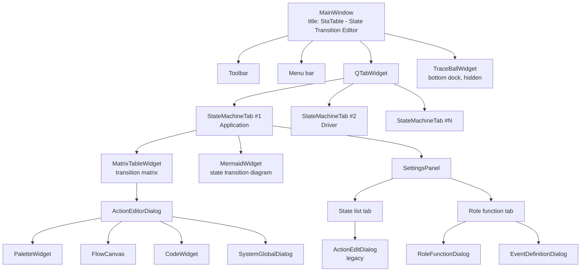
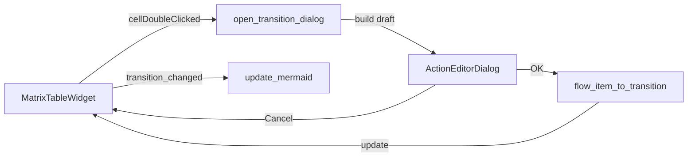
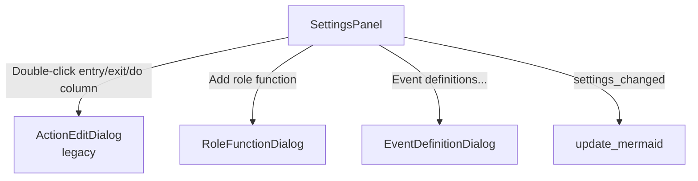
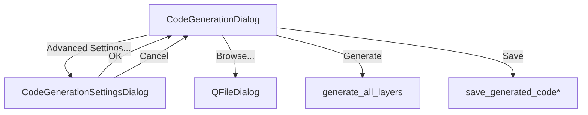
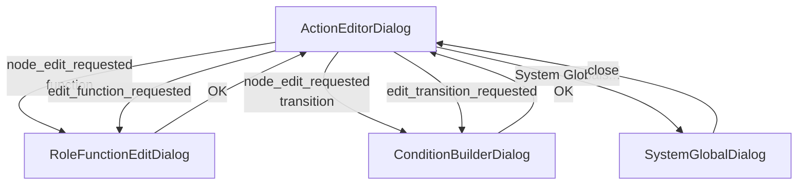
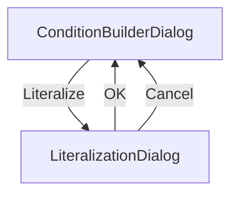
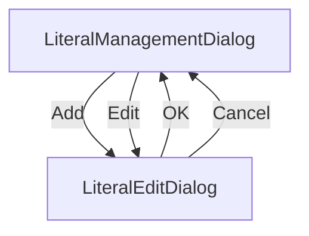

# StaTable Screen Transition Specification v1.2 (English)

Version: 1.2
Date: 2026-09-20
Scope: All GUI screens, dialogs, and the embedded state transition diagram
Source basis: `statable_gui/main_window.py` (v1.5), `statable_gui/widgets.py` (v2.2)

---

## Table of Contents

1. Overview
2. State Transition Diagram (MermaidWidget)
3. Screen Hierarchy
4. Main Window Layout
5. Toolbar / Menu → Dialog Transitions
6. Tab-Level Transitions
7. Dialog-Level Transitions
8. Modal / Modeless Classification
9. Transition Matrix
10. Revision History

---

## 1. Overview

StaTable's GUI consists of:

- **1 MainWindow** (persistent, title: `StaTable - State Transition Editor`)
- **N Tabs** (one per layer, closable, minimum 1)
- **16 dialogs** (opened/closed on demand)
- **1 embedded state transition diagram** (`MermaidWidget` inside each tab)

The state transition diagram is a **read-only visualization** of the current `StateMachine`, rendered by Mermaid.js inside a `QWebEngineView`.

---

## 2. State Transition Diagram (MermaidWidget)

### 2.1 Overview

Each `StateMachineTab` contains a `MermaidWidget` that displays a **state transition diagram** of the current `StateMachine`. It is a read-only visualization, always kept in sync with the underlying model.

| Item | Value |
|------|-------|
| Widget class | `MermaidWidget` (`statable_gui/widgets.py`) |
| Generator | `statable.mermaid_gen.generate_mermaid(sm)` |
| Renderer | Mermaid.js (`mermaidwin.js` resource) |
| Renderer host | `QWebEngineView` (PySide6-Addons) |
| Output format | `stateDiagram-v2` |
| Update trigger | `StateMachineTab.update_mermaid()` |
| Fallback (WebEngine unavailable) | `QPlainTextEdit` showing raw Mermaid code + install hint |
| Fallback (`STATABLE_DISABLE_MERMAID=1`) | `QLabel` with `"Mermaid rendering disabled (test mode)"` |

### 2.2 Layout within `StateMachineTab`

```
┌────────────────────────────────────────────────────────────────┐
│  StateMachineTab (QWidget)                                     │
│  QHBoxLayout                                                   │
│  ┌────────────────────────────────────────┐  ┌───────────────┐ │
│  │ QSplitter(Qt.Vertical)  [stretch=3]    │  │ SettingsPanel │ │
│  │ ┌────────────────────────────────────┐ │  │ [stretch=1]   │ │
│  │ │ MatrixTableWidget                  │ │  │               │ │
│  │ │ (transition matrix)                │ │  │  QTabWidget   │ │
│  │ │                                    │ │  │ ┌───────────┐ │ │
│  │ │  [state × event cells]             │ │  │ │State list │ │ │
│  │ ├────────────────────────────────────┤ │  │ ├───────────┤ │ │
│  │ │ MermaidWidget                      │ │  │ │Role       │ │ │
│  │ │ (state transition diagram)  ★      │ │  │ │function   │ │ │
│  │ │                                    │ │  │ └───────────┘ │ │
│  │ │  [*] --> Idle                      │ │  │               │ │
│  │ │  Idle --> Active : (START)         │ │  │ [Add][Delete] │ │
│  │ │  Active --> Idle : (STOP)          │ │  │               │ │
│  │ │  ...                               │ │  │ [Event        │ │
│  │ │                                    │ │  │  definitions] │ │
│  │ └────────────────────────────────────┘ │  │               │ │
│  └────────────────────────────────────────┘  └───────────────┘ │
└────────────────────────────────────────────────────────────────┘
```

**Splitter sizes** (from `widgets.py`):

```python
table_height   = int(WINDOW_HEIGHT * TABLE_PREVIEW_RATIO)
mermaid_height = WINDOW_HEIGHT - table_height
left_split.setSizes([table_height, mermaid_height])
```

**Minimum sizes**:
- `MatrixTableWidget`: `setMinimumHeight(300)`
- `MermaidWidget`: `setMinimumHeight(MERMAID_PREVIEW_MIN_HEIGHT)`

### 2.3 Generation Rules (`mermaid_gen.py`)

`generate_mermaid(sm)` produces:

```
stateDiagram-v2
    direction LR
    [*] --> <initial_state>                         # if sm.initial_state set
    <source> --> <target> : <label>                 # for each transition with target
    note right of <source> : internal: <label>      # for internal transitions (no target)
```

**Label composition** (`label_parts`, joined by space):

| Order | Element | Condition |
|-------|---------|-----------|
| 1 | `t.title` | if `title` set and not `"(無題遷移)"` |
| 1 (alt) | `t.target` | if title empty and target exists |
| 1 (alt) | `"(内部)"` | if title empty and no target |
| 2 | `(<event>)` | if `t.event` non-empty |
| 3 | `[<condition>]` | if `t.condition` non-empty (truncated, see §2.4) |

**Notes**:
- Actions are **not** shown in the diagram.
- Title default is `"(無題遷移)"`; when equal to this, it is treated as empty.

### 2.4 Condition Truncation (`_truncate_condition`)

```python
def _truncate_condition(condition: str, max_chars: int = 50) -> str:
    if not condition:
        return ""
    lines = condition.split('\n')
    first_line = lines[0].strip() if lines else ""
    if not first_line:
        return ""
    if len(first_line) > max_chars:
        return first_line[:max_chars].rstrip() + "..."
    if len(lines) > 1:
        return first_line + " ..."
    return first_line
```

| Input | Output |
|-------|--------|
| `""` | `""` |
| `"a == 1"` | `"a == 1"` |
| `"a == 1\nb == 2"` | `"a == 1 ..."` |
| `"x" * 60` | `"x" * 50 + "..."` |

### 2.5 Rendering Pipeline

```mermaid
sequenceDiagram
    participant ST as StateMachineTab
    participant MW as MermaidWidget
    participant FS as FileSystem
    participant Web as QWebEngineView

    ST->>ST: update_mermaid()
    ST->>ST: settings.apply_changes()
    ST->>ST: table.populate()
    ST->>ST: code = generate_mermaid(sm)
    ST->>MW: set_mermaid_code(code)
    alt _disabled (STATABLE_DISABLE_MERMAID=1)
        MW-->>ST: return (no-op)
    else web_view available
        MW->>FS: check mermaidwin.js exists
        alt not exists
            MW-->>ST: log error, return
        else exists
            MW->>FS: write temp .html with inline <pre class="mermaid">
            MW->>Web: load(QUrl.fromLocalFile(temp_html))
            Web-->>MW: loadFinished(ok)
            MW->>Web: page().runJavaScript("renderMermaid();")
        end
    else text_view fallback
        MW->>MW: text_view.setPlainText(code)
    end
```

### 2.6 Environment Variable: `STATABLE_DISABLE_MERMAID`

Set `STATABLE_DISABLE_MERMAID=1` to disable Mermaid rendering entirely.

| Environment | Behavior |
|-------------|----------|
| Unset / `0` | Normal: `QWebEngineView` + `mermaidwin.js` |
| `1` | `QLabel("Mermaid rendering disabled (test mode)")` — no import attempted |

**Important**: When `STATABLE_DISABLE_MERMAID=1`, the `QWebEngineView` import is **skipped at module load time**, so `PySide6-Addons` is not required.

This is used by CI (the `tests` job) to avoid requiring QtWebEngine.

### 2.7 Fallback Behavior

| Condition | Widget | Content |
|-----------|--------|---------|
| Normal | `QWebEngineView` | Rendered Mermaid diagram |
| `STATABLE_DISABLE_MERMAID=1` | `QLabel` | `"Mermaid rendering disabled (test mode)"` |
| WebEngine import failed | `QPlainTextEdit` | Raw Mermaid code + `"pip install PySide6-Addons"` hint |
| `mermaidwin.js` missing | `QWebEngineView` (unchanged) | Logged error; last content remains |

---

## 3. Screen Hierarchy



---

## 4. Main Window Layout

```
┌─────────────────────────────────────────────────────────────┐
│  Menu bar: File / Edit / Validate(&V) /                     │
│            Code generation(&G) / View                       │
├─────────────────────────────────────────────────────────────┤
│  Toolbar: Global definitions | Type definitions |           │
│           Event definitions | Event delivery settings |     │
│           Interrupt settings | Layer settings |             │
│           Validation / AI diagnosis |                       │
│           Code generation | Generation settings |           │
│           Save generated code | Open | Save |               │
│           New tab | Rename tab | Show log                   │
├─────────────────────────────────────────────────────────────┤
│  centralWidget = QTabWidget (closable)                      │
│  cornerWidget (top-right): "+" button                       │
│  ┌───────────────────────────────────────────────────────┐  │
│  │ ┌───────┐┌───────┐┌───────┐                           │  │
│  │ │ App   ││ Drv   ││ Mid   │                    [+]    │  │
│  │ └───────┘└───────┘└───────┘                           │  │
│  ├───────────────────────────────────────────────────────┤  │
│  │  StateMachineTab (see §2.2 for layout)                │  │
│  └───────────────────────────────────────────────────────┘  │
├─────────────────────────────────────────────────────────────┤
│  TraceBallWidget (BottomDockWidgetArea, hidden by default)  │
└─────────────────────────────────────────────────────────────┘
```

**Window title**: `StaTable - State Transition Editor`

---

## 5. Toolbar / Menu → Dialog Transitions

### 5.1 Toolbar Buttons (exact labels from source)

| Button | Action | Opened dialog |
|--------|--------|--------------|
| `Global definitions` | `open_global_defs_dialog` | `GlobalDefinitionsDialog` |
| `Type definitions` | `open_type_manager` | `TypeManagerDialog` |
| `Event definitions` | `open_event_definition_dialog` | `EventDefinitionDialog` |
| `Event delivery settings` | `open_event_delivery_settings` | `EventDeliverySettingsDialog` |
| `Interrupt settings` | `open_interrupt_settings` | `InterruptHandlerEditDialog` |
| `Layer settings` | `open_layer_settings` | `LayerSettingsDialog` |
| `Validation / AI diagnosis` | `open_validation_dialog` | `ValidationDialog` |
| `Code generation` | `open_code_generation_dialog` | `CodeGenerationDialog` |
| `Generation settings` | `open_code_generation_settings` | `CodeGenerationSettingsDialog` |
| `Save generated code` | `save_generated_code_direct` | (direct) |
| `Open` | `open_project` | `QFileDialog` |
| `Save` | `save_project` | `QFileDialog` |
| `New tab` | `add_new_tab` | `QInputDialog` |
| `Rename tab` | `rename_current_tab` | `QInputDialog` |
| `Show log` | `toggle_traceball` | TraceBallWidget |

### 5.2 Menu Items (exact labels)

| Menu | Item | Shortcut |
|------|------|----------|
| `File` | `Open Project...` | – |
| `File` | `Save Project...` | – |
| `File` | `Rename Tab...` | – |
| `File` | `New State Machine` | – |
| `Edit` | `Global Definitions...` | – |
| `Edit` | `Type Definitions...` | – |
| `Edit` | `Event Definitions...` | – |
| `Edit` | `Event Delivery Settings...` | – |
| `Edit` | `Interrupt Settings...` | – |
| `Edit` | `Layer Settings...` | – |
| `Validate(&V)` | `Validation / AI diagnosis...` | `Ctrl+Shift+V` |
| `Code generation(&G)` | `Code generation...` | `Ctrl+G` |
| `Code generation(&G)` | `Generation settings...` | `Ctrl+Shift+G` |
| `Code generation(&G)` | `Save generated code...` | `Ctrl+Shift+S` |
| `View` | `TraceBall` | – |

---

## 6. Tab-Level Transitions

### 6.1 Tab Operations

| Operation | Trigger | Handler |
|-----------|---------|---------|
| Add tab | `+` button / `New tab` | `add_new_tab` |
| Close tab | Tab close button | `close_tab` |
| Rename tab | Double-click tab bar | `rename_tab_at` |
| Switch tab | Click tab | (Qt default) |

**Note**: `close_tab` refuses to close the last tab (`"At least one tab is required."`).

### 6.2 Cell Editing (from `MatrixTableWidget`)



### 6.3 Settings Panel Editing



**SettingsPanel tabs and columns (exact from source)**:

| Tab | Columns |
|-----|---------|
| `State list` | Name, Description, entry function, exit function, do function, Type |
| `Role function` | Title, Function name, Namespace, Description, Return type, Arg 1 type, Arg 1 name, Arg 2 type, Arg 2 name |

**Buttons**:

| Tab | Buttons |
|-----|---------|
| `State list` | `Add`, `Delete` |
| `Role function` | `Add`, `Delete`, `Event definitions...` |

### 6.4 entry / exit Handling (v2.2)

`State.entry` and `State.exit` are `List[str]`. The UI displays them as `"; "`-joined strings.

| Function | Purpose |
|----------|---------|
| `_list_to_display(items)` | `List[str]` → `"A; B; C"` |
| `_display_to_list(text)` | `"A; B; C"` → `List[str]` |

- Populate: `_list_to_display(state.entry)`
- Apply: `_display_to_list(item.text())`
- Tooltip: `"Multiple functions: separate with '; '\nDouble-click to edit via action dialog"`

---

## 7. Dialog-Level Transitions

### 7.1 `CodeGenerationDialog`



### 7.2 `ActionEditorDialog`



### 7.3 `ConditionBuilderDialog`



### 7.4 `LiteralManagementDialog`



---

## 8. Modal / Modeless Classification

All dialogs are modal (`exec()`).

| Dialog | Type |
|--------|------|
| `GlobalDefinitionsDialog` | Modal |
| `TypeManagerDialog` | Modal |
| `EventDefinitionDialog` | Modal |
| `EventDeliverySettingsDialog` | Modal |
| `InterruptHandlerEditDialog` | Modal |
| `LayerSettingsDialog` | Modal |
| `ValidationDialog` | Modal |
| `CodeGenerationDialog` | Modal |
| `CodeGenerationSettingsDialog` | Modal |
| `ActionEditorDialog` | Modal |
| `RoleFunctionEditDialog` | Modal |
| `ConditionBuilderDialog` | Modal |
| `SystemGlobalDialog` | Modal |
| `LiteralizationDialog` | Modal |
| `LiteralManagementDialog` | Modal |
| `LiteralEditDialog` | Modal |
| `QFileDialog` | Modal |
| `QInputDialog` | Modal |

---

## 9. Transition Matrix

### 9.1 From MainWindow

| Source | → Dialog | Method |
|--------|----------|--------|
| Toolbar `Global definitions` | GlobalDefinitionsDialog | `open_global_defs_dialog` |
| Toolbar `Type definitions` | TypeManagerDialog | `open_type_manager` |
| Toolbar `Event definitions` | EventDefinitionDialog | `open_event_definition_dialog` |
| Toolbar `Event delivery settings` | EventDeliverySettingsDialog | `open_event_delivery_settings` |
| Toolbar `Interrupt settings` | InterruptHandlerEditDialog | `open_interrupt_settings` |
| Toolbar `Layer settings` | LayerSettingsDialog | `open_layer_settings` |
| Toolbar `Validation / AI diagnosis` | ValidationDialog | `open_validation_dialog` |
| Toolbar `Code generation` | CodeGenerationDialog | `open_code_generation_dialog` |
| Toolbar `Generation settings` | CodeGenerationSettingsDialog | `open_code_generation_settings` |
| Toolbar `New tab` | QInputDialog | `add_new_tab` |
| Toolbar `Rename tab` | QInputDialog | `rename_current_tab` |
| Menu `Open Project...` | QFileDialog | `open_project` |
| Menu `Save Project...` | QFileDialog | `save_project` |

### 9.2 Between Dialogs / Widgets

| Source | → Target | Trigger |
|--------|----------|---------|
| CodeGenerationDialog | CodeGenerationSettingsDialog | `Advanced Settings...` |
| CodeGenerationDialog | QFileDialog | `Browse...` |
| ActionEditorDialog | RoleFunctionEditDialog | palette / node double-click |
| ActionEditorDialog | ConditionBuilderDialog | transition node double-click |
| ActionEditorDialog | SystemGlobalDialog | `System Globals...` |
| ConditionBuilderDialog | LiteralizationDialog | `Literalize` |
| LiteralManagementDialog | LiteralEditDialog | `Add` / `Edit` |
| SettingsPanel (State list) | ActionEditDialog | entry/exit/do column double-click |
| SettingsPanel (Role function) | RoleFunctionDialog | `Add` |
| SettingsPanel (Role function) | EventDefinitionDialog | `Event definitions...` |
| MatrixTableWidget | ActionEditorDialog | `cellDoubleClicked` |

### 9.3 Signal Flow → Mermaid Update

| Signal | Source | → Slot |
|--------|--------|--------|
| `transition_changed` | `MatrixTableWidget` | `StateMachineTab.update_mermaid` |
| `settings_changed` | `SettingsPanel` | `StateMachineTab.update_mermaid` |

`update_mermaid()` sequence:
1. `settings.apply_changes()`
2. `table.populate()`
3. `generate_mermaid(sm)`
4. `mermaid.set_mermaid_code(code)`

---

## 10. Revision History

| Version | Date | Content |
|---------|------|---------|
| 1.0 | 2026-09-20 | Initial English version |
| 1.1 | 2026-09-20 | Corrected UI labels to match `main_window.py` v1.5 |
| 1.2 | 2026-09-20 | Added §2 State Transition Diagram (MermaidWidget); corrected SettingsPanel columns and v2.2 entry/exit handling |