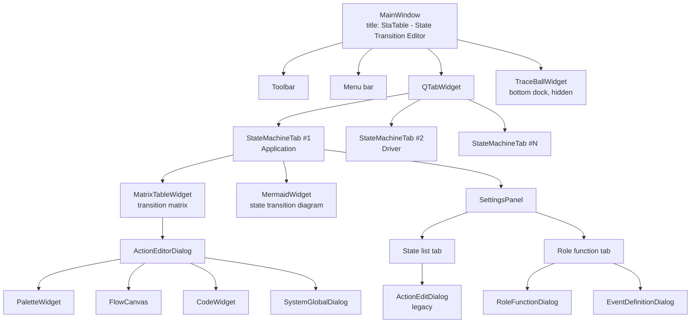
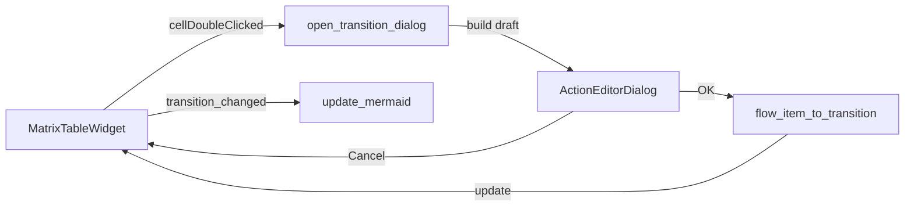
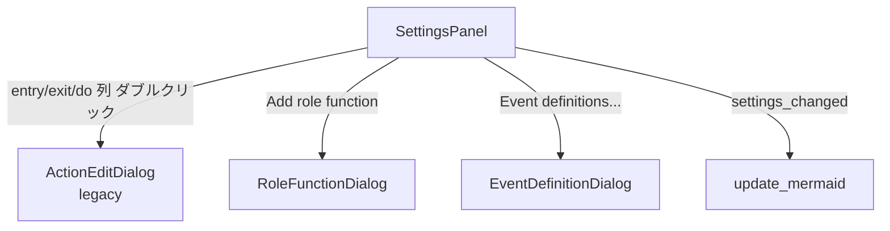
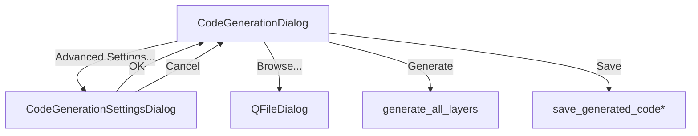
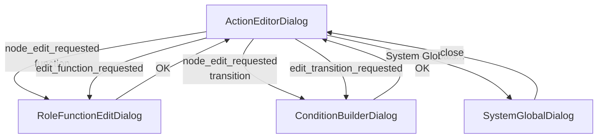
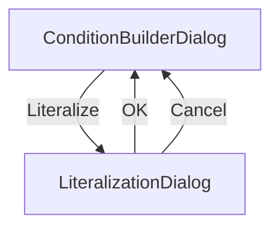
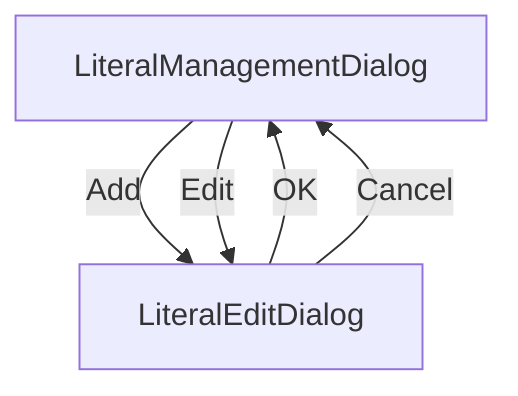

# StaTable 画面遷移仕様書 v1.2（日本語版）

版: 1.2
作成日: 2026-09-20
対象: 全 GUI 画面、ダイアログ、および埋め込み状態遷移図
根拠: `statable_gui/main_window.py` (v1.5), `statable_gui/widgets.py` (v2.2)

---

## 目次

1. 概要
2. 状態遷移図（MermaidWidget）
3. 画面階層
4. メインウィンドウ レイアウト
5. ツールバー / メニュー → ダイアログ遷移
6. タブレベル遷移
7. ダイアログレベル遷移
8. モーダル / モードレス分類
9. 遷移マトリクス
10. 改訂履歴

---

## 1. 概要

StaTable の GUI は以下で構成される：

- **MainWindow 1 個**（常駐、タイトル: `StaTable - State Transition Editor`）
- **タブ N 個**（層ごとに 1 個、閉じ可能、最小 1）
- **ダイアログ 16 個**（必要時に開閉）
- **埋め込み状態遷移図 1 個**（各タブ内の `MermaidWidget`）

状態遷移図は現在の `StateMachine` を **読み取り専用で可視化** するもので、Mermaid.js により `QWebEngineView` 内に描画される。

---

## 2. 状態遷移図（MermaidWidget）

### 2.1 概要

各 `StateMachineTab` には `MermaidWidget` が含まれ、現在の `StateMachine` の **状態遷移図** を表示する。読み取り専用で、常にモデルと同期される。

| 項目 | 値 |
|------|-----|
| ウィジェットクラス | `MermaidWidget`（`statable_gui/widgets.py`） |
| 生成器 | `statable.mermaid_gen.generate_mermaid(sm)` |
| 描画エンジン | Mermaid.js（`mermaidwin.js` リソース） |
| 描画ホスト | `QWebEngineView`（PySide6-Addons） |
| 出力形式 | `stateDiagram-v2` |
| 更新トリガー | `StateMachineTab.update_mermaid()` |
| フォールバック（WebEngine 不可） | `QPlainTextEdit` に生の Mermaid コード + インストール案内 |
| フォールバック（`STATABLE_DISABLE_MERMAID=1`） | `QLabel` に `"Mermaid rendering disabled (test mode)"` |

### 2.2 `StateMachineTab` 内のレイアウト

```
┌────────────────────────────────────────────────────────────────┐
│  StateMachineTab (QWidget)                                     │
│  QHBoxLayout                                                   │
│  ┌────────────────────────────────────────┐  ┌───────────────┐ │
│  │ QSplitter(Qt.Vertical)  [stretch=3]    │  │ SettingsPanel │ │
│  │ ┌────────────────────────────────────┐ │  │ [stretch=1]   │ │
│  │ │ MatrixTableWidget                  │ │  │               │ │
│  │ │ (transition matrix)                │ │  │  QTabWidget   │ │
│  │ │                                    │ │  │ ┌───────────┐ │ │
│  │ │  [state × event cells]             │ │  │ │State list │ │ │
│  │ ├────────────────────────────────────┤ │  │ ├───────────┤ │ │
│  │ │ MermaidWidget                      │ │  │ │Role       │ │ │
│  │ │ (state transition diagram)  ★      │ │  │ │function   │ │ │
│  │ │                                    │ │  │ └───────────┘ │ │
│  │ │  [*] --> Idle                      │ │  │               │ │
│  │ │  Idle --> Active : (START)         │ │  │ [Add][Delete] │ │
│  │ │  Active --> Idle : (STOP)          │ │  │               │ │
│  │ │  ...                               │ │  │ [Event        │ │
│  │ │                                    │ │  │  definitions] │ │
│  │ └────────────────────────────────────┘ │  │               │ │
│  └────────────────────────────────────────┘  └───────────────┘ │
└────────────────────────────────────────────────────────────────┘
```

**スプリッタサイズ**（`widgets.py` より）:

```python
table_height   = int(WINDOW_HEIGHT * TABLE_PREVIEW_RATIO)
mermaid_height = WINDOW_HEIGHT - table_height
left_split.setSizes([table_height, mermaid_height])
```

**最小サイズ**:
- `MatrixTableWidget`: `setMinimumHeight(300)`
- `MermaidWidget`: `setMinimumHeight(MERMAID_PREVIEW_MIN_HEIGHT)`

### 2.3 生成規則（`mermaid_gen.py`）

`generate_mermaid(sm)` の出力:

```
stateDiagram-v2
    direction LR
    [*] --> <initial_state>                         # sm.initial_state 設定時
    <source> --> <target> : <label>                 # target を持つ各遷移
    note right of <source> : internal: <label>      # 内部遷移（target なし）
```

**ラベル構成**（`label_parts`、スペースで連結）:

| 順序 | 要素 | 条件 |
|------|------|------|
| 1 | `t.title` | `title` 設定済かつ `"(無題遷移)"` でない |
| 1（代替） | `t.target` | title 空かつ target あり |
| 1（代替） | `"(内部)"` | title 空かつ target なし |
| 2 | `(<event>)` | `t.event` が非空 |
| 3 | `[<condition>]` | `t.condition` が非空（§2.4 で短縮） |

**注記**:
- アクションは図に表示されない
- title の既定値は `"(無題遷移)"`。これと一致する場合は空として扱われる

### 2.4 条件式の短縮（`_truncate_condition`）

```python
def _truncate_condition(condition: str, max_chars: int = 50) -> str:
    if not condition:
        return ""
    lines = condition.split('\n')
    first_line = lines[0].strip() if lines else ""
    if not first_line:
        return ""
    if len(first_line) > max_chars:
        return first_line[:max_chars].rstrip() + "..."
    if len(lines) > 1:
        return first_line + " ..."
    return first_line
```

| 入力 | 出力 |
|------|------|
| `""` | `""` |
| `"a == 1"` | `"a == 1"` |
| `"a == 1\nb == 2"` | `"a == 1 ..."` |
| `"x" * 60` | `"x" * 50 + "..."` |

### 2.5 描画パイプライン

```mermaid
sequenceDiagram
    participant ST as StateMachineTab
    participant MW as MermaidWidget
    participant FS as FileSystem
    participant Web as QWebEngineView

    ST->>ST: update_mermaid()
    ST->>ST: settings.apply_changes()
    ST->>ST: table.populate()
    ST->>ST: code = generate_mermaid(sm)
    ST->>MW: set_mermaid_code(code)
    alt _disabled (STATABLE_DISABLE_MERMAID=1)
        MW-->>ST: return (no-op)
    else web_view available
        MW->>FS: check mermaidwin.js exists
        alt not exists
            MW-->>ST: log error, return
        else exists
            MW->>FS: write temp .html with inline <pre class="mermaid">
            MW->>Web: load(QUrl.fromLocalFile(temp_html))
            Web-->>MW: loadFinished(ok)
            MW->>Web: page().runJavaScript("renderMermaid();")
        end
    else text_view fallback
        MW->>MW: text_view.setPlainText(code)
    end
```

### 2.6 環境変数 `STATABLE_DISABLE_MERMAID`

`STATABLE_DISABLE_MERMAID=1` を設定すると、Mermaid 描画を完全に無効化する。

| 環境 | 挙動 |
|------|------|
| 未設定 / `0` | 通常: `QWebEngineView` + `mermaidwin.js` |
| `1` | `QLabel("Mermaid rendering disabled (test mode)")` — import は試行しない |

**重要**: `STATABLE_DISABLE_MERMAID=1` 時、`QWebEngineView` の import は **モジュールロード時にスキップ** されるため、`PySide6-Addons` は不要。

CI（`tests` ジョブ）で QtWebEngine を要求しないために使用される。

### 2.7 フォールバック挙動

| 条件 | ウィジェット | 内容 |
|------|-------------|------|
| 通常 | `QWebEngineView` | 描画済 Mermaid 図 |
| `STATABLE_DISABLE_MERMAID=1` | `QLabel` | `"Mermaid rendering disabled (test mode)"` |
| WebEngine import 失敗 | `QPlainTextEdit` | 生 Mermaid コード + `"pip install PySide6-Addons"` 案内 |
| `mermaidwin.js` 不在 | `QWebEngineView`（変更なし） | エラーログのみ、直前の内容を保持 |

---

## 3. 画面階層



---

## 4. メインウィンドウ レイアウト

```
┌─────────────────────────────────────────────────────────────┐
│  メニューバー: File / Edit / Validate(&V) /                 │
│                Code generation(&G) / View                   │
├─────────────────────────────────────────────────────────────┤
│  ツールバー: Global definitions | Type definitions |        │
│             Event definitions | Event delivery settings |   │
│             Interrupt settings | Layer settings |           │
│             Validation / AI diagnosis |                     │
│             Code generation | Generation settings |         │
│             Save generated code | Open | Save |             │
│             New tab | Rename tab | Show log                 │
├─────────────────────────────────────────────────────────────┤
│  centralWidget = QTabWidget（閉じ可能）                     │
│  cornerWidget（右上）: "+" ボタン                           │
│  ┌───────────────────────────────────────────────────────┐  │
│  │ ┌───────┐┌───────┐┌───────┐                           │  │
│  │ │ App   ││ Drv   ││ Mid   │                    [+]    │  │
│  │ └───────┘└───────┘└───────┘                           │  │
│  ├───────────────────────────────────────────────────────┤  │
│  │  StateMachineTab（レイアウトは §2.2 参照）             │  │
│  └───────────────────────────────────────────────────────┘  │
├─────────────────────────────────────────────────────────────┤
│  TraceBallWidget (BottomDockWidgetArea、既定で非表示)       │
└─────────────────────────────────────────────────────────────┘
```

**ウィンドウタイトル**: `StaTable - State Transition Editor`

---

## 5. ツールバー / メニュー → ダイアログ遷移

### 5.1 ツールバーボタン（ソース上の正確なラベル）

| ボタン | アクション | 開くダイアログ |
|--------|-----------|---------------|
| `Global definitions` | `open_global_defs_dialog` | `GlobalDefinitionsDialog` |
| `Type definitions` | `open_type_manager` | `TypeManagerDialog` |
| `Event definitions` | `open_event_definition_dialog` | `EventDefinitionDialog` |
| `Event delivery settings` | `open_event_delivery_settings` | `EventDeliverySettingsDialog` |
| `Interrupt settings` | `open_interrupt_settings` | `InterruptHandlerEditDialog` |
| `Layer settings` | `open_layer_settings` | `LayerSettingsDialog` |
| `Validation / AI diagnosis` | `open_validation_dialog` | `ValidationDialog` |
| `Code generation` | `open_code_generation_dialog` | `CodeGenerationDialog` |
| `Generation settings` | `open_code_generation_settings` | `CodeGenerationSettingsDialog` |
| `Save generated code` | `save_generated_code_direct` | （直接実行） |
| `Open` | `open_project` | `QFileDialog` |
| `Save` | `save_project` | `QFileDialog` |
| `New tab` | `add_new_tab` | `QInputDialog` |
| `Rename tab` | `rename_current_tab` | `QInputDialog` |
| `Show log` | `toggle_traceball` | TraceBallWidget |

### 5.2 メニュー項目（ソース上の正確なラベル）

| メニュー | 項目 | ショートカット |
|---------|------|---------------|
| `File` | `Open Project...` | – |
| `File` | `Save Project...` | – |
| `File` | `Rename Tab...` | – |
| `File` | `New State Machine` | – |
| `Edit` | `Global Definitions...` | – |
| `Edit` | `Type Definitions...` | – |
| `Edit` | `Event Definitions...` | – |
| `Edit` | `Event Delivery Settings...` | – |
| `Edit` | `Interrupt Settings...` | – |
| `Edit` | `Layer Settings...` | – |
| `Validate(&V)` | `Validation / AI diagnosis...` | `Ctrl+Shift+V` |
| `Code generation(&G)` | `Code generation...` | `Ctrl+G` |
| `Code generation(&G)` | `Generation settings...` | `Ctrl+Shift+G` |
| `Code generation(&G)` | `Save generated code...` | `Ctrl+Shift+S` |
| `View` | `TraceBall` | – |

---

## 6. タブレベル遷移

### 6.1 タブ操作

| 操作 | トリガー | ハンドラ |
|------|---------|---------|
| タブ追加 | `+` ボタン / `New tab` | `add_new_tab` |
| タブ閉じ | タブ閉じボタン | `close_tab` |
| タブ名変更 | タブバー ダブルクリック | `rename_tab_at` |
| タブ切替 | タブクリック | （Qt 既定） |

**注記**: `close_tab` は最後のタブを閉じるのを拒否する（`"At least one tab is required."`）。

### 6.2 セル編集（`MatrixTableWidget` から）



### 6.3 設定パネル編集



**SettingsPanel のタブと列（ソース上の正確な値）**:

| タブ | 列 |
|------|-----|
| `State list` | Name, Description, entry function, exit function, do function, Type |
| `Role function` | Title, Function name, Namespace, Description, Return type, Arg 1 type, Arg 1 name, Arg 2 type, Arg 2 name |

**ボタン**:

| タブ | ボタン |
|------|--------|
| `State list` | `Add`, `Delete` |
| `Role function` | `Add`, `Delete`, `Event definitions...` |

### 6.4 entry / exit の扱い（v2.2）

`State.entry` と `State.exit` は `List[str]`。UI では `"; "` で連結した文字列として表示する。

| 関数 | 用途 |
|------|------|
| `_list_to_display(items)` | `List[str]` → `"A; B; C"` |
| `_display_to_list(text)` | `"A; B; C"` → `List[str]` |

- 表示: `_list_to_display(state.entry)`
- 反映: `_display_to_list(item.text())`
- ツールチップ: `"Multiple functions: separate with '; '\nDouble-click to edit via action dialog"`

---

## 7. ダイアログレベル遷移

### 7.1 `CodeGenerationDialog`



### 7.2 `ActionEditorDialog`



### 7.3 `ConditionBuilderDialog`



### 7.4 `LiteralManagementDialog`



---

## 8. モーダル / モードレス分類

全ダイアログはモーダル（`exec()`）。

| ダイアログ | 種別 |
|-----------|------|
| `GlobalDefinitionsDialog` | モーダル |
| `TypeManagerDialog` | モーダル |
| `EventDefinitionDialog` | モーダル |
| `EventDeliverySettingsDialog` | モーダル |
| `InterruptHandlerEditDialog` | モーダル |
| `LayerSettingsDialog` | モーダル |
| `ValidationDialog` | モーダル |
| `CodeGenerationDialog` | モーダル |
| `CodeGenerationSettingsDialog` | モーダル |
| `ActionEditorDialog` | モーダル |
| `RoleFunctionEditDialog` | モーダル |
| `ConditionBuilderDialog` | モーダル |
| `SystemGlobalDialog` | モーダル |
| `LiteralizationDialog` | モーダル |
| `LiteralManagementDialog` | モーダル |
| `LiteralEditDialog` | モーダル |
| `QFileDialog` | モーダル |
| `QInputDialog` | モーダル |

---

## 9. 遷移マトリクス

### 9.1 MainWindow から

| 起点 | → ダイアログ | メソッド |
|------|-------------|---------|
| ツールバー `Global definitions` | GlobalDefinitionsDialog | `open_global_defs_dialog` |
| ツールバー `Type definitions` | TypeManagerDialog | `open_type_manager` |
| ツールバー `Event definitions` | EventDefinitionDialog | `open_event_definition_dialog` |
| ツールバー `Event delivery settings` | EventDeliverySettingsDialog | `open_event_delivery_settings` |
| ツールバー `Interrupt settings` | InterruptHandlerEditDialog | `open_interrupt_settings` |
| ツールバー `Layer settings` | LayerSettingsDialog | `open_layer_settings` |
| ツールバー `Validation / AI diagnosis` | ValidationDialog | `open_validation_dialog` |
| ツールバー `Code generation` | CodeGenerationDialog | `open_code_generation_dialog` |
| ツールバー `Generation settings` | CodeGenerationSettingsDialog | `open_code_generation_settings` |
| ツールバー `New tab` | QInputDialog | `add_new_tab` |
| ツールバー `Rename tab` | QInputDialog | `rename_current_tab` |
| メニュー `Open Project...` | QFileDialog | `open_project` |
| メニュー `Save Project...` | QFileDialog | `save_project` |

### 9.2 ダイアログ / ウィジェット間

| 起点 | → 対象 | トリガー |
|------|--------|---------|
| CodeGenerationDialog | CodeGenerationSettingsDialog | `Advanced Settings...` |
| CodeGenerationDialog | QFileDialog | `Browse...` |
| ActionEditorDialog | RoleFunctionEditDialog | パレット / ノード ダブルクリック |
| ActionEditorDialog | ConditionBuilderDialog | transition ノード ダブルクリック |
| ActionEditorDialog | SystemGlobalDialog | `System Globals...` |
| ConditionBuilderDialog | LiteralizationDialog | `Literalize` |
| LiteralManagementDialog | LiteralEditDialog | `Add` / `Edit` |
| SettingsPanel (State list) | ActionEditDialog | entry/exit/do 列 ダブルクリック |
| SettingsPanel (Role function) | RoleFunctionDialog | `Add` |
| SettingsPanel (Role function) | EventDefinitionDialog | `Event definitions...` |
| MatrixTableWidget | ActionEditorDialog | `cellDoubleClicked` |

### 9.3 シグナルフロー → Mermaid 更新

| シグナル | 発信元 | → スロット |
|---------|--------|-----------|
| `transition_changed` | `MatrixTableWidget` | `StateMachineTab.update_mermaid` |
| `settings_changed` | `SettingsPanel` | `StateMachineTab.update_mermaid` |

`update_mermaid()` の実行順:
1. `settings.apply_changes()`
2. `table.populate()`
3. `generate_mermaid(sm)`
4. `mermaid.set_mermaid_code(code)`

---

## 10. 改訂履歴

| 版 | 日付 | 内容 |
|----|------|------|
| 1.0 | 2026-09-20 | 英語初版 |
| 1.1 | 2026-09-20 | `main_window.py` v1.5 の UI ラベルに修正 |
| 1.2 | 2026-09-20 | §2 状態遷移図（MermaidWidget）追加、SettingsPanel の列修正、v2.2 の entry/exit 対応を反映 |