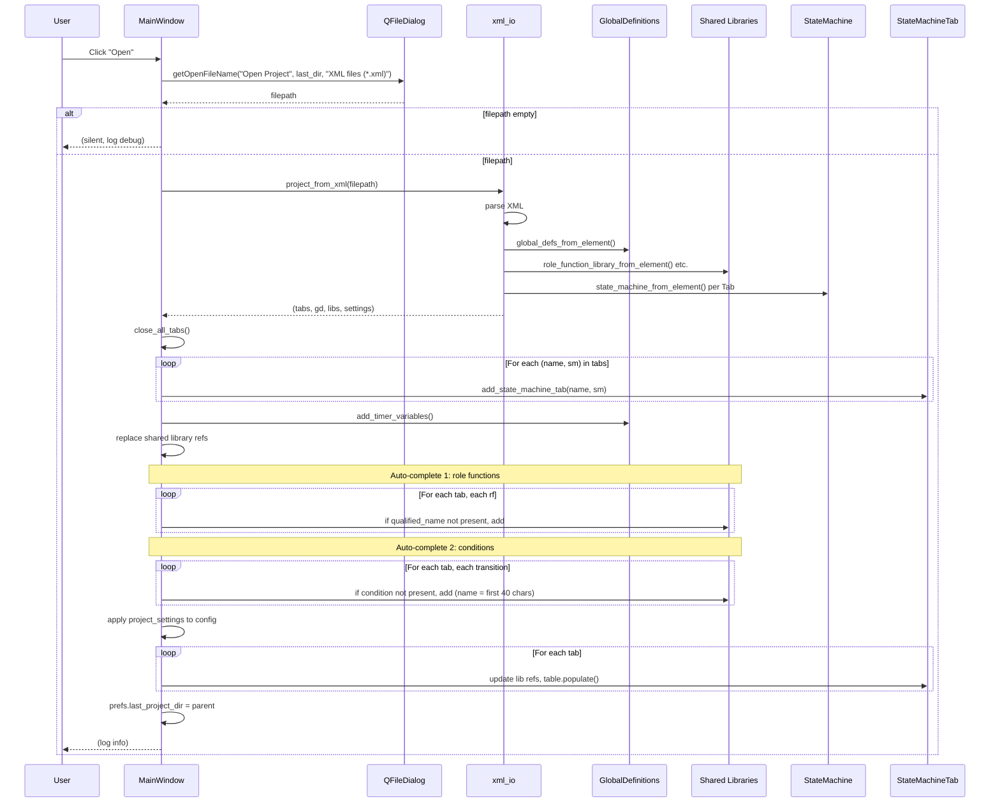
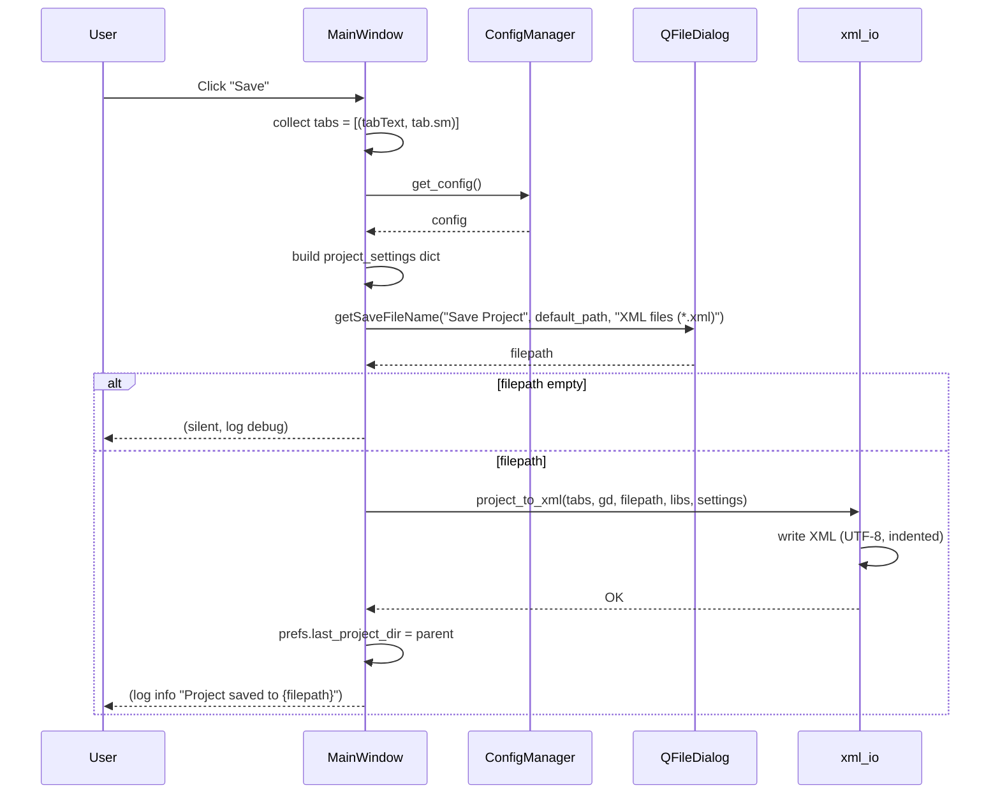
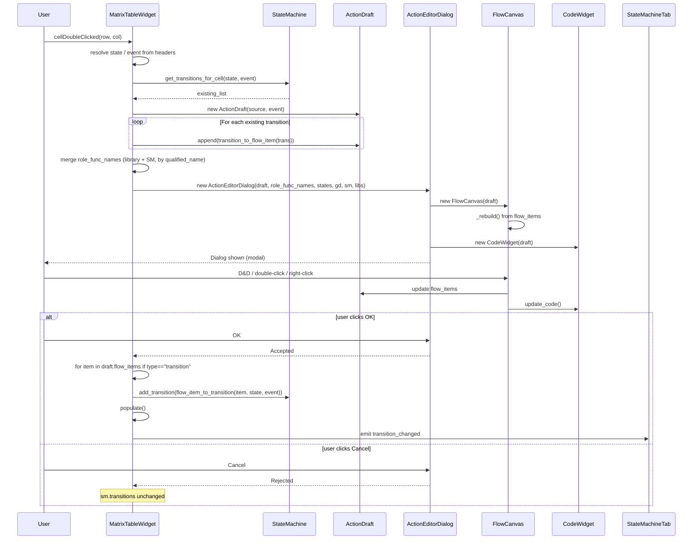
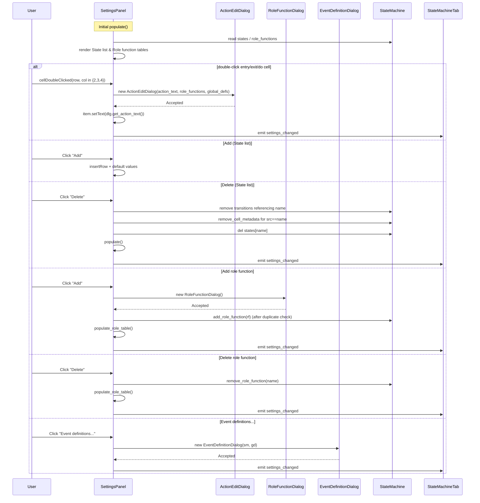
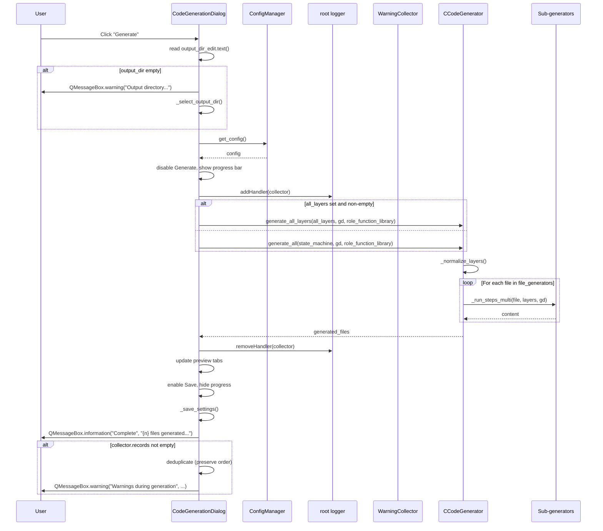
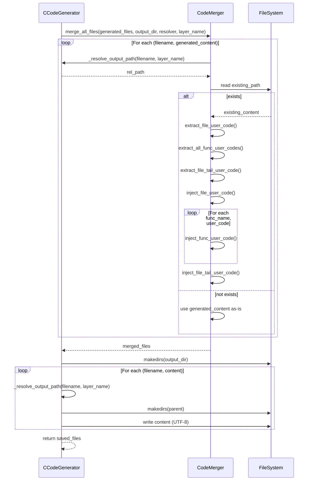
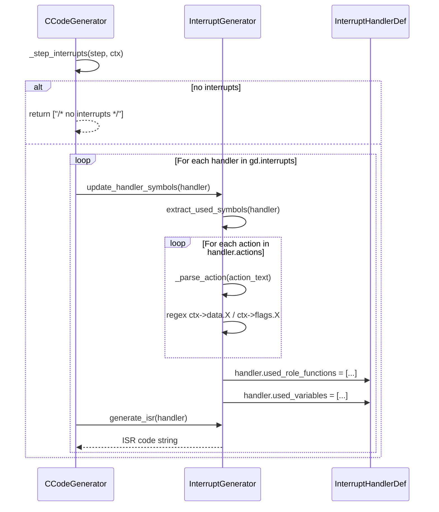
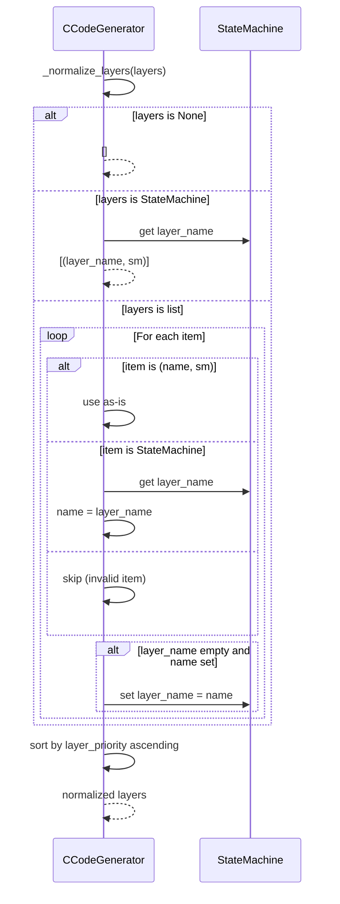
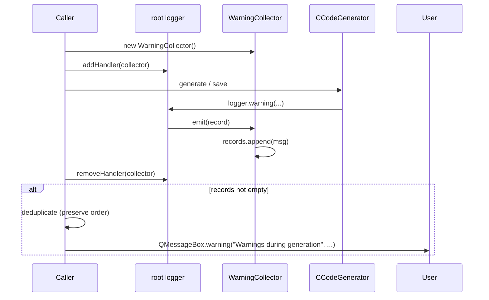

# StaTable Sequence Specification v1.2 (English)

Version: 1.2
Date: 2026-09-20
Scope: Runtime sequences for startup, editing, generation, save, and Mermaid updates
Source basis: `main_window.py` (v1.5), `widgets.py` (v2.2), `code_generation_dialog.py`, `c_code_generator.py`, `code_merger.py`

---

## Table of Contents

1. Overview
2. Startup Sequence
3. Project Load Sequence
4. Project Save Sequence
5. Cell Editing Sequence
6. Settings Panel Editing Sequence
7. Mermaid Update Sequence
8. Code Generation Sequence
9. Code Save Sequence (with Merge)
10. ISR Symbol Update Sequence
11. Layer Normalization Sequence
12. Warning Collection Sequence
13. Cross-References
14. Revision History

---

## 1. Overview

This document defines the runtime sequences of StaTable. Each sequence lists:

- Trigger
- Participants
- Steps (as a Mermaid `sequenceDiagram` or `flowchart`)
- Success and failure paths

All user-facing message strings are quoted **exactly** as they appear in the source (v1.5 / v2.2).

---

## 2. Startup Sequence

### 2.1 Trigger

Application launch.

### 2.2 Participants

- `QApplication`
- `MainWindow`
- `StaTableLogger`
- `Preferences`
- `ConfigManager`
- `GlobalDefinitions`
- `RoleFunctionLibrary` / `ConditionLibrary` / `LiteralLibrary`
- `StateMachineTab`
- `SampleDataGenerator`

### 2.3 Sequence

```mermaid
sequenceDiagram
    participant User
    participant App as QApplication
    participant MW as MainWindow
    participant Log as StaTableLogger
    participant Pref as Preferences
    participant CM as ConfigManager
    participant GD as GlobalDefinitions
    participant Lib as Shared Libraries
    participant SM as SampleDataGenerator
    participant Tab as StateMachineTab

    User->>App: Run main.py
    App->>MW: new MainWindow()
    MW->>MW: setWindowTitle("StaTable - State Transition Editor")
    MW->>MW: resize(WINDOW_WIDTH, WINDOW_HEIGHT)
    MW->>Log: Initialize
    MW->>Pref: Load preferences
    MW->>CM: new ConfigManager()
    MW->>GD: create_sample_global_defs()
    GD->>GD: add_timer_variables()
    MW->>Lib: new RoleFunctionLibrary / ConditionLibrary / LiteralLibrary
    MW->>SM: create_sample_state_machine()
    SM-->>MW: sample_sm

    Note over MW,Lib: v1.5: register with namespace
    loop For each rf in sample_sm.role_functions
        MW->>Lib: RoleFunction(name, namespace, title, description)
        MW->>Lib: role_function_library.add(lib_rf)
    end

    MW->>Lib: condition_library.add(ERROR, RETRY)
    MW->>Lib: literal_library.add(RETRY_THRESHOLD, VOLTAGE_MIN)

    MW->>MW: QTabWidget setup (closable, tabCloseRequested)
    MW->>MW: add_tab_button = QToolButton("+")
    MW->>MW: tabBarDoubleClicked -> rename_tab_at
    MW->>MW: create_menus() / create_toolbar()
    MW->>MW: TraceBallWidget(self); addDockWidget; hide()

    MW->>Tab: add_state_machine_tab("Application", sample_sm)
    Tab->>Tab: MatrixTableWidget + MermaidWidget + SettingsPanel
    Tab->>Tab: update_mermaid()
    MW-->>User: Window shown
    App->>App: exec() event loop
```

### 2.4 Notes

- `add_state_machine_tab` sets `sm.layer_name = name` if unset.
- **[v1.5]** `RoleFunction` registration now passes `namespace=getattr(rf, 'namespace', '') or ''`.
- `+` button tooltip: `"Add new state machine"`.
- `add_timer_variables()` is called twice (once inside `create_sample_global_defs`, once after).

---

## 3. Project Load Sequence

### 3.1 Trigger

Toolbar `Open` or Menu → `Open Project...`.

### 3.2 Sequence



### 3.3 Auto-completion Details

Two automatic registrations occur after load:

| Step | Target | Condition | Name generation |
|------|--------|-----------|-----------------|
| 1 | Role functions | `qualified_name` not yet in library | `qualified_name` |
| 2 | Transition conditions | `condition` string not yet in library | first 40 chars of `condition`, with `_2`, `_3`, … on collision |

**Registered condition description**: `f"Auto-collected ({_tab_name})"`

### 3.4 Failure Path

If `project_from_xml` raises:

```
QMessageBox.critical(
    self, "Error",
    f"Failed to open project:\n{e}")
```

Existing tabs remain unchanged (except those already closed by `close_all_tabs`).

---

## 4. Project Save Sequence

### 4.1 Trigger

Toolbar `Save` or Menu → `Save Project...`.

### 4.2 Sequence



### 4.3 `project_settings` Fields

Assembled by `MainWindow.save_project`:

```
project_name, table_type, generation_style, os_type,
folder_structure, include_dir_name, source_dir_name,
common_dir_name, project_dir_name,
generate_super_include, super_include_file,
external_includes, external_includes_in_super,
external_includes_in_role, external_includes_in_transitions,
external_includes_in_common, max_consecutive_pending_events
```

**Note**: `super_include_dir` is **not** included (see Known Constraints in `SPEC_OVERVIEW_en.md` §12).

### 4.4 Failure Path

```
QMessageBox.critical(
    self, "Error",
    f"Failed to save project:\n{e}")
```

---

## 5. Cell Editing Sequence

### 5.1 Trigger

Double-click a cell in `MatrixTableWidget`, or press `Enter` / `F2`, or `Delete` / `Backspace`.

### 5.2 Sequence



### 5.3 Delete Path

| Key | Action |
|-----|--------|
| `Enter` / `F2` | Open edit dialog |
| `Delete` / `Backspace` | Remove all transitions in the cell |

For delete: `sm.remove_transition(t)` for each in `cell.data(Qt.UserRole)`, then `populate()` + `emit transition_changed`.

---

## 6. Settings Panel Editing Sequence

### 6.1 Trigger

Any of the following in `SettingsPanel`:

- Double-click on an `entry function` / `exit function` / `do function` cell in the State list tab
- Click `Add` / `Delete` in either tab
- Click `Event definitions...` in the Role function tab

### 6.2 Sequence



### 6.3 Item Change Debounce

`state_table.itemChanged` and `role_table.itemChanged` trigger a 300 ms debounce timer:

```python
self._debounce_timer = QTimer()
self._debounce_timer.setSingleShot(True)
self._debounce_timer.setInterval(300)
self._debounce_timer.timeout.connect(self._emit_settings_changed)
```

### 6.4 Apply Changes (entry / exit as List[str], v2.2)

`SettingsPanel.apply_changes()` parses the table back into the model:

| Field | Display form | Model form |
|-------|-------------|-----------|
| `entry` | `"; "`-joined string | `List[str]` |
| `exit` | `"; "`-joined string | `List[str]` |
| `do` | plain string | `str` |

Conversion:

```python
entry_list = _display_to_list(entry_text)   # "A; B" -> ["A", "B"]
exit_list  = _display_to_list(exit_text)
```

Role functions are fully cleared and rebuilt:

```python
self.sm.role_functions.clear()
for row in ...:
    self.sm.add_role_function(RoleFunction(...))
```

---

## 7. Mermaid Update Sequence

### 7.1 Trigger

Any signal connected to `StateMachineTab.update_mermaid`:

| Signal | Source |
|--------|--------|
| `transition_changed` | `MatrixTableWidget` |
| `settings_changed` | `SettingsPanel` |
| `__init__` | `StateMachineTab` (initial render) |

### 7.2 Sequence

```mermaid
sequenceDiagram
    participant Trigger as Signal Source
    participant Tab as StateMachineTab
    participant SP as SettingsPanel
    participant MT as MatrixTableWidget
    participant MG as mermaid_gen
    participant MW as MermaidWidget
    participant FS as FileSystem
    participant Web as QWebEngineView

    Trigger->>Tab: update_mermaid()
    Tab->>SP: apply_changes()
    Tab->>MT: populate()
    Tab->>MG: generate_mermaid(sm)
    MG-->>Tab: code
    Tab->>MW: set_mermaid_code(code)

    alt _disabled (STATABLE_DISABLE_MERMAID=1)
        MW-->>Tab: (no-op; QLabel placeholder shown)
    else web_view available
        MW->>FS: check mermaidwin.js
        alt not found
            MW-->>Tab: log error, return
        else found
            MW->>FS: write temp .html (delete=False)
            MW->>Web: load(QUrl.fromLocalFile(temp_html))
            Web-->>MW: loadFinished(ok)
            MW->>Web: page().runJavaScript("renderMermaid();")
        end
    else text_view fallback
        MW->>MW: text_view.setPlainText(code)
    end
```

### 7.3 Notes

- `apply_changes()` is called **before** `populate()` — the model is updated from the UI first.
- `MermaidWidget.set_mermaid_code` writes an inline HTML to a temp file each time; the temp file is **not** deleted by this code.
- WebEngine file access is enabled via `QWebEngineSettings.LocalContentCanAccessFileUrls` and `LocalContentCanAccessRemoteUrls`.

---

## 8. Code Generation Sequence

### 8.1 Trigger

`CodeGenerationDialog._generate_code()`, invoked by the `Generate` button.

### 8.2 Sequence



### 8.3 Exception Path

```
QMessageBox.critical(self, "Error", f"Code generation failed:\n{e}")
self.generate_btn.setEnabled(True)
self.progress_bar.setVisible(False)
```

`root_logger.removeHandler(collector)` is always called in `finally`.

### 8.4 Layer-Specific Branch

`generate_all_layers` dispatches internally:

- `folder_structure == 'by_layer'` → `_generate_all_by_layer()`
- Otherwise → `_run_steps_multi()` for each file

---

## 9. Code Save Sequence (with Merge)

### 9.1 Trigger

`CCodeGenerator.save_generated_code_with_merge(files, output_dir, layer_name='')`.

### 9.2 Sequence



### 9.3 Marker Extraction Patterns

| Marker | Start | End |
|--------|-------|-----|
| File user code | `/* [[STABLE_USER_CODE_START]] */` | `/* [[STABLE_USER_CODE_END]] */` |
| Function user code | `/* [[STABLE_USER_CODE_START:<name>]] */` | `/* [[STABLE_USER_CODE_END:<name>]] */` |
| File tail user code | `/* [[STABLE_USER_CODE_TAIL_START]] */` | `/* [[STABLE_USER_CODE_TAIL_END]] */` |
| Auto-generated region | `/* [[STABLE_AUTO_GENERATED_START]] */` | `/* [[STABLE_AUTO_GENERATED_END]] */` |

Function name extraction:

```python
FUNC_NAME_PATTERNS = [
    r'RoleFunc_(\w+)\s*\(',   # RoleFunc_Driver_Init -> 'Driver_Init'
    r'ISR_(\w+)\s*\(',        # ISR_TIMER0           -> 'TIMER0'
]
```

### 9.4 Injection Rules

| Target | Behavior |
|--------|----------|
| `inject_file_user_code` | Insert after the **last** `#include` line; if none, insert at top |
| `inject_func_user_code` | **Replace** existing marker block; if not found, no-op + warning |
| `inject_file_tail_user_code` | **Replace** existing tail marker block; if not found, no-op + warning |

---

## 10. ISR Symbol Update Sequence

### 10.1 Trigger

`CCodeGenerator._step_interrupts` during code generation.

### 10.2 Sequence



### 10.3 Action Parsing Rules

| Input | C output | `used_role_functions` entry |
|-------|----------|----------------------------|
| `Driver.Init` | `RoleFunc_Driver_Init(NULL, ctx)` | `["Driver.Init"]` |
| `Driver.Init(arg)` | `RoleFunc_Driver_Init(NULL, ctx)` | `["Driver.Init"]` |
| `Init(args)` | `RoleFunc_<Layer>_Init(NULL, ctx)` | `["<Layer>.Init"]` |
| `RoleFunc_XXX(...)` | as-is | (empty) |
| C keyword (`if`, `return`) | as-is | (empty) |

When `condition` is set, `_parse_action_with_semicolon` wraps:

```c
if (<condition>) { <body>; }
```

### 10.4 ISR Template Sections

Fixed section comments inside each ISR:

1. `/* ===== コンテキスト参照（自動生成） ===== */` — see `ISR_TEMPLATES['context_section']`
2. `/* ===== 入場ログ ===== */`
3. `/* ===== アクション（自動生成） ===== */`
4. `/* ===== ユーザー追加領域 ===== */`
5. `/* ===== 退場ログ ===== */`

> Note: The actual source of `interrupt_generator.py` uses literal strings for these sections; refer to `code_templates.ISR_TEMPLATES` for the canonical values.

---

## 11. Layer Normalization Sequence

### 11.1 Trigger

`generate_all_layers(layers, ...)` entry.

### 11.2 Sequence



### 11.3 Notes

- Priority range: 1–9 (default 5)
- Sorted **ascending** → lower priority value executes first
- `MainWindow._get_all_layers()` also sorts by `layer_priority` before passing to the generator

---

## 12. Warning Collection Sequence

### 12.1 Trigger

`MainWindow.save_generated_code_direct` or `CodeGenerationDialog._generate_code`.

### 12.2 Sequence



### 12.3 Warning Sources

| Source | Message |
|--------|---------|
| `_run_steps_multi` | Unknown step action |
| `_generate_table_switch` | Not implemented, fallback to array |
| `_generate_process_switch_case` | Not implemented, fallback to table_driven |
| `merge_all_files` | `path_resolver` failed |
| `inject_func_user_code` | Marker not found |
| `inject_file_tail_user_code` | Tail marker not found |
| `_step_interrupts` | `update_handler_symbols` failed |
| `_dedupe_by_name` | Duplicate name skipped |
| `_extract_func_names_from_condition` | C keyword excluded |

### 12.4 User-Facing Messages (exact from source)

| Context | Title | Body |
|---------|-------|------|
| No layers | `Warning` | `No layers are defined.` |
| No tab | `Warning` | `There is no state transition tab.` |
| Close last tab | `Warning` | `At least one tab is required.` |
| No output dir | `Warning` | `Output directory is not set.\nFirst set the output directory in settingsPlease specify.` |
| No tabs | `Warning` | `There are no tabs.` |
| Save failed | `Error` | `Failed to save project:\n{e}` |
| Open failed | `Error` | `Failed to open project:\n{e}` |
| Gen failed | `Error` | `Code generation failed:\n{e}` |
| Save complete | `Save complete` | `{n} files saved.\nLayers: {m}\n\nOutput: {dir}` |
| Warnings | `Warnings during generation` | `The following warnings occurred:\n\n- {msg}...` |
| Rename tab | `Rename Tab` | `Enter new tab name:` |
| New tab | `New State Machine` | `Enter tab name:` |

---

## 13. Cross-References

| Sequence | Related Specification |
|----------|----------------------|
| §2 Startup | `SPEC_OVERVIEW_en.md` §2.5 |
| §3 Project Load | `SPEC_OVERVIEW_en.md` §3.5 |
| §4 Project Save | `SPEC_OVERVIEW_en.md` §3.5 |
| §5 Cell Editing | `SPEC_SCREENS_en.md` §6.2 |
| §6 Settings Panel | `SPEC_SCREENS_en.md` §6.3, §6.4 |
| §7 Mermaid Update | `SPEC_SCREENS_en.md` §2 |
| §8 Code Generation | `SPEC_CODEGEN_v3.md` §6 |
| §9 Code Save | `SPEC_CODEGEN_v3.md` §6.3 |
| §10 ISR Update | `SPEC_CODEGEN_v3.md` §4.8 |
| §11 Layer Normalization | `SPEC_CODEGEN_v3.md` §6.2 |
| §12 Warning Collection | `SPEC_CODEGEN_v3.md` §10 |

---

## 14. Revision History

| Version | Date | Content |
|---------|------|---------|
| 1.0 | 2026-09-20 | Initial English version |
| 1.1 | 2026-09-20 | Corrected exact UI labels and message strings from `main_window.py` v1.5 |
| 1.2 | 2026-09-20 | Added §7 Mermaid Update Sequence; added §6 Settings Panel Editing Sequence; aligned with `widgets.py` v2.2 entry/exit `List[str]` handling |