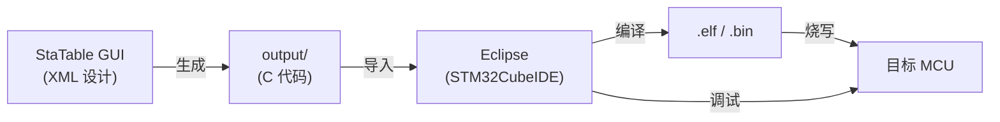

# StaTable Eclipse 集成指南 — 复合烹饪器具

Version: 1.0
Date: 2026-10-04
适用：Galanz 等复合烹饪器具的软件开发
目标用户：嵌入式软件工程师（具备 C / MCU / Eclipse 基础）

---

## 目录

1. 前言
2. 环境准备
3. STM32CubeIDE 集成（推荐）
4. 标准 Eclipse CDT 集成
5. 国产 MCU 应用（GD32 等）
6. 调试配置
7. 常见问题（FAQ）

---

## 1. 前言

### 1.1 本文目的

本文档说明如何将 **StaTable 生成的 C 代码** 集成到 **Eclipse 系 IDE** 中：

- STM32CubeIDE（ST 官方 Eclipse 发行版，最推荐）
- 标准 Eclipse + CDT + GNU ARM Toolchain
- 国产 MCU（GD32 等，与 STM32 引脚兼容）

包括项目创建、源码导入、构建配置、调试配置的完整流程。

### 1.2 目标工作流



### 1.3 前提条件

| # | 前提 | 说明 |
|---|---|---|
| 1 | StaTable v3.3.0 以上 | 已安装并可使用 |
| 2 | `cooking_heater_controller.xml` | 六层架构示例 |
| 3 | Eclipse 系 IDE | STM32CubeIDE 或标准 CDT |
| 4 | GNU ARM Toolchain | `arm-none-eabi-gcc` |
| 5 | 调试探针 | ST-Link / J-Link 等 |
| 6 | 目标 MCU | STM32F4 / F7 / G0 等 |

---

## 2. 环境准备

### 2.1 工具链一览

| 工具 | 用途 | 下载源 |
|---|---|---|
| STM32CubeIDE | IDE + 配置工具 + 编译器 | ST 官网 |
| GNU ARM Toolchain | 编译工具链（CubeIDE 内置） | ARM 官网 |
| ST-Link Utility | 烧写工具（可选） | ST 官网 |
| OpenOCD | 开源调试器（J-Link 用） | openocd.org |

### 2.2 StaTable 侧的准备

在生成 C 代码前，确认以下设置：

1. **启动 StaTable GUI**:

   ```powershell
   cd C:\Users\user\OneDrive\ドキュメント\GitHub\StaTable\code
   python -m statable
   ```

2. **打开示例**:
   - 菜单 **File → Open Project...**
   - 选择 `code/docs/samples/cooking_heater_controller.xml`

3. **代码生成设置**:
   - 菜单 **Code generation → Generation settings...** (**Ctrl+Shift+G**)
   - **Output settings** 标签页:
     - Output directory: `C:\projects\cooking\output`
     - Folder structure: `by_layer`（推荐）
     - Save with merge: ✅
   - **Code generation → Code generation...** (**Ctrl+G**)

4. **确认生成的文件**:

   ```
   output/
   ├── Application/
   ├── Driver/
   ├── MwGrill/
   ├── MwMicrowave/
   ├── MwOven/
   ├── MwSteam/
   ├── include/
   ├── src/
   └── common/
   ```

### 2.3 目标 MCU 的选型

复合烹饪器具常用的 STM32:

| 系列 | 内核 | 推荐用途 |
|---|---|---|
| **STM32G0** | Cortex-M0+ | 入门 / 单功能机 |
| **STM32G4** | Cortex-M4 (FPU) | 复合机 / PID 控制 |
| **STM32F4** | Cortex-M4 (FPU) | 高性能 / 多功能 |
| **STM32F7** | Cortex-M7 | 高端 / HMI |

---

## 3. STM32CubeIDE 集成（推荐）

### 3.1 为什么推荐 STM32CubeIDE

| # | 理由 |
|---|---|
| 1 | **一体化环境**：IDE + CubeMX + 编译器 + 调试器 |
| 2 | **免费**：ST 官方提供 |
| 3 | **中国本土普及率高**：大部分 STM32 工程师使用 |
| 4 | **HAL 库集成**：与 StaTable 生成的 Role 函数易于结合 |
| 5 | **中国服务器对应**：ST 中国提供下载镜像 |

### 3.2 安装 STM32CubeIDE

#### 步骤

1. 访问 **ST 中国官网**: `https://www.st.com/zh/development-tools/stm32cubeide.html`
2. 下载对应 OS 版本（推荐 Windows 10/11 x64）
3. 解压后执行安装程序
4. 安装过程中选择以下选项：
   - **Install ST-Link drivers**（调试探针用）
   - **Install GNU ARM Toolchain**（自动同捆）
   - 安装位置: 默认（`C:\ST\STM32CubeIDE_1.x.x`）

#### 中国本土用户注意事项

- 从 ST 中国官网下载通常需要 5〜15 分钟
- 安装后，首次启动时下载 **STM32Cube 固件包**（数百 MB）
- 在中国本土，从 ST 中国镜像（`https://www.stmcu.com.cn/`）下载速度更快

### 3.3 新建 STM32 项目

#### 步骤 1: 启动新项目

1. **File → New → STM32 Project**
2. 在 **MCU/MPU Selector** 中选择目标 MCU（例: `STM32G474RETx`）
3. Project Name: `CookingHeater`
4. Project Type: **STM32Cube**（默认）
5. **Finish**

#### 步骤 2: CubeMX 配置

STM32CubeIDE 会自动生成 `.ioc` 文件（CubeMX 设定）。

**必须设定**:

| 分类 | 设定 | 用途 |
|---|---|---|
| **RCC** | HSE / LSE 设定 | 外部时钟 |
| **SYS** | Debug: Serial Wire | SWD 调试 |
| **USART1** | 115200 bps, 8N1 | Android 面板通信用（零交叉同步） |
| **TIM1** | PWM 3ch (20kHz) | 加热器控制 |
| **TIM2** | PWM 1ch | 热风风扇 |
| **TIM3** | PWM 1ch | 蒸汽泵 |
| **ADC1** | CH0-3 (12bit) | 传感器输入 |
| **GPIO** | 各种输出 / 输入 | 磁控管 / 继电器 / 门 / 等 |

#### 步骤 3: 代码生成设定

1. **Project Manager → Code Generator**
2. 勾选以下内容：
   - ✅ **Generate peripheral initialization as a pair of '.c/.h' files per peripheral**
   - ✅ **Copy only the necessary library files**
   - ✅ **Set all free pins as analog**

3. **Project Manager → Advanced Settings**
   - **HAL**: `HAL`（推荐）
   - **Generate Under Root**: ✅

4. **Ctrl+S** 保存 → 自动生成代码

### 3.4 导入 StaTable 生成的代码

#### 步骤 1: 复制生成的代码

```powershell
# Windows PowerShell
$src = "C:\projects\cooking\output"
$dst = "C:\ST\workspace\CookingHeater\StaTable"

# 删除现有文件夹
Remove-Item $dst -Recurse -Force -ErrorAction SilentlyContinue

# 复制
Copy-Item $src $dst -Recurse -Force
Write-Host "[OK] copied StaTable output to $dst"
```

#### 步骤 2: 让 Eclipse 识别文件夹

1. 在 **Project Explorer** 中右键 `CookingHeater`
2. **Refresh**（或按 **F5**）
3. 出现 `StaTable/` 文件夹

#### 步骤 3: 添加包含路径

1. **Project → Properties**
2. **C/C++ Build → Settings**
3. **Tool Settings** 标签页:
   - **MCU/MPU GCC Compiler → Include paths**
   - **Add...** 添加以下内容：

   ```
   ../StaTable
   ../StaTable/Application
   ../StaTable/Driver
   ../StaTable/MwGrill
   ../StaTable/MwMicrowave
   ../StaTable/MwOven
   ../StaTable/MwSteam
   ../StaTable/include
   ```

4. **Apply and Close**

### 3.5 构建配置调整

#### 3.5.1 编译器标志

**Project → Properties → C/C++ Build → Settings → Tool Settings**

| 项目 | 设定 |
|---|---|
| **MCU/MPU GCC Compiler → Optimization** | `-O2` 或 `-Os` |
| **MCU/MPU GCC Compiler → Warnings** | `-Wall -Wextra` |
| **MCU/MPU GCC Compiler → Language** | `-std=c99` |

#### 3.5.2 链接脚本

StaTable 生成代码**不依赖链接脚本**。
可以直接使用默认的 `.ld` 文件（CubeMX 自动生成）。

#### 3.5.3 首次构建

```powershell
# Eclipse: Project → Build All (Ctrl+B)
```

**预期结果**:
```
Build Finished. 0 errors, 0 warnings.
```

`Debug/CookingHeater.elf` 会被生成。

---
## 4. 标准 Eclipse CDT 集成

### 4.1 适用场景

使用 STM32CubeIDE 以外的情况：

- 使用 GD32 等国产 MCU
- 使用 NXP / Renesas 等非 ST 厂商 MCU
- 已有 Eclipse 环境的团队

### 4.2 环境搭建

#### 4.2.1 Eclipse CDT 安装

1. 下载 **Eclipse IDE for C/C++ Developers**
   官网: `https://www.eclipse.org/downloads/packages/`
2. 解压到任意目录（例: `C:\eclipse\`）
3. 双击 `eclipse.exe` 启动

#### 4.2.2 GNU ARM Toolchain 安装

1. 下载 **Arm GNU Toolchain**
   官网: `https://developer.arm.com/downloads/-/arm-gnu-toolchain-downloads`
2. 安装到 `C:\Program Files (x86)\Arm GNU Toolchain arm-none-eabi\14.2 rel1\`
3. 将 `bin/` 加入 PATH 环境变量
4. 确认:
   ```powershell
   arm-none-eabi-gcc --version
   ```

#### 4.2.3 插件安装

Eclipse 中安装 **GNU MCU Eclipse 插件**:

1. **Help → Install New Software...**
2. Add Site: `https://download.eclipse.org/embed-cdt/updates/v6/`
3. 勾选 **GNU MCU Eclipse ARM Embedded GCC** 与 **GNU MCU Eclipse OpenOCD**
4. 安装后重启

### 4.3 创建项目

1. **File → New → C Project**
2. Project Name: `CookingHeater`
3. Project Type: **Empty Project**
4. Toolchain: **Cross GCC**
5. **Finish**

### 4.4 添加 StaTable 代码

同 STM32CubeIDE（§3.4）:

1. 复制 `output/` 到项目内
2. Refresh (F5)
3. 添加 Include paths

### 4.5 Makefile 自动生成

Eclipse CDT 会基于配置自动生成 Makefile。
**不需要手写**。

构建: **Project → Build All (Ctrl+B)**

---

## 5. 国产 MCU 应用（GD32 等）

### 5.1 GD32 与 STM32 的兼容性

| 项目 | 兼容性 | 备注 |
|---|---|---|
| 引脚 | 完全兼容 | 同封装可替换 |
| 外设寄存器 | 大部分兼容 | 时钟树略有差异 |
| HAL 库 | 不兼容 | 需使用 GigaDevice 官方库 |
| 中断向量 | 大部分兼容 | 部分重命名 |

### 5.2 GD32 项目创建

1. 从 GigaDevice 官网下载 **GD32Firmware Library**
2. STM32CubeIDE 或标准 Eclipse 中：
   - 新建 Empty Project
   - 添加 GD32 固件库源文件
   - 添加 StaTable 生成代码
   - Include paths 追加 GD32 库头文件路径
3. 修改 `system_gd32fxxx.c` 的时钟配置

### 5.3 从 STM32 迁移到 GD32

步骤:

1. **替换启动文件**: `startup_stm32xxx.s` → `startup_gd32xxx.s`
2. **替换链接脚本**: `.ld` 文件（内存映射可能不同）
3. **替换 HAL 调用**: `HAL_GPIO_WritePin` → `gpio_bit_set` 等
4. **StaTable Role 函数内修改**: `[[STABLE_USER_CODE_START/END]]` 之间

**StaTable 生成代码本身无需修改**（纯 C99）。

### 5.4 中国本土 MCU 一览

| 厂商 | 系列 | 与 STM32 兼容 |
|---|---|---|
| **GigaDevice (兆易创新)** | GD32 | ✅ 高 |
| **极海半导体** | APM32 | ✅ 高 |
| **中颖电子** | SH79 | ❌ 8bit |
| **灵动微电子** | MM32 | ✅ 中 |

---

## 6. 调试配置

### 6.1 ST-Link 调试（STM32CubeIDE）

#### 6.1.1 自动配置

STM32CubeIDE 通常自动识别 ST-Link。
点击 **Run → Debug (F11)** 即可开始调试。

#### 6.1.2 手动配置

1. **Run → Debug Configurations...**
2. 双击 **STM32 C/C++ Application**
3. **Debugger** 标签页:
   - Debug probe: **ST-LINK (OpenOCD)**
   - Interface: **SWD**
4. **Apply → Debug**

### 6.2 J-Link 调试

#### 6.2.1 SEGGER J-Link 驱动安装

1. 从 SEGGER 官网下载 J-Link 软件包
2. 安装后，将 `JLinkGDBServer.exe` 路径加入 PATH

#### 6.2.2 Eclipse 配置

1. **Run → Debug Configurations...**
2. **GDB OpenOCD Debugging** 或 **GDB SEGGER J-Link Debugging**
3. **Debugger** 标签页:
   - GDB Client: `arm-none-eabi-gdb`
   - GDB Server: `JLinkGDBServer.exe`
   - Device: `STM32G474RE`
   - Interface: **SWD**
4. **Apply → Debug**

### 6.3 OpenOCD + CMSIS-DAP

适用于开源调试探针（如 DAPLink）。

配置示例:

```
# openocd.cfg
source [find interface/cmsis-dap.cfg]
source [find target/stm32g4x.cfg]
```

Eclipse: **GDB OpenOCD Debugging** → Config options:
```
-f interface/cmsis-dap.cfg -f target/stm32g4x.cfg
```

### 6.4 调试技巧

| # | 技巧 |
|---|---|
| 1 | **断点**: 在 Role 函数内设置 |
| 2 | **变量监视**: 关注 `ctx->data.*` |
| 3 | **状态机查看**: 监视 `current_state` |
| 4 | **实时变量**: Live Expressions 使用 |
| 5 | **SWO 输出**: `printf` 重定向到 SWO |

---

## 7. 常见问题（FAQ）

### Q1: 编译时报错找不到 `statable_all.h`

**原因**: Include path 未配置。

**对策**:
```
Project → Properties → C/C++ Build → Settings
→ MCU/MPU GCC Compiler → Include paths
```
追加 `../StaTable` 等。

### Q2: 链接时报错 `undefined reference to ...`

**原因**: 生成的 `.c` 文件未包含在构建中。

**对策**:
1. 确认 `StaTable/` 已复制到项目内
2. Refresh (F5)
3. **Project → Clean... → Build All**

### Q3: 调试时程序卡在 `SystemContext_Init`

**原因**: 时钟未正确初始化。

**对策**:
在 `main.c` 的 `SystemContext_Init(&ctx)` 之前确保：
```c
HAL_Init();
SystemClock_Config();
```

### Q4: 烧写后无反应

**原因**: BOOT 引脚配置错误，或链接脚本起始地址不符。

**对策**:
1. 确认 BOOT0 引脚为 GND
2. 确认链接脚本 `FLASH ORIGIN = 0x08000000`

### Q5: GD32 替换 STM32 后编译错误

**原因**: HAL 库不兼容。

**对策**: 使用 GD32 官方固件库重写 Role 函数内的 HAL 调用。

### Q6: 提示"GDB Server 无法启动"

**原因**: 端口被占用或驱动未安装。

**对策**:
1. 检查 ST-Link / J-Link 是否被其他程序占用（如 STM32CubeProgrammer）
2. 重新安装 ST-Link / J-Link 驱动
3. 尝试更换 USB 端口

### Q7: 如何处理中文路径问题

**原因**: ARM GCC 对非 ASCII 路径支持有限。

**对策**:
- **项目路径使用全英文**（如 `C:\projects\cooking\`）
- **避免** `C:\用户\文档\项目\` 等中文路径
- StaTable 生成代码本身无此问题

---

## 变更历史

| 版本 | 日期 | 内容 |
|---|---|---|
| 1.0 | 2026-10-04 | 初版（Eclipse 集成指南） |

---

*本文档为 Galanz 复合烹饪器具的 StaTable Eclipse 集成参考资料。*