# StaTable 七层架构设计指南 — 复合烹饪器具

Version: 1.1
Date: 2026-10-04
适用对象：Galanz 等复合烹饪器具（微波炉 / 烤箱 / 蒸箱 / 组合机）的软件设计者
关联文件：`cooking_heater_controller.xml`

---

## 目录

1. 前言
2. 七层架构总览
3. 设计理论
   - 3.1 为什么需要七层
   - 3.2 各层职责
   - 3.3 层间通信原则
4. 实现详解
   - 4.1 DriverInput 层（输入系）
   - 4.2 DriverOutput 层（输出系）
   - 4.3 MwMicrowave 层
   - 4.4 MwOven 层
   - 4.5 MwGrill 层
   - 4.6 MwSteam 层
   - 4.7 Application 层
5. 层间交互模式
6. 扩展指南
7. 参考资料

---

## 1. 前言

### 1.1 本文目的

本文档说明 **复合烹饪器具** 的 StaTable 七层架构设计，
包括设计理论与实现细节，供以下人员参考：

- 软件设计者：设计状态机、编写用户代码
- 系统架构师：审查层间职责划分
- 测试工程师：理解各层测试边界

### 1.2 背景

Galanz 等复合烹饪器具（微波炉 + 烤箱 + 蒸箱 + 组合）的软件具有以下特征：

| 特征 | 挑战 |
|---|---|
| 多种加热方式 | 微波 / 烤箱 / 烧烤 / 蒸箱 独立或并列 |
| 多阶段烹饪 | 如"微波 → 烤箱 → 蒸" 三段连续 |
| 精确温控 | PID + 移动平均 + 多传感器融合 |
| 主从架构 | Android 面板为主，MCU 为从 |
| 通信噪声 | AC 零交叉同步串行（低噪声时刻通信） |
| 安全要求 | 过热保护、门锁、异常检测 |

单一状态机无法清晰表达这些复杂性，因此采用 **七层架构**。

---

## 2. 七层架构总览

### 2.1 整体结构

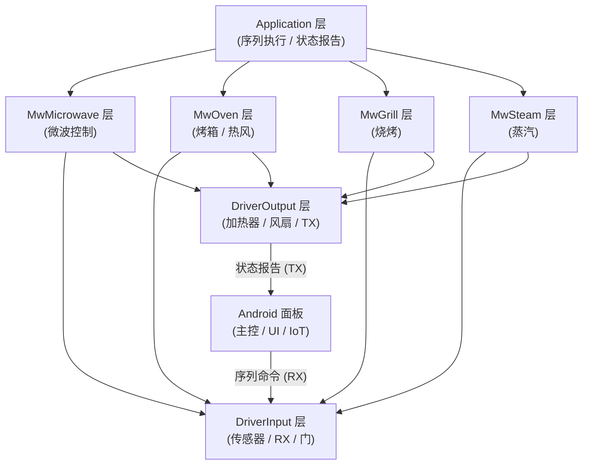

### 2.2 层一览

| # | 层 | 职责 | 状态数 | 优先级 |
|---|---|---:|---:|---:|
| 1 | **Application** | 烹饪序列执行、状态报告 | 5 | 5 |
| 2 | **MwSteam** | 蒸汽发生控制 | 5 | 3 |
| 3 | **MwGrill** | 烧烤加热控制 | 3 | 3 |
| 4 | **MwOven** | 烤箱 / 热风控制 | 3 | 3 |
| 5 | **MwMicrowave** | 微波控制 | 4 | 3 |
| 6 | **DriverInput** | 输入系（传感器 / RX / 门） | 5 | 1 |
| 7 | **DriverOutput** | 输出系（加热器 / 风扇 / TX） | 6 | 1 |

**优先级数值越小越先执行**（DriverInput / DriverOutput 最优先）。

### 2.3 命名空间

| 层名 | 命名空间 | 生成文件前缀 |
|---|---|---|
| Application | `Application.*` | `statable_*_Application.c` |
| MwSteam | `MwSteam.*` | `statable_*_MwSteam.c` |
| MwGrill | `MwGrill.*` | `statable_*_MwGrill.c` |
| MwOven | `MwOven.*` | `statable_*_MwOven.c` |
| MwMicrowave | `MwMicrowave.*` | `statable_*_MwMicrowave.c` |
| DriverInput | `DriverInput.*` | `statable_*_DriverInput.c` |
| DriverOutput | `DriverOutput.*` | `statable_*_DriverOutput.c` |

---

## 3. 设计理论

### 3.1 为什么需要七层

#### 3.1.1 单一状态机的问题

假设所有功能放入 1 个状态机：

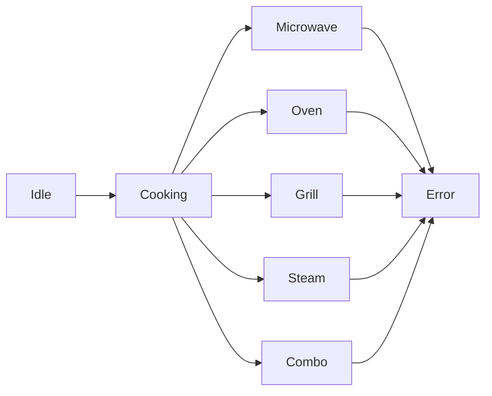

问题点：

| # | 问题 |
|---|---|
| 1 | 状态数爆炸（各加热方式 × 各异常 = 数十状态） |
| 2 | 状态迁移条件复杂（`if (mode == MICROWAVE && temp > X && ...)`） |
| 3 | 测试困难（1 个状态变更影响全体） |
| 4 | 并列加热（微波 + 蒸汽）难以表达 |

#### 3.1.2 分层后的效果

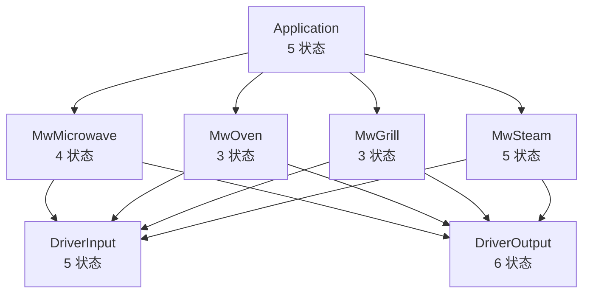

| # | 效果 |
|---|---|
| 1 | 状态数线性增长（5 + 4 + 3 + 3 + 5 + 5 + 6 = 31，而非 数十） |
| 2 | 各层独立测试可能 |
| 3 | 并列加热 = Application 层同时激活多个中间层 |
| 4 | 新加热方式 = 新中间层追加（既有层不变） |
| 5 | Driver 分离为输入系 / 输出系，责任明确 |

### 3.2 各层职责

#### 3.2.1 职责划分原则

| # | 原则 |
|---|---|
| 1 | **下层不知道上层存在**（单向依赖） |
| 2 | **中间层之间不直接通信**（通过 Application 层协调） |
| 3 | **DriverInput / DriverOutput 层只做 HW 抽象**（无业务逻辑） |
| 4 | **Application 层只做序列**（无 HW 操作） |

#### 3.2.2 职责一览

| 层 | 输入 | 处理 | 输出 |
|---|---|---|---|
| **DriverInput** | HW 信号（ADC / 门 / ZC）、串行数据 | 传感器读取、移动平均、事件发行 | 事件 → 中间层 |
| **DriverOutput** | 中间层指令 | 加热器 / 风扇 / 磁控管 PWM、串行发送 | HW 输出、状态报告 |
| **MwMicrowave** | Application 指令 | 磁控管起停、功率控制 | 加热、事件 |
| **MwOven** | Application 指令 | PID 温控、热风、加热管 | 加热、事件 |
| **MwGrill** | Application 指令 | 烧烤加热管控制 | 加热、事件 |
| **MwSteam** | Application 指令 | 锅炉控制、脉冲注水 | 蒸汽、事件 |
| **Application** | Android 序列 | 序列解析、阶段推进 | 中间层指令、报告 |

### 3.3 层间通信原则

#### 3.3.1 通信方式：事件驱动

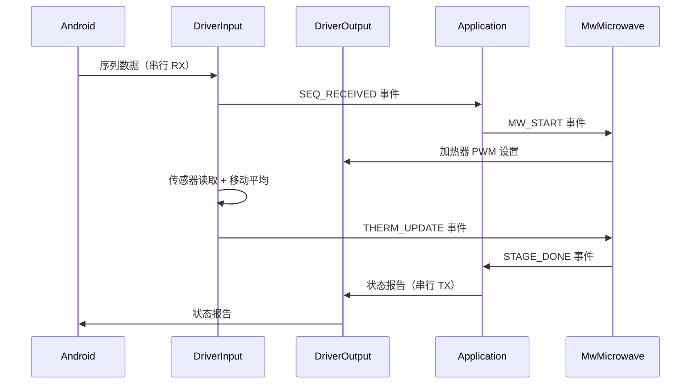

#### 3.3.2 事件类型

| 方向 | 事件示例 | delivery |
|---|---|---|
| DriverInput → 中间层 | `THERM_UPDATE`, `IR_READY` | queue |
| DriverInput → 中间层 | `HW_FAULT` | queue |
| 中间层 → DriverOutput | （通过 RoleFunc 直接调用） | — |
| 中间层 → Application | `STAGE_DONE`, `OVERHEAT` | direct |
| Application → DriverOutput | （通过 RoleFunc 直接调用） | — |

#### 3.3.3 数据流：共享变量

除了事件之外，通过 **GlobalDefinitions 的变量**共享数据：

| 变量 | 更新元 | 参照元 |
|---|---|---|
| `thermistor_top` | DriverInput | MwOven, MwGrill |
| `ir_value` | DriverInput | Application |
| `steam_sensor` | DriverInput | MwSteam |
| `oven_target_temp` | Application | MwOven |
| `mw_power` | Application | MwMicrowave |

**原则**：**更新仅由 1 层负责，参照可由多层进行**（读写分离）。

---
## 4. 实现详解

### 4.1 DriverInput 层（输入系）

#### 4.1.1 职责

DriverInput 层负责**输入系硬件**的读取与事件发行：

- ADC 传感器读取（IR / 蒸汽 / 热敏电阻 × 3 / 湿度）
- 移动平均计算
- AC 零交叉同步 UART 接收（ZC_RX）
- 门开关监控（安全）
- 输入事件发行（IR_READY / STEAM_READY / THERM_READY）

#### 4.1.2 状态（5）

| # | 状态 | 说明 |
|---|---|---|
| 1 | `InIdle` | 待机（等待中断） |
| 2 | `InSensing` | ADC 读取 + 移动平均 |
| 3 | `InTxRx` | 零交叉同步 UART 接收 |
| 4 | `InDoorOpen` | 门开启（安全） |
| 5 | `InError` | 输入错误 |

#### 4.1.3 状态迁移图

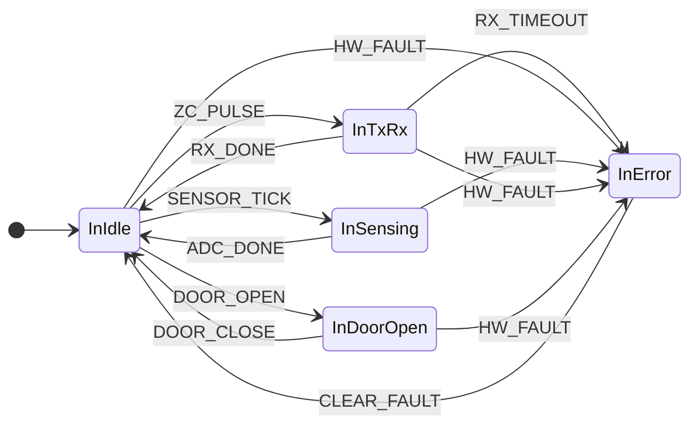

#### 4.1.4 事件（9）

| # | 事件 | delivery | priority | 说明 |
|---|---|---|---|---:|---|
| 1 | `SENSOR_TICK` | queue | 0 | 周期传感器触发 |
| 2 | `ADC_DONE` | direct | 0 | ADC 转换完成 |
| 3 | `ZC_PULSE` | direct | 9 | AC 零交叉脉冲 |
| 4 | `RX_DONE` | direct | 0 | UART 接收完成 |
| 5 | `RX_TIMEOUT` | direct | 5 | UART 接收超时 |
| 6 | `DOOR_OPEN` | direct | 9 | 门开启（安全） |
| 7 | `DOOR_CLOSE` | direct | 9 | 门关闭 |
| 8 | `HW_FAULT` | queue | 9 | 硬件故障 |
| 9 | `CLEAR_FAULT` | direct | 0 | 清除故障 |

#### 4.1.5 主要 Role 函数（6）

| # | 函数 | 用途 |
|---|---|---|
| 1 | `ReadSensorsMovingAvg` | 传感器读取 + 移动平均 |
| 2 | `EmitIrReady` | 发布 IR_READY 事件 |
| 3 | `EmitSteamReady` | 发布 STEAM_READY 事件 |
| 4 | `EmitThermReady` | 发布 THERM_READY 事件 |
| 5 | `ReceiveCommand` | 从面板接收命令 |
| 6 | `OnDoorOpen` | 门开启时立即停止（安全） |

---

### 4.2 DriverOutput 层（输出系）

#### 4.2.1 职责

DriverOutput 层负责**输出系硬件**的控制：

- 加热器 PWM / ON-OFF（上部 / 中部 / 下部）
- 对流风扇 PWM / ON-OFF
- 蒸汽泵 ON-OFF
- 磁控管 PWM / ON-OFF（逆变器控制）
- AC 零交叉同步 UART 发送（ZC_TX）
- 阳极电流监控

#### 4.2.2 状态（6）

| # | 状态 | 说明 |
|---|---|---|
| 1 | `OutIdle` | 全输出 OFF |
| 2 | `OutHeating` | 加热器输出中 |
| 3 | `OutFanPump` | 风扇 / 泵运行中 |
| 4 | `OutMag` | 磁控管运行中 |
| 5 | `OutTx` | UART 发送中 |
| 6 | `OutError` | 输出错误 |

#### 4.2.3 状态迁移图

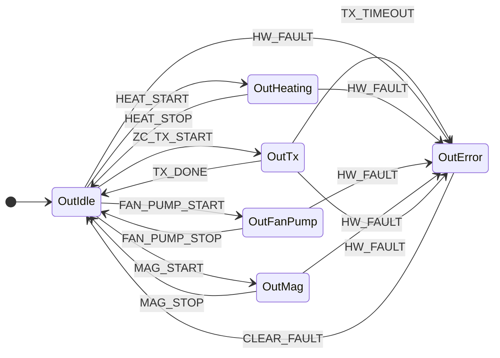

#### 4.2.4 事件（11）

| # | 事件 | delivery | priority | 说明 |
|---|---|---|---|---:|---|
| 1 | `HEAT_START` | direct | 0 | 开始加热 |
| 2 | `HEAT_STOP` | direct | 0 | 停止加热 |
| 3 | `FAN_PUMP_START` | direct | 0 | 风扇 / 泵启动 |
| 4 | `FAN_PUMP_STOP` | direct | 0 | 风扇 / 泵停止 |
| 5 | `MAG_START` | direct | 0 | 磁控管启动 |
| 6 | `MAG_STOP` | direct | 0 | 磁控管停止 |
| 7 | `ZC_TX_START` | direct | 9 | 零交叉同步发送开始 |
| 8 | `TX_DONE` | direct | 0 | UART 发送完成 |
| 9 | `TX_TIMEOUT` | direct | 5 | UART 发送超时 |
| 10 | `HW_FAULT` | queue | 9 | 硬件故障 |
| 11 | `CLEAR_FAULT` | direct | 0 | 清除故障 |

#### 4.2.5 主要 Role 函数（13）

| # | 函数 | 用途 |
|---|---|---|
| 1 | `SetHeaterOn` | 加热器 ON（全功率） |
| 2 | `SetHeaterOff` | 加热器 OFF |
| 3 | `SetHeaterPwm` | 加热器 PWM duty 设置 |
| 4 | `SetFanOn` | 风扇 ON |
| 5 | `SetFanOff` | 风扇 OFF |
| 6 | `SetFanPwm` | 风扇 PWM duty 设置 |
| 7 | `SetPumpOn` | 泵 ON |
| 8 | `SetPumpOff` | 泵 OFF |
| 9 | `SetMagOn` | 磁控管 ON（全功率） |
| 10 | `SetMagOff` | 磁控管 OFF |
| 11 | `SetMagPwm` | 磁控管 PWM（逆变器电力控制） |
| 12 | `SendStatusMaster` | 向面板发送状态 |
| 13 | `CheckAnodeCurrent` | 磁控管阳极电流监控 |

---

### 4.3 MwMicrowave 层

#### 4.3.1 职责

微波控制的专用层：

- 磁控管软启动 / 预热（Preheating）
- 功率级别设置（PWM 逆变器控制）
- 阳极电流监控（异常检测）

#### 4.3.2 状态（4）

| # | 状态 | 说明 |
|---|---|---|
| 1 | `MwIdle` | 待机 |
| 2 | `Preheating` | 磁控管预热（软启动） |
| 3 | `Heating` | 磁控管加热中 |
| 4 | `MwError` | 微波错误 |

#### 4.3.3 状态迁移图

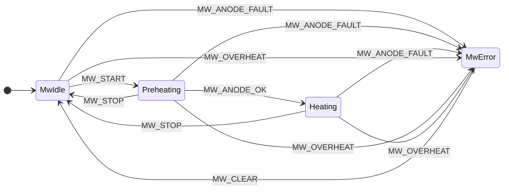

#### 4.3.4 事件（6）

| # | 事件 | delivery | priority |
|---|---|---|---:|
| 1 | `MW_START` | direct | 0 |
| 2 | `MW_STOP` | direct | 0 |
| 3 | `MW_ANODE_OK` | direct | 0 |
| 4 | `MW_ANODE_FAULT` | queue | 9 |
| 5 | `MW_OVERHEAT` | queue | 9 |
| 6 | `MW_CLEAR` | direct | 0 |

#### 4.3.5 Role 函数（6）

| # | 函数 | 用途 |
|---|---|---|
| 1 | `StartMagnetron` | 磁控管软启动 |
| 2 | `StopMagnetron` | 磁控管停止 |
| 3 | `SetMwPower` | 功率级别设置 |
| 4 | `CheckAnodeCurrent` | 阳极电流监控 |
| 5 | `LogMwFault` | 微波故障记录 |
| 6 | `ClearMwFault` | 微波故障清除 |

---

### 4.4 MwOven 层

#### 4.4.1 职责

烤箱 / 热风控制（含烤架）：

- PID 温度控制
- 上部 / 下部 / 背部加热器控制
- 热风（Convection）风扇控制

#### 4.4.2 状态（3）

| # | 状态 | 说明 |
|---|---|---|
| 1 | `OvIdle` | 待机 |
| 2 | `PidHeating` | PID 加热中 |
| 3 | `OvError` | 烤箱错误 |

#### 4.4.3 状态迁移图

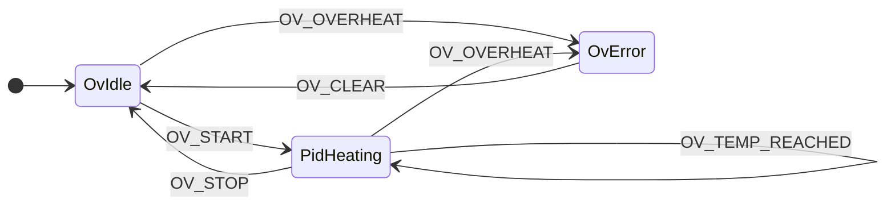

#### 4.4.4 事件（6）

| # | 事件 | delivery | priority |
|---|---|---|---:|
| 1 | `OV_START` | direct | 0 |
| 2 | `OV_STOP` | direct | 0 |
| 3 | `OV_TEMP_REACHED` | direct | 0 |
| 4 | `OV_THERM_TICK` | queue | 0 |
| 5 | `OV_OVERHEAT` | queue | 9 |
| 6 | `OV_CLEAR` | direct | 0 |

#### 4.4.5 Role 函数（10）

| # | 函数 | 用途 |
|---|---|---|
| 1 | `StartOvenPid` | PID 控制开始 |
| 2 | `StopOvenPid` | PID 控制停止 |
| 3 | `SetTopHeaterDuty` | 上部加热器 duty |
| 4 | `SetBottomHeaterDuty` | 下部加热器 duty |
| 5 | `SetBackHeaterDuty` | 背部加热器 duty |
| 6 | `SetConvectionFan` | 热风风扇 duty |
| 7 | `ReadThermistors` | 全热敏电阻读取 |
| 8 | `CheckOvenOverheat` | 过热检测 |
| 9 | `LogOvFault` | 烤箱故障记录 |
| 10 | `ClearOvFault` | 烤箱故障清除 |

---

### 4.5 MwGrill 层

#### 4.5.1 职责

烧烤专用控制（上部加热器仅）：

- 烧烤加热器开 / 关
- duty 控制
- 过热检测

#### 4.5.2 状态（3）

| # | 状态 | 说明 |
|---|---|---|
| 1 | `GrIdle` | 待机 |
| 2 | `Grilling` | 烧烤加热中 |
| 3 | `GrError` | 烧烤错误 |

#### 4.5.3 状态迁移图

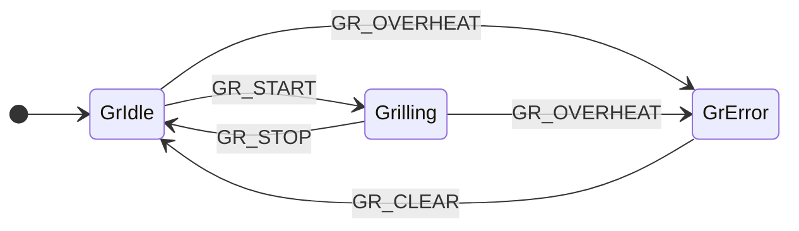

#### 4.5.4 事件（4）

| # | 事件 | delivery | priority |
|---|---|---|---:|
| 1 | `GR_START` | direct | 0 |
| 2 | `GR_STOP` | direct | 0 |
| 3 | `GR_OVERHEAT` | queue | 9 |
| 4 | `GR_CLEAR` | direct | 0 |

#### 4.5.5 Role 函数（6）

| # | 函数 | 用途 |
|---|---|---|
| 1 | `StartGrill` | 烧烤开始 |
| 2 | `StopGrill` | 烧烤停止 |
| 3 | `SetGrillDuty` | 烧烤 duty 设置 |
| 4 | `CheckGrillOverheat` | 过热检测 |
| 5 | `LogGrFault` | 烧烤故障记录 |
| 6 | `ClearGrFault` | 烧烤故障清除 |

---

### 4.6 MwSteam 层

#### 4.6.1 职责

蒸汽发生控制：

- 锅炉加热器控制
- 脉冲注水（Pulse pump ON/OFF 交互）
- 锅炉温度 PID

#### 4.6.2 状态（5）

| # | 状态 | 说明 |
|---|---|---|
| 1 | `StIdle` | 待机 |
| 2 | `Steaming` | 蒸汽发生中 |
| 3 | `PumpOn` | 泵脉冲 ON |
| 4 | `PumpOff` | 泵脉冲 OFF |
| 5 | `StError` | 蒸汽错误 |

#### 4.6.3 状态迁移图

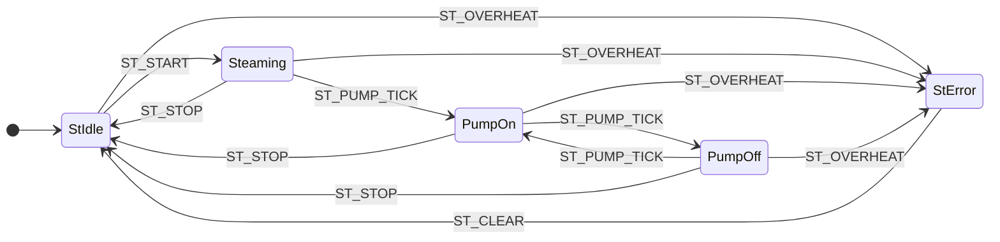

#### 4.6.4 事件（6）

| # | 事件 | delivery | priority |
|---|---|---|---:|
| 1 | `ST_START` | direct | 0 |
| 2 | `ST_STOP` | direct | 0 |
| 3 | `ST_BOILER_READY` | direct | 0 |
| 4 | `ST_PUMP_TICK` | queue | 0 |
| 5 | `ST_OVERHEAT` | queue | 9 |
| 6 | `ST_CLEAR` | direct | 0 |

#### 4.6.5 Role 函数（9）

| # | 函数 | 用途 |
|---|---|---|
| 1 | `StartBoilerHeater` | 锅炉加热器开始 |
| 2 | `StopBoilerHeater` | 锅炉加热器停止 |
| 3 | `PulsePump` | 脉冲注水 |
| 4 | `SetPumpDuty` | 泵 duty 设置 |
| 5 | `ReadBoilerTemp` | 锅炉温度读取 |
| 6 | `CalculateSteamPID` | 蒸汽 PID 计算 |
| 7 | `CheckSteamOverheat` | 过热检测 |
| 8 | `LogStFault` | 蒸汽故障记录 |
| 9 | `ClearStFault` | 蒸汽故障清除 |

---

### 4.7 Application 层

#### 4.7.1 职责

烹饪序列执行：

- Android 序列解析
- 阶段推进
- 状态报告
- 并列加热协调

#### 4.7.2 状态（5）

| # | 状态 | 说明 |
|---|---|---|
| 1 | `Idle` | 等待序列 |
| 2 | `Executing` | 阶段执行中 |
| 3 | `StepTransition` | 阶段间迁移 |
| 4 | `Completed` | 全阶段完成 |
| 5 | `Error` | 致命错误 |

#### 4.7.3 状态迁移图

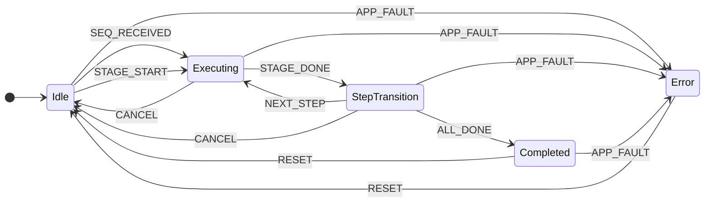

#### 4.7.4 事件（8）

| # | 事件 | delivery | priority |
|---|---|---|---:|
| 1 | `SEQ_RECEIVED` | direct | 0 |
| 2 | `STAGE_START` | direct | 0 |
| 3 | `STAGE_DONE` | direct | 0 |
| 4 | `NEXT_STEP` | direct | 0 |
| 5 | `ALL_DONE` | direct | 0 |
| 6 | `CANCEL` | direct | 1 |
| 7 | `APP_FAULT` | queue | 9 |
| 8 | `RESET` | direct | 0 |

#### 4.7.5 Role 函数（10）

| # | 函数 | 用途 |
|---|---|---|
| 1 | `ReceiveSequence` | 序列接收 |
| 2 | `ParseSequence` | 序列解析 |
| 3 | `StartStage` | 当前阶段开始 |
| 4 | `StopStage` | 当前阶段停止 |
| 5 | `CheckStageDone` | 阶段完成判定 |
| 6 | `NextStage` | 下一阶段推进 |
| 7 | `ReportStatus` | 状态报告 |
| 8 | `ReportComplete` | 完成报告 |
| 9 | `LogAppError` | 应用故障记录 |
| 10 | `ClearAppError` | 应用故障清除 |

---
## 5. 层间交互模式

### 5.1 单阶段烹饪

最简单的模式：Android 面板发送一个阶段，MCU 执行。

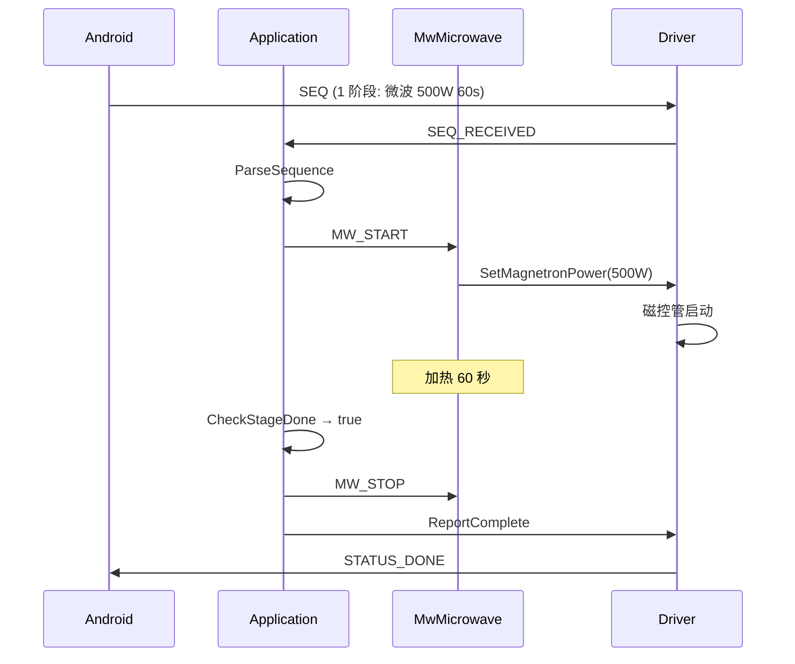

### 5.2 三阶段烹饪（顺序）

如"微波 → 烤箱 → 蒸"：

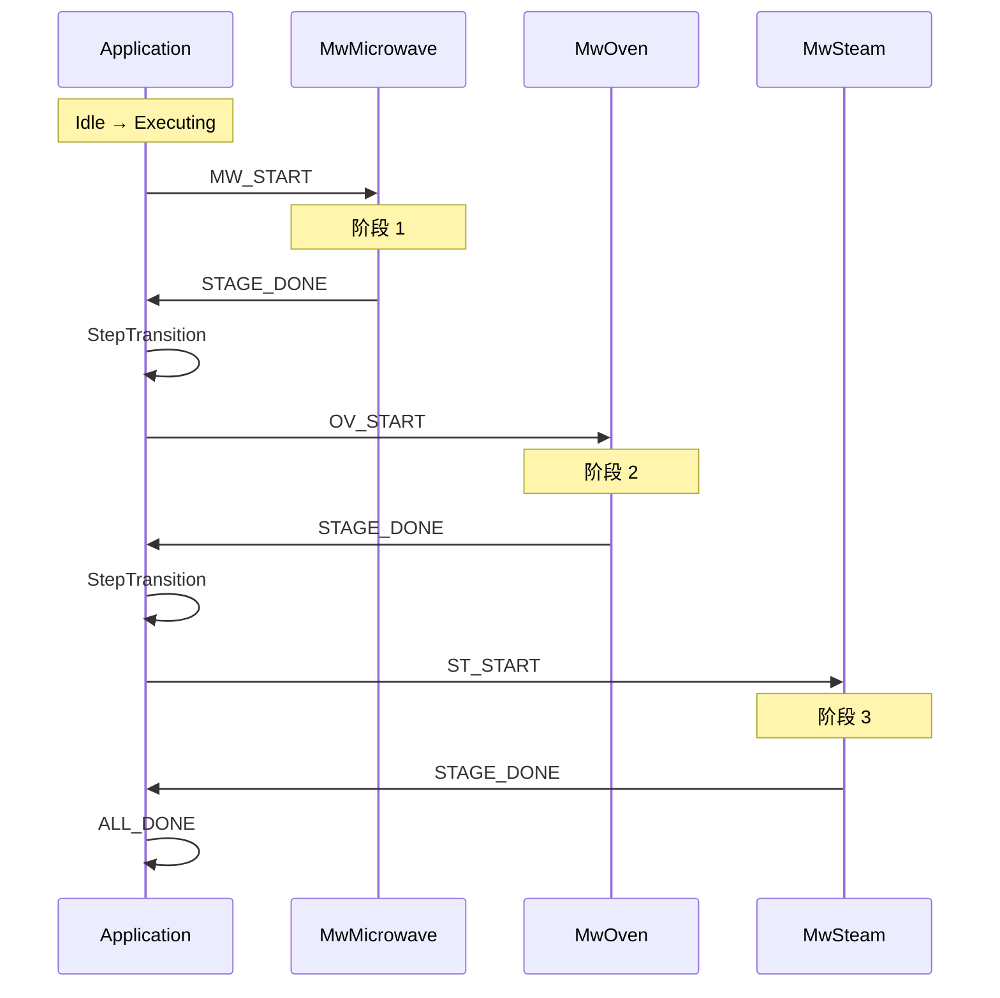

### 5.3 并列加热（微波 + 蒸汽）

App 同时激活 2 个中间层：

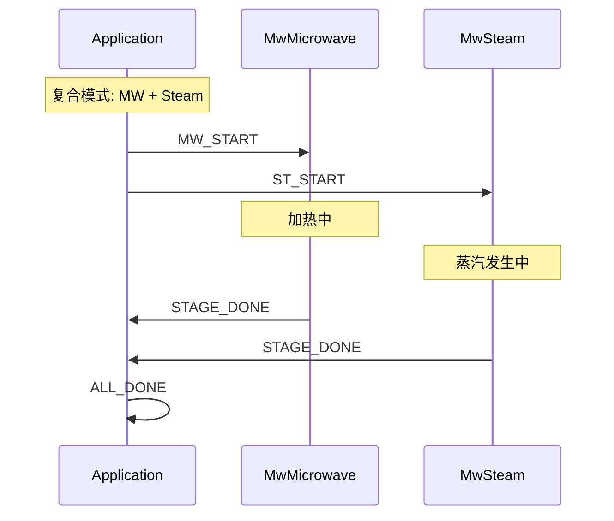

### 5.4 异常传播

任一中间层检出过热 → Application → Driver → Android：

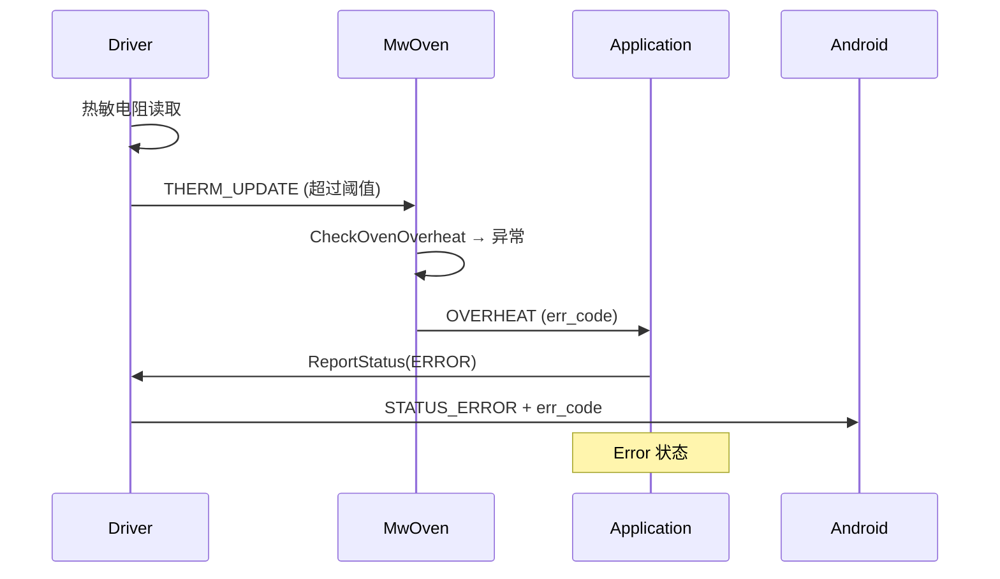

---

## 6. 扩展指南

### 6.1 添加新加热方式

例如追加"油炸"（Fryer）：

**步骤 1**: 新建层 `MwFryer`（通过 GUI 或 XML）

**步骤 2**: 定义状态

```xml
<Tab name="MwFryer">
  <StateMachine initial="FrIdle" layer_priority="3" layer_name="MwFryer">
    <States>
      <State name="FrIdle" type="initial" description="待机" />
      <State name="Frying" type="normal" description="油炸中" />
      <State name="FrError" type="normal" description="错误" />
    </States>
    ...
  </StateMachine>
</Tab>
```

**步骤 3**: 追加事件与 Role 函数

| 事件 | 用途 |
|---|---|
| `FR_START` | 开始油炸 |
| `FR_STOP` | 停止油炸 |
| `FR_OVERHEAT` | 过热 |
| `FR_CLEAR` | 清除故障 |

**步骤 4**: 在 Application 层的事件中追加 `MW_START_FRY` 等

**现有层不受影响** —— 这是分层设计的优势。

### 6.2 修改现有层

例如 MwOven 添加"风扇速度"控制：

1. GlobalDefinitions 追加变量 `oven_fan_speed`
2. MwOven 的 Role 函数追加 `SetFanSpeed`
3. Application 层追加使用逻辑

**仅影响 MwOven 层**，其他层不变。

### 6.3 用户代码保留

StaTable 采用**标记（marker）方式**保留用户代码：

```c
/* [[STABLE_USER_CODE_START:Driver_SetHeaterPwm]] */
/* 用户实现的代码 */
TIM1->CCR1 = duty;
/* [[STABLE_USER_CODE_END:Driver_SetHeaterPwm]] */
```

重新生成时，**标记间的代码不会丢失**。

---

## 7. 参考资料

### 7.1 相关文档

| # | 文档 | 内容 |
|---|---|---|
| 1 | `USER_CODE_GUIDE_zh.md` | 用户代码编写指南 |
| 2 | `TUTORIAL_zh.md` | 完整教程 |
| 3 | `ECLIPSE_INTEGRATION_zh.md` | Eclipse 集成 |
| 4 | `SPEC_OVERVIEW_zh-CN.md` | 详细规格 |
| 5 | `SPEC_SDK_API_en.md` | SDK API |

### 7.2 示例文件

| 文件 | 说明 |
|---|---|
| `cooking_heater_controller.xml` | 七层架构示例 |
| `output/` | 生成的 C 代码（参考用） |

### 7.3 验证工具

| 工具 | 用途 |
|---|---|
| `tools/gen_output_from_xml.py` | 从 XML 生成 C 代码 |
| `tools/verify_c_syntax.py` | gcc + ARM 编译验证 |
| `tools/verify_arm_link.py` | ARM 链接验证 |

---

## 变更历史

| 版本 | 日期 | 内容 |
|---|---|---|
| 1.0 | 2026-10-04 | 初版（六层架构设计指南） |
| 1.1 | 2026-10-10 | v3.4.3 整備：7 層架構（DriverInput / DriverOutput 分割）、MwMicrowave +1 状態、MwSteam +2 状態、Role 60 個 |

---

*本文档为 Galanz 复合烹饪器具的 StaTable 架构设计参考资料。*