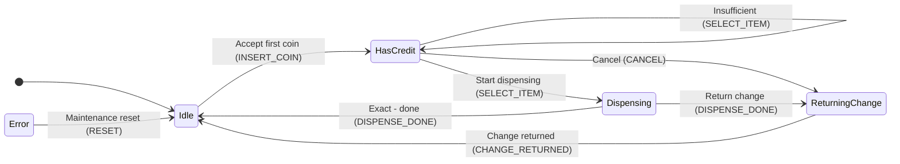

# StaTable TUTORIAL - A 3-Layer State Machine Built with a Vending Machine

Version: 1.1
Date: 2026-09-26
Target: StaTable v2.6.0 or later

---

## 1. Introduction

This tutorial walks you through the complete workflow of **StaTable**:
design a vending-machine control logic, generate C code, and verify
it by compiling with multiple toolchains.

### 1.1 What you will build

| Item | Value |
|------|-------|
| Subject | Vending machine control logic |
| Layers | Driver / Middleware / Application (3 layers) |
| States | 16 total (Driver 5 + Middleware 6 + Application 5) |
| Events | 19 total |
| Transitions | 40 total |
| Generated code | C99, static functions, MISRA C:2012-aware |
| Verification | gcc + arm-none-eabi-gcc, both -Wall -Wextra |

### 1.2 Prerequisites

- StaTable is installed and python -m statable_gui.main launches
- docs/tutorial/vending_machine.xml exists

---

## 2. The Vending Machine Model

### 2.1 Three-layer architecture

The vending-machine logic is split into three layers by responsibility.

**Application layer (priority 5)**
- User-facing flow
- States: Idle / HasCredit / Dispensing / ReturningChange / Error
- Namespace: Vending.*

**Middleware layer (priority 3)**
- Payment and inventory
- States: Waiting / Accumulating / Ready / CheckingStock / Releasing / MwError
- Namespace: Middleware.*

**Driver layer (priority 1)**
- Hardware abstraction
- States: Waiting / CoinPulse / ButtonPressed / MotorRunning / HardwareFault
- Namespace: Driver.*

Lower priority values run first. This preserves the natural order
"read hardware, decide payment, update display".

### 2.2 State diagram (Application layer)



---

## 3. Opening the XML in the GUI

### 3.1 Launch

```powershell
cd C:\...\StaTable\code
python -m statable_gui.main
```

> **Environment note**: If `QT_QPA_PLATFORM=offscreen` is set, the
> window will not appear. Clear it with `Remove-Item Env:QT_QPA_PLATFORM`.

### 3.2 Open the XML

**File > Open Project...** and select `docs/tutorial/vending_machine.xml`.

**Three tabs** (Driver / Middleware / Application) will appear.

### 3.3 What each tab shows

| Area | Content |
|------|---------|
| Matrix (top) | State x Event transition cells |
| Mermaid diagram (middle) | State diagram |
| SettingsPanel (right) | State list / Role function list |

---

## 4. Driver Layer (Hardware Abstraction)

### 4.1 States

| State | Type | Description |
|-------|------|-------------|
| `Waiting` | initial | Waiting for a hardware event |
| `CoinPulse` | normal | Coin sensor edge detected |
| `ButtonPressed` | normal | Item button pressed |
| `MotorRunning` | normal | Dispense motor running |
| `HardwareFault` | normal | Hardware fault |

### 4.2 Events

| Event | Delivery | Payload | Trigger (condition) |
|-------|----------|---------|---------------------|
| `COIN_SENSOR` | queue | `coin_value` (uint32_t) | edge: `GPIO_COIN`, falling, 50ms |
| `BUTTON_SENSOR` | queue | `item_id` (uint8_t) | edge: `GPIO_BUTTON_1`, falling, 20ms |
| `MOTOR_COMPLETE` | direct | - | manual |
| `HW_FAULT` | queue | `err_code` (uint8_t), priority 9 | edge: `GPIO_FAULT`, falling, 5ms |
| `CLEAR_FAULT` | direct | - | manual |

### 4.3 Trigger detail (structured)

Since C-51 Step 3, event firing conditions can be recorded in a
structured way.  Expand the **Trigger detail** section in the event
editor dialog to enter them.

#### Supported Types

| Type | Purpose | Fields |
|------|---------|--------|
| `manual` | Manual firing (default) | none |
| `edge` | GPIO edge detection | Edge / Debounce / Source |
| `polling` | Periodic polling | Period / Source |
| `timer` | Timer expiry | Period / Auto reload / Source |
| `call` | Function invocation | Caller |
| `comparison` | Condition comparison | Condition / Poll period |

#### Example: item button

1. Select event `BUTTON_SENSOR` and edit
2. Check the Trigger detail section
3. Type: select `edge`
4. Source: select `GPIO_BUTTON_1` (auto-candidate from interrupt definitions)
5. Edge: select `falling`
6. Debounce: enter `20` ms

Generated XML:

```xml
<Event name="BUTTON_SENSOR" ...>
  <Trigger type="edge" source="GPIO_BUTTON_1"
           edge="falling" debounce_ms="20" />
</Event>
```

#### Source candidates

- `edge`: GPIO names from interrupt definitions (`GlobalDefinitions.interrupts`)
- `timer` / `polling`: names from timer definitions (`timer_base` / `extra_timers`)
- `call`: role function names
- Custom text input is also allowed when no candidate matches

### 4.4 Design notes

- **Queue delivery**: Sensor events use `queue` to avoid loss
- **Priority 9 FAULT**: Processed before normal events
- **Cell actions**: `Waiting + COIN_SENSOR` demonstrates Pre/Post

---

## 5. Middleware Layer (Payment and Inventory)

### 5.1 States

| State | Type | Description |
|-------|------|-------------|
| `Waiting` | initial | Waiting for a request |
| `Accumulating` | normal | Accumulating coins |
| `Ready` | normal | Enough balance |
| `CheckingStock` | normal | Verifying stock |
| `Releasing` | normal | Dispensing |
| `MwError` | normal | Middleware error |

### 5.2 Exclusive relation example

The `Accumulating + ITEM_SELECT` cell has an **exclusive relation**:

```xml
<Relation kind="exclusive" members="T1,T2" />
```

This guarantees that only one of T1 (enough balance) and T2
(insufficient) can fire at a time.

### 5.3 Nested group example

The `Releasing + RELEASE_DONE` cell has a **nested group**:

```xml
<Relation kind="group" members="T1,T2"
          shared_condition="RoleFunc_Middleware_CheckStock(transition, ctx) != 0">
  <Children>
    <Relation kind="exclusive" members="T1,T2" />
  </Children>
</Relation>
```

**Generated C code:**

```c
if (RoleFunc_Middleware_CheckStock(transition, ctx) != 0) {
    if (cond_with_change) {
        /* T1: with change */
    } else if (cond_exact) {
        /* T2: exact */
    }
}
```

---

## 6. Application Layer (User-Facing Flow)

### 6.1 States

| State | Type | Description |
|-------|------|-------------|
| `Idle` | initial | Waiting for a coin |
| `HasCredit` | normal | Coins inserted |
| `Dispensing` | normal | Dispensing |
| `ReturningChange` | normal | Returning change |
| `Error` | final | Fatal error |

### 6.2 Cell actions

The `Idle + INSERT_COIN` cell has **cell actions**:

```xml
<Actions>
  <Action role_function="Vending.PreCheck"
          trigger="before_transitions" />
  <Action role_function="Vending.PostCommit"
          trigger="after_transitions" />
</Actions>
```

**Generated C code (order):**

```c
static STATE_Vending_t t_Idle_INSERT_COIN(...)
{
    STATE_Vending_t next_state = transition->from_state;

    /* Cell actions (before_transitions) */
    (void)RoleFunc_Vending_PreCheck(transition, ctx);

    /* Transition[T1] (Commit) */
    if (1) {
        next_state = STATE_Vending_HasCredit;
    }

    /* Cell actions (after_transitions) */
    (void)RoleFunc_Vending_PostCommit(transition, ctx);

    return next_state;
}
```

- **Pre**: Before transition evaluation (runs even if no transition fires)
- **Post**: After transition evaluation (runs even after early return)

### 6.3 Nested group in practice

The `Dispensing + DISPENSE_DONE` cell:

```xml
<Relation kind="group" members="T1,T2"
          shared_condition="ctx->data.stock > 0">
  <Children>
    <Relation kind="exclusive" members="T1,T2" />
  </Children>
</Relation>
```

Only when stock remains, run either change-return **or** completion.

---

## 7. Code Generation

### 7.1 From the GUI

1. **Generate > Code Generation...**
2. Verify output directory, generation style, OS type
3. Click **Generate**

### 7.2 From the CLI (recommended)

```powershell
cd C:\...\StaTable\code

python tools\gen_output_from_xml.py `
    --xml docs\tutorial\vending_machine.xml `
    --out output_vending
```

**Expected:**

```
Loading: docs\tutorial\vending_machine.xml
  tabs:  ['Driver', 'Middleware', 'Application']
  gd:    variables=8, flags=2, interrupts=1
  roles: 27
  layers: 3
  config: folder_structure=by_layer, project_name=VendingMachineTutorial

Generating C code ...
  generated 24 files
  saved 24 files to ...\output_vending

Result: 12 .c / 12 .h under output_vending
```

### 7.3 Generated file layout

```
output_vending/
  statable_all.h
  statable_types_common.h
  statable_init.c
  statable_interrupt.c
  statable_timer.c
  statable_event_queue.c
  osal.c / osal.h
  VendingMachineTutorial_run.c
  Driver/
    statable_types_Driver.h
    statable_role_functions_Driver.h / .c
    statable_transitions_Driver.h / .c
  Middleware/  (same layout)
  Vending/     (layer_name="Vending")
    statable_types_Vending.h
    statable_role_functions_Vending.h / .c
    statable_transitions_Vending.h / .c
```

---

## 8. Compile Verification

### 8.1 Single toolchain

```powershell
python tools\verify_c_syntax.py --root output_vending --compiler gcc
python tools\verify_c_syntax.py --root output_vending --compiler arm
```

### 8.2 Both toolchains (recommended)

```powershell
python tools\verify_c_syntax.py --root output_vending --compiler both
```

**Expected:**

```
==============================================================================
  Summary
==============================================================================
  gcc      PASS     (12/12)
  arm      PASS     (12/12)

  Overall:  ALL PASS
==============================================================================
  Log saved to: ...verify_report\verify_c_syntax_YYYYMMDD_HHMMSS.log
==============================================================================
```

### 8.3 Evidence log

Every run writes `verify_report/verify_c_syntax_YYYYMMDD_HHMMSS.log`
containing timestamp, git commit, and environment info. This can
serve as a release-time artifact.

---

## 9. Common Pitfalls

### 9.1 C-50: namespace had to match layer_name (before v2.5.1)

**Symptom:**

```
error: implicit declaration of function 'RoleFunc_Vending_PreCheck'
```

**Cause**: With `layer_name="Application"` and `namespace="Vending"`,
the call is generated but the declaration is missing.

**Workaround:**

- Before v2.5.1: use `namespace="App"` (prefix of `Application`)
- **v2.5.2 or later**: any namespace works (C-50 resolved)

### 9.2 (void) suppression is user-editable (since v2.5.2)

Generated role functions declare local pointers to `ctx->data.*`
and discard unused ones with `(void)` to avoid warnings.

```c
uint32_t *const balance = &ctx->data.balance;
...
/* [[STABLE_USER_CODE_START:...]] */
/* --- auto-generated: unused-variable suppression --- */
(void)balance;
...
/* [[STABLE_USER_CODE_END:...]] */
```

**Since v2.5.2, the (void) block lives inside the user-editable marker.**

- First generation: (void) lines appear inside the marker
- User deletes unused lines -> they do not come back on regeneration

### 9.3 How merging works

StaTable preserves user edits on regeneration.

| Marker | Purpose |
|--------|---------|
| `[[STABLE_USER_CODE_START]]` ... `END` | File-level user area |
| `[[STABLE_USER_CODE_START:Driver_Init]]` ... `END:Driver_Init` | Function-level user area |
| `[[STABLE_USER_CODE_TAIL_START]]` ... `END` | File-tail user area |

**Inside markers: preserved. Outside: overwritten.**

---

## 10. Exercises

### Exercise 1: Add a new state

Add a `Refunding` state to the Application layer and create
`ReturningChange -> Refunding -> Idle`.

### Exercise 2: Timeout handling

Add a transition that auto-cancels `HasCredit` after 60 seconds.

**Hint**: use `EventKind.TIME`.

### Exercise 3: Out-of-stock display

When the Middleware layer receives `STOCK_EMPTY`, add an event
that prompts the Application layer to show "out of stock".

---

## 11. References

| Resource | Location |
|----------|----------|
| Full specification | `docs/SPEC_OVERVIEW_ja.md` (Japanese) |
| Issue log | `docs/ISSUES_v2_5.md` |
| Tutorial XML | `docs/tutorial/vending_machine.xml` |
| Vending-tab XML | `docs/tutorial/vending_machine_vending_tab.xml` |
| Compile verification tool | `tools/verify_c_syntax.py` |
| Generation tool | `tools/gen_output_from_xml.py` |

---

End of `docs/tutorial/TUTORIAL_en.md` v1.0.
