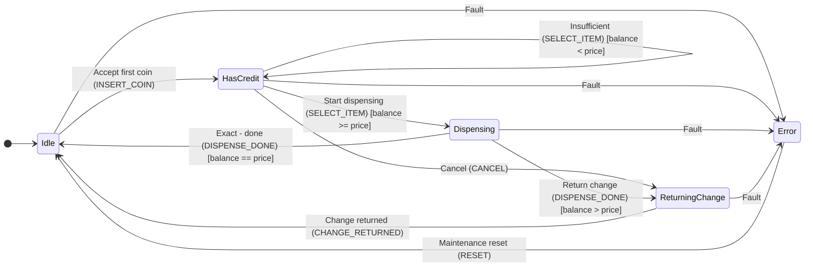

# StaTable TUTORIAL — Learn a 3-Layer State Machine with a Vending Machine

Version: 1.2
Date: 2026-09-26
Target: StaTable v2.6.0 or later
---

## 1. Introduction

This tutorial teaches the complete workflow for designing vending machine control logic with **StaTable**,
generating C code, and verifying the generated code by compilation.

### 1.1 What You Will Build

| Item | Description |
|------|------|
| Subject | Vending machine control logic |
| Layers | Three layers: Driver / Middleware / Application |
| States | 16 total (Driver 5 + Middleware 6 + Application 5) |
| Events | 19 total |
| Transitions | 40 total |
| Generated code | C99-compliant, uses many `static` functions, MISRA C:2012 compatible |
| Verification | `-Wall -Wextra` passes with both gcc + arm-none-eabi-gcc |

### 1.2 Prerequisites

- StaTable is set up (`python -m statable_gui.main` starts successfully)
- `docs/tutorial/vending_machine.xml` exists
---

## 2. Subject: Vending Machine

### 2.1 3-Layer Architecture

The vending machine control is divided into three layers according to responsibility.

```

┌──────────────────────────────────────────────────┐
│  Application layer (priority 5)                  │
│  - User-facing flow                              │
│  - States: Idle / HasCredit / Dispensing /      │
│         ReturningChange / Error                  │
│  - Namespace: Vending.*                         │
├──────────────────────────────────────────────────┤
│  Middleware layer (priority 3)                  │
│  - Payment and inventory management             │
│  - States: Waiting / Accumulating / Ready /     │
│         CheckingStock / Releasing / MwError      │
│  - Namespace: Middleware.*                      │
├──────────────────────────────────────────────────┤
│  Driver layer (priority 1)                      │
│  - Hardware abstraction                         │
│  - States: Waiting / CoinPulse / ButtonPressed /│
│         MotorRunning / HardwareFault             │
│  - Namespace: Driver.*                          │
└──────────────────────────────────────────────────┘

```

**Layers with lower priority numbers execute first.** This ensures
the natural sequence of “hardware reading → payment decision → user display”.


### 2.2 State Transition Diagram (Application Layer)



---

## 3. Open the XML in the GUI

### 3.1 Start

```powershell

cd C:...\StaTable\code
python -m statable_gui.main

```

> **Environment variable note**: If `QT_QPA_PLATFORM=offscreen` is set,
> the GUI will not be displayed. Clear it with `Remove-Item Env:QT_QPA_PLATFORM`.

### 3.2 Open the XML

Select `docs/tutorial/vending_machine.xml` via **File > Open Project...**.
The **three tabs** (Driver / Middleware / Application) are displayed.

### 3.3 What You Can Check in Each Tab

| Area | Description |
|------|------|
| Matrix (top) | State × event transition cells |
| Mermaid diagram (center) | State transition diagram |
| SettingsPanel (right) | State list / role function list |

---

## 4. Driver Layer (Hardware Abstraction)

### 4.1 States

| State | Type | Description |
|------|------|------|
| `Waiting` | initial | Waiting for hardware events |
| `CoinPulse` | normal | Coin sensor edge detected |
| `ButtonPressed` | normal | Product button pressed |
| `MotorRunning` | normal | Dispensing motor running |
| `HardwareFault` | normal | Hardware fault |

### 4.2 Events

| Event | Delivery | Associated data | Trigger (condition) |
|---------|---------|-----------|-------------------------|
| `COIN_SENSOR` | queue | `coin_value`（uint32_t） | edge: `GPIO_COIN`, falling, 50ms |
| `BUTTON_SENSOR` | queue | `item_id`（uint8_t） | edge: `GPIO_BUTTON_1`, falling, 20ms |
| `MOTOR_COMPLETE` | direct | – | manual |
| `HW_FAULT` | queue | `err_code` (`uint8_t`), priority 9 | edge: `GPIO_FAULT`, falling, 5ms |
| `CLEAR_FAULT` | direct | – | manual |

### 4.3 Recording Triggers (Event Conditions)

Starting with C-51 Step 3, event conditions can be recorded in a structured form.
Expand the **Trigger detail** section of the event editing dialog and enter the information.

#### Supported Types

| Type | Use | Settings |
|------|------|---------|
| `manual` | Manual trigger (default) | None |
| `edge` | GPIO edge detection | Edge / Debounce / Source |
| `polling` | Periodic polling | Period / Source |
| `timer` | Timer expiration | Period / Auto reload / Source |
| `call` | Function call | Caller |
| `comparison` | Condition comparison | Condition / Poll period |

#### Input Example: Product Button

1. Select and edit the `BUTTON_SENSOR` event
2. Check the Trigger detail section
3. Select Type: `edge`
4. Select Source: `GPIO_BUTTON_1` (automatically suggested from interrupt definitions)
5. Select Edge: `falling`
6. Enter Debounce: `20` ms

Generated XML:

```xml
<Event name="BUTTON_SENSOR" ...>
  <Trigger type="edge" source="GPIO_BUTTON_1"
           edge="falling" debounce_ms="20" />
</Event>
```

#### About Source Candidates

- `edge`: GPIO names in the interrupt definitions (`GlobalDefinitions.interrupts`)
- `timer` / `polling`: Names in the timer definitions (`timer_base` / `extra_timers`)
- `call`: Role function name
- If it is not among the candidates, it can also be entered directly as text.

### 4.4 Design Points

- **Queue delivery**: Sensor events use `queue` to prevent missed events
- **Priority 9 FAULT**: Processed before normal events
- **Cell actions**: Demonstrated with Pre/Post on `Waiting + COIN_SENSOR`
---

## 5. Middleware Layer (Payment and Inventory)

### 5.1 States

| State | Type | Description |
|------|------|------|
| `Waiting` | initial | Waiting for requests |
| `Accumulating` | normal | Accumulating coins |
| `Ready` | normal | Ready for payment |
| `CheckingStock` | normal | Checking inventory |
| `Releasing` | normal | Releasing |
| `MwError` | normal | Middleware error |

### 5.2 Example of an Exclusive Relation

The `Accumulating + ITEM_SELECT` cell has an **exclusive relation**:

```xml

<Relation kind="exclusive" members="T1,T2" />

```

This guarantees that T1 (sufficient balance) and T2 (insufficient balance)
can trigger **at most one**.

### 5.3 Example of a Nested Group

The `Releasing + RELEASE_DONE` cell contains a **nested group**:

```xml

<Relation kind="group" members="T1,T2"
          shared_condition="RoleFunc_Middleware_CheckStock(transition, ctx) != 0">
  <Children>
    <Relation kind="exclusive" members="T1,T2" />
  </Children>
</Relation>

```

**Generated C code:**

```c

if (RoleFunc_Middleware_CheckStock(transition, ctx) != 0) {
    if (cond_with_change) {
        /* T1: change returned */
    } else if (cond_exact) {
        /* T2: exact amount */
    }
}

```

---

## 6. Application Layer (User-Facing Flow)

### 6.1 States

| State | Type | Description |
|------|------|------|
| `Idle` | initial | Waiting for coin insertion |
| `HasCredit` | normal | Credit available |
| `Dispensing` | normal | Dispensing |
| `ReturningChange` | normal | Returning change |
| `Error` | final | Fatal error |

### 6.2 Cell Actions

The `Idle + INSERT_COIN` cell has **cell actions**:

```xml

<Actions>
  <Action role_function="Vending.PreCheck"
          trigger="before_transitions" />
  <Action role_function="Vending.PostCommit"
          trigger="after_transitions" />
</Actions>

```

**Generated C code (order):**

```c

static STATE_Vending_t t_Idle_INSERT_COIN(...)
{
    STATE_Vending_t next_state = transition->from_state;
    /* Cell actions (before_transitions) */
    (void)RoleFunc_Vending_PreCheck(transition, ctx);
    /* Transition[T1] (Commit) */
    if (1) {
        next_state = STATE_Vending_HasCredit;
    }
    /* Cell actions (after_transitions) */
    (void)RoleFunc_Vending_PostCommit(transition, ctx);
    return next_state;
}

```

- **Pre**: **Before** transition evaluation (executed even if no transition fires)
- **Post**: **After** transition evaluation (executed even if Commit causes an early return)

### 6.3 Nested Group Example

`Dispensing + DISPENSE_DONE` cell:

```xml

<Relation kind="group" members="T1,T2"
          shared_condition="ctx->data.stock > 0">
  <Children>
    <Relation kind="exclusive" members="T1,T2" />
  </Children>
</Relation>

```

“Only when inventory is available, execute **either one** of change return or completion processing.”
---

## 7. Periodic Processing and Event Sources

### 7.1 StaTable Is Event-Driven

StaTable generated code calls the state transition function **only when an event arrives**.
The super loop has the following structure:

```c
while (1) {
    Event_t ev = StateMachine_GetNextEvent_<Layer>(&ctx);
    if (ev != EVENT_NONE) {
        StateMachine_Process_<Layer>(ev, &ctx);
    }
    /* Do nothing when EVENT_NONE (idle) */
}
```

**StaTable is designed as a purely event-driven system and does not adopt the UML state machine concept of
the do activity (continuous processing while staying in a state).**
The moment a state is entered or exited can be represented by entry / exit, but
processing corresponding to “continuously while staying” must be **explicitly designed as periodic processing**.

### 7.2 Three Types of Event Sources

Event sources can be broadly divided into three types.
**StaTable does not distinguish these three types**. All are unified as “event arrival → transition function call”


| # | Source | Example | Trigger method |
|---|-------|-----|---------|
| 1 | Hardware interrupt | GPIO edge, UART reception complete, ADC conversion complete | `FIRE_EVENT_QUEUE_<Layer>()` in ISR |
| 2 | Timer (periodic) | 1ms tick, 10ms tick, software timer | `FIRE_EVENT_QUEUE_<Layer>()` in timer ISR |
| 3 | Polling (no interrupt) | Sensor threshold, flag monitoring, software condition | `FIRE_EVENT_<Layer>()` in super loop or RoleFunc |

### 7.3 Periodic Monitoring Pattern: TIME Event + Self-Transition

Example: monitor a sensor every 10 ms in the `Running` state

```xml
<Event name="TICK_10MS" kind="time" .../>
<Transition source="Running" event="TICK_10MS" target="Running"
            pre_actions="Driver.PollSensor" .../>
```

This calls `Driver.PollSensor()` every 10 ms.
Because the target is the same state, the state does not change.

**TIP**: Define the timer in `GlobalDefinitions` and select it as the Source with
`type="timer"` in Trigger detail (see §4.3).

### 7.4 GUI Setup Procedure (Pattern A)

This section shows how to configure Pattern A (TIME event + conditional self-transition) in the StaTable GUI.
As an example, we will monitor temperature every 10 ms in the `Running` state and
call `SetOverheatFlag` when it exceeds 80°C.

#### Step 1: Define the TIME Event `TICK_10MS`

1. Open **Edit > Event Definitions...**
2. Create a new event with **[Add]**:
   - Name: `TICK_10MS`
   - Kind: `time`
   - Delivery: `direct` (usually sufficient for periodic processing)
3. Expand the **Trigger detail** section and enable it:
   - Type: `timer`
   - Source: `TIMER_10MS` (select from the timer definitions in `GlobalDefinitions`)
   - Period: `10`（ms）
   - Auto reload: ✅ ON
4. Confirm with **[OK]**

> **TIP**: If you first add
> `TIMER_10MS` as a timer definition via **Edit > Global Definitions...**, it will appear as a Source candidate.
> If it is not listed, you can also enter the text directly (see §4.3).

#### Step 2: Add a Self-Transition for the `Running` State

1. Switch to the **Application** tab (or the target layer)
2. **Double-click** the **(Running, TICK_10MS)** cell in the matrix
3. **ActionEditorDialog** opens
4. In the **Transitions** tab, click **[+ Add]**:
   - Label: `T1` (default)
   - Source: `Running` (automatic)
   - Event: `TICK_10MS` (automatic)
   - Target: **`Running`** (select the same state)
   - Condition: `ctx->data.temperature > 80`
   - Early return (Commit): Optional (normally recommended ON)
5. In the **Pre / Post Actions** tab, add it to the Pre group:
   - Role function: `Driver.SetOverheatFlag`
   - Trigger: `before_transitions`
6. Confirm with **[OK]**

#### Step 3: Verify in XML

After saving via **File > Save Project...**, check the relevant section in a text editor:

```xml
<Events>
  <Event name="TICK_10MS" kind="time" delivery_type="direct" ...>
    <Trigger type="timer" source="TIMER_10MS"
             period_ms="10" auto_reload="true"/>
  </Event>
</Events>
...
<Transitions>
  <Transition source="Running" event="TICK_10MS" target="Running"
              condition="ctx->data.temperature &gt; 80"
              early_return="true" label="T1">
    <PreAction action="Driver.SetOverheatFlag"/>
  </Transition>
</Transitions>
```

#### Step 4: Verify the Generated Code

After generating via **Generate > Code Generation...** or the CLI (§8.2),
check the corresponding cell function in `statable_transitions_<Layer>.c`:

```c
static STATE_Vending_t t_Running_TICK_10MS(...)
{
    STATE_Vending_t next_state = transition->from_state;
    if (ctx->data.temperature > 80) {
        (void)RoleFunc_Driver_SetOverheatFlag(transition, ctx);
        next_state = STATE_Vending_Running;   /* self-transition */
    }
    return next_state;
}
```

Because `next_state` is set to the same state, **the state does not change and
only the action is executed periodically**.

#### Common Mistakes

| # | Symptom | Cause | Corrective action |
|---|------|------|------|
| 1 | Transition never fires | Event `kind` is not `time`, or the Timer ISR does not call `FIRE_EVENT_QUEUE_<Layer>(TICK_10MS)` | Implement the timer ISR according to the mapping table in §7.8 |
| 2 | Condition is always false | Incorrect `condition` syntax (missing `ctx->` prefix or XML escaping for `>`) | Use `&gt;` / `&lt;` in XML |
| 3 | `pre_actions` is not executed | If the condition is false, `pre_actions` is also not executed (it is part of the transition body) | Use a **Cell action** (`before_transitions`) when it must run regardless of the condition (see §6.2) |
| 4 | Runs more frequently than expected | Incorrect Timer `period_ms` or `auto_reload` setting | Recheck Trigger detail |

### 7.5 Handling Events That Are Not Interrupt-Generated

If there is no interrupt but you need periodic checking, there are three ways to implement it.

#### Pattern A (Recommended): Conditional Self-Transition

```xml
<Transition source="Monitoring" event="TICK_10MS" target="Monitoring"
            condition="temperature > 80"
            pre_actions="Driver.SetOverheatFlag" .../>
```

→ Completes within the cell without firing another event. **Most readable** (see §7.4 for setup).

#### Pattern B (Not Recommended): Fire Another Event from RoleFunc

```c
int RoleFunc_Driver_CheckTemp(...) {
    if (ctx->temperature > 80) {
        FIRE_EVENT_Application(OVERHEAT);   /* ← fire another event */
    }
    return 0;
}
```

→ Event firing becomes distributed, making it **difficult to track where and what happens**.
Avoid this unless there is a specific reason.

#### Pattern C: Inject Events Directly from the Super Loop

```c
/* inside [[STABLE_USER_CODE]] in {project}_run.c */
if (ctx.temperature > 80) {
    FIRE_EVENT_QUEUE_Application(OVERHEAT);
}
```

→ Poll outside the state machine and **inject only the event**.
Suitable for complex judgments or conditions spanning multiple states.

### 7.6 Which One to Use (Decision Table)

| Purpose | Pattern |
|------|---------|
| Periodic execution + simple condition | A (conditional self-transition) |
| Periodic execution + complex judgment → another transition | C (injection from super loop) |
| ISR-originated (edge, reception) | ISR + `FIRE_EVENT_QUEUE_<Layer>` |
| Processing that must run every cycle (no omissions) | Call RoleFunc directly from the super loop |

### 7.7 Notes

| # | Note | Corrective action |
|---|------|------|
| 1 | **Event queue overflow**: If the polling period < processing time, the queue can overflow and events can be missed | Monitor the `EventQueueState_t.dropped` counter (C-54). If it overflows, lengthen the period or use `delivery_type="direct"` |
| 2 | **Guarantee of “exactly once every cycle”**: Queue delivery can introduce delay or loss | If every-cycle execution is required, call `RoleFunc_*` directly from the super loop instead of using a TIME event |
| 3 | **Design as periodic processing**: StaTable does not use the UML do activity, so “continuously while staying” must be explicitly designed as periodic processing using the idioms in this section | See the patterns in §7.3–7.5 |

### 7.8 Embedded Implementation Mapping

| Field implementation | StaTable equivalent |
|-----------|-----------------|
| Hardware timer ISR sets a flag every 1 ms | Fire the `EventKind.TIME` `TICK_1MS` event from the ISR |
| RTOS software timer callback | Same (call `FIRE_EVENT_QUEUE_<Layer>` in the callback) |
| Check `if (tick_flag)` at the start of the main loop | Replace it with the TIME event + self-transition above |
| Periodic sensor reading | TIME event + conditional self-transition (Pattern A, see §7.4) |

---

## 8. Code Generation

### 8.1 Generate from the GUI

1. **Generate > Code Generation...**
2. Check the output directory, generation method, and OS type
3. Click **Generate**

### 8.2 Generate from the CLI (Recommended)

```powershell

cd C:...\StaTable\code
python tools\gen_output_from_xml.py `
    --xml docs\tutorial\vending_machine.xml `
    --out output_vending

```

**Expected:**

```

Loading: docs\tutorial\vending_machine.xml
  tabs:  ['Driver', 'Middleware', 'Application']
  gd:    variables=8, flags=2, interrupts=1
  roles: 27
  layers: 3
  config: folder_structure=by_layer, project_name=VendingMachineTutorial
Generating C code ...
  generated 24 files
  saved 24 files to ...\output_vending
Result: 12 .c / 12 .h under output_vending

```

### 8.3 Generated File Structure

```

output_vending/
├── statable_all.h
├── statable_types_common.h
├── statable_init.c
├── statable_interrupt.c
├── statable_timer.c
├── statable_event_queue.c
├── osal.c / osal.h
├── VendingMachineTutorial_run.c
├── Driver/
│   ├── statable_types_Driver.h
│   ├── statable_role_functions_Driver.h / .c
│   └── statable_transitions_Driver.h / .c
├── Middleware/
│   └── (same structure)
└── Vending/               ← layer_name="Vending"
    ├── statable_types_Vending.h
    ├── statable_role_functions_Vending.h / .c
    └── statable_transitions_Vending.h / .c

```

---

## 9. Compilation Verification

### 9.1 Single Toolchain

```powershell

python tools\verify_c_syntax.py --root output_vending --compiler gcc
python tools\verify_c_syntax.py --root output_vending --compiler arm

```

### 9.2 Both Toolchains (Recommended)

```powershell

python tools\verify_c_syntax.py --root output_vending --compiler both

```

**Expected:**

```

==============================================================================
  Summary
==============================================================================
  gcc      PASS     (12/12)
  arm      PASS     (12/12)
  Overall:  ALL PASS
==============================================================================
  Log saved to: ...verify_report\verify_c_syntax_YYYYMMDD_HHMMSS.log
==============================================================================

```

### 9.3 Evidence Log

Each run automatically saves `verify_report/verify_c_syntax_YYYYMMDD_HHMMSS.log`.
It contains the **timestamp, git commit, and environment information**,
so it can be used as release evidence.
---

## 10. Common Pitfalls

### 10.1 C-50: namespace Must Have a Prefix Match with layer_name (Before v2.5.1)

**Symptom:**

```

error: implicit declaration of function 'RoleFunc_Vending_PreCheck'

```

**Cause:** When `namespace="Vending"` is used with `layer_name="Application"`,
the call is generated but the **declaration is missing**.
**Corrective action:**
- Before v2.5.1: Use a prefix-matching name such as `namespace="App"`
- **v2.5.2 and later**: Any namespace can be used (C-50 resolved)

### 10.2 User Editing of (void) Suppression (v2.5.2 and Later)

Generated Role functions declare local pointers to `ctx->data.*` and
explicitly discard them with `(void)` to avoid unused-variable warnings.

```c

uint32_t *const balance = &ctx->data.balance;
...
/* [[STABLE_USER_CODE_START:...]] */
/* --- auto-generated: unused-variable suppression --- */
(void)balance;
...
/* [[STABLE_USER_CODE_END:...]] */

```

**Starting with v2.5.2, the `(void)` statements have been moved into the user-editable area (inside the markers).**
- Initial generation: the `(void)` statements appear inside the markers
- If the user deletes unnecessary lines, they **do not reappear** after regeneration

### 10.3 Understanding Merge Behavior

StaTable **preserves user edits** when regenerating.

| Marker | Purpose |
|---------|------|
| `[[STABLE_USER_CODE_START]]` ... `END` | User area for the entire file |
| `[[STABLE_USER_CODE_START:Driver_Init]]` ... `END:Driver_Init` | User area for an individual function |
| `[[STABLE_USER_CODE_TAIL_START]]` ... `END` | User area at the end of the file |

**Edits inside the markers are preserved; content outside them is overwritten.**
---

## 11. Exercises

### Exercise 1: Add a New State

Add a `Refunding` state to the Application layer and
create the transitions `ReturningChange → Refunding → Idle`.

### Exercise 2: Timeout Processing

In the Application layer, add a transition that “automatically cancels after the `HasCredit` state lasts 60 seconds”.

**Hint:** Use `EventKind.TIME` and the periodic monitoring pattern in §7.3.

### Exercise 3: Display When Out of Stock

When the Middleware layer receives `STOCK_EMPTY`,
add an event that prompts the Application layer to display “out of stock”.
---

## 12. References

| Resource | Location |
|------|------|
| Overall specification | `docs/SPEC_OVERVIEW_ja.md` |
| Issue records | `docs/ISSUES_v2_5.md` / `docs/ISSUES_v2_6.md` |
| TUTORIAL XML | `docs/tutorial/vending_machine.xml` |
| Vending-tab XML | `docs/tutorial/vending_machine_vending_tab.xml` |
| Compilation verification tool | `tools/verify_c_syntax.py` |
| Generation tool | `tools/gen_output_from_xml.py` |
