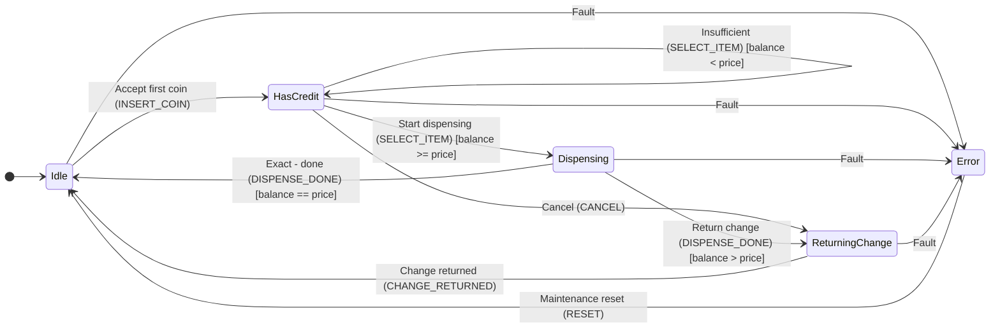

# StaTable TUTORIAL — 自動販売機で学ぶ3層ステートマシン

Version: 1.2
Date: 2026-09-26
対象: StaTable v2.6.0 以降
---

## 1. はじめに

このチュートリアルでは、**StaTable** を使って自動販売機の制御ロジックを
設計し、C コードを生成し、コンパイル検証まで行う一連の流れを学びます。

### 1.1 完成するもの

| 項目 | 内容 |
|------|------|
| 題材 | 自動販売機の制御ロジック |
| 層構成 | Driver / Middleware / Application の3層 |
| 状態数 | 合計16（Driver 5 + Middleware 6 + Application 5） |
| イベント数 | 合計19 |
| 遷移数 | 合計40 |
| 生成コード | C99 準拠、`static` 関数多用、MISRA C:2012 対応 |
| 検証 | gcc + arm-none-eabi-gcc の両方で `-Wall -Wextra` パス |

### 1.2 前提

- StaTable がセットアップ済み（`python -m statable_gui.main` が起動）
- `docs/tutorial/vending_machine.xml` が存在
---

## 2. 題材: 自動販売機

### 2.1 3層アーキテクチャ

自動販売機の制御を、責務ごとに3層に分割します。

```

┌──────────────────────────────────────────────────┐
│  Application 層（優先度 5）                       │
│  - ユーザー向けフロー                            │
│  - 状態: Idle / HasCredit / Dispensing /         │
│         ReturningChange / Error                  │
│  - 名前空間: Vending.*                           │
├──────────────────────────────────────────────────┤
│  Middleware 層（優先度 3）                        │
│  - 決済・在庫管理                                │
│  - 状態: Waiting / Accumulating / Ready /        │
│         CheckingStock / Releasing / MwError      │
│  - 名前空間: Middleware.*                        │
├──────────────────────────────────────────────────┤
│  Driver 層（優先度 1）                            │
│  - ハードウェア抽象化                            │
│  - 状態: Waiting / CoinPulse / ButtonPressed /   │
│         MotorRunning / HardwareFault             │
│  - 名前空間: Driver.*                            │
└──────────────────────────────────────────────────┘

```

**優先度が小さい層ほど先に実行されます。** これにより、
「ハードウェア読み取り → 決済判定 → ユーザー表示」という
自然な順序が保証されます。

### 2.2 状態遷移図（Application 層）



---

## 3. GUI で XML を開く

### 3.1 起動

```powershell

cd C:...\StaTable\code
python -m statable_gui.main

```

> **環境変数の注意**: `QT_QPA_PLATFORM=offscreen` が設定されていると
> 画面に表示されません。`Remove-Item Env:QT_QPA_PLATFORM` で解除してください。

### 3.2 XML を開く

**File > Open Project...** で `docs/tutorial/vending_machine.xml` を選択。
**3つのタブ**（Driver / Middleware / Application）が表示されます。

### 3.3 各タブで確認できること

| 領域 | 内容 |
|------|------|
| マトリクス（上） | 状態 × イベント の遷移セル |
| Mermaid 図（中） | 状態遷移図 |
| SettingsPanel（右） | 状態一覧 / ロール関数一覧 |

---

## 4. Driver 層（ハードウェア抽象化）

### 4.1 状態

| 状態 | 種別 | 説明 |
|------|------|------|
| `Waiting` | initial | ハードウェアイベント待ち |
| `CoinPulse` | normal | コインセンサーエッジ検出 |
| `ButtonPressed` | normal | 商品ボタン押下 |
| `MotorRunning` | normal | ディスペンスモーター動作中 |
| `HardwareFault` | normal | ハードウェアフォルト |

### 4.2 イベント

| イベント | 配送方式 | 付随データ | Trigger（発生条件） |
|---------|---------|-----------|-------------------------|
| `COIN_SENSOR` | queue | `coin_value`（uint32_t） | edge: `GPIO_COIN`, falling, 50ms |
| `BUTTON_SENSOR` | queue | `item_id`（uint8_t） | edge: `GPIO_BUTTON_1`, falling, 20ms |
| `MOTOR_COMPLETE` | direct | – | manual |
| `HW_FAULT` | queue | `err_code`（uint8_t）、優先度 9 | edge: `GPIO_FAULT`, falling, 5ms |
| `CLEAR_FAULT` | direct | – | manual |

### 4.3 Trigger（発生条件）の記録

C-51 Step 3 以降、イベントの発生条件を構造化して記録できます。
イベント編集ダイアログの **Trigger detail** セクションを展開して入力します。

#### 対応 Type

| Type | 用途 | 設定項目 |
|------|------|---------|
| `manual` | 手動発火（デフォルト） | なし |
| `edge` | GPIO エッジ検出 | Edge / Debounce / Source |
| `polling` | 定期ポーリング | Period / Source |
| `timer` | タイマー満了 | Period / Auto reload / Source |
| `call` | 関数呼び出し | Caller |
| `comparison` | 条件比較 | Condition / Poll period |

#### 入力例: 商品ボタン

1. イベント `BUTTON_SENSOR` を選択して編集
2. Trigger detail セクションをチェック
3. Type: `edge` を選択
4. Source: `GPIO_BUTTON_1` を選択（割り込み定義から自動候補）
5. Edge: `falling` を選択
6. Debounce: `20` ms を入力

生成される XML:

```xml
<Event name="BUTTON_SENSOR" ...>
  <Trigger type="edge" source="GPIO_BUTTON_1"
           edge="falling" debounce_ms="20" />
</Event>
```

#### Source の候補について

- `edge`: 割り込み定義（`GlobalDefinitions.interrupts`）の GPIO 名
- `timer` / `polling`: タイマー定義（`timer_base` / `extra_timers`）の名前
- `call`: ロール関数名
- 候補に無い場合はテキスト直接入力も可能

### 4.4 設計ポイント

- **キュー配送**: センサーイベントは `queue` で取りこぼし防止
- **優先度 9 の FAULT**: 通常イベントより先に処理される
- **セルアクション**: `Waiting + COIN_SENSOR` で Pre/Post を実演
---

## 5. Middleware 層（決済・在庫）

### 5.1 状態

| 状態 | 種別 | 説明 |
|------|------|------|
| `Waiting` | initial | 要求待ち |
| `Accumulating` | normal | コイン累積中 |
| `Ready` | normal | 決済可能 |
| `CheckingStock` | normal | 在庫確認中 |
| `Releasing` | normal | リリース中 |
| `MwError` | normal | ミドルウェアエラー |

### 5.2 排他リレーションの例

`Accumulating + ITEM_SELECT` セルには**排他リレーション**があります:

```xml

<Relation kind="exclusive" members="T1,T2" />

```

これにより、T1（残高十分）と T2（残高不足）は
**最大1つしか発火しない**ことが保証されます。

### 5.3 ネスト group の例

`Releasing + RELEASE_DONE` セルには**ネストされた group**:

```xml

<Relation kind="group" members="T1,T2"
          shared_condition="RoleFunc_Middleware_CheckStock(transition, ctx) != 0">
  <Children>
    <Relation kind="exclusive" members="T1,T2" />
  </Children>
</Relation>

```

**生成される C コード:**

```c

if (RoleFunc_Middleware_CheckStock(transition, ctx) != 0) {
    if (cond_with_change) {
        /* T1: お釣りあり */
    } else if (cond_exact) {
        /* T2: ちょうど */
    }
}

```

---

## 6. Application 層（ユーザー向けフロー）

### 6.1 状態

| 状態 | 種別 | 説明 |
|------|------|------|
| `Idle` | initial | コイン投入待ち |
| `HasCredit` | normal | クレジットあり |
| `Dispensing` | normal | ディスペンス中 |
| `ReturningChange` | normal | お釣り返却中 |
| `Error` | final | 致命的エラー |

### 6.2 セルアクション

`Idle + INSERT_COIN` セルには**セルアクション**があります:

```xml

<Actions>
  <Action role_function="Vending.PreCheck"
          trigger="before_transitions" />
  <Action role_function="Vending.PostCommit"
          trigger="after_transitions" />
</Actions>

```

**生成される C コード（順序）:**

```c

static STATE_Vending_t t_Idle_INSERT_COIN(...)
{
    STATE_Vending_t next_state = transition->from_state;
    /* Cell actions (before_transitions) */
    (void)RoleFunc_Vending_PreCheck(transition, ctx);
    /* Transition[T1] (Commit) */
    if (1) {
        next_state = STATE_Vending_HasCredit;
    }
    /* Cell actions (after_transitions) */
    (void)RoleFunc_Vending_PostCommit(transition, ctx);
    return next_state;
}

```

- **Pre**: 遷移評価の**前**（遷移が発火しなくても実行）
- **Post**: 遷移評価の**後**（Commit で early return しても実行）

### 6.3 ネスト group の実例

`Dispensing + DISPENSE_DONE` セル:

```xml

<Relation kind="group" members="T1,T2"
          shared_condition="ctx->data.stock > 0">
  <Children>
    <Relation kind="exclusive" members="T1,T2" />
  </Children>
</Relation>

```

「在庫がある場合のみ、お釣り返却または完了処理の**どちらか一方**を実行」。
---

## 7. 定常処理とイベント発生源

### 7.1 StaTable はイベント駆動です

StaTable の生成コードは、**イベントが到着したときだけ**状態遷移関数を
呼びます。スーパーループは以下の構造です:

```c
while (1) {
    Event_t ev = StateMachine_GetNextEvent_<Layer>(&ctx);
    if (ev != EVENT_NONE) {
        StateMachine_Process_<Layer>(ev, &ctx);
    }
    /* EVENT_NONE のときは何もしない（アイドル） */
}
```

**StaTable は純イベント駆動として設計されており、UML ステートマシンの
do アクティビティ（状態滞在中の継続処理）という概念は採用していません。**
状態に「入った瞬間」「出る瞬間」は entry / exit で表現できますが、
「滞在中ずっと」に相当する処理は、**周期処理として明示的に設計**します。

### 7.2 イベントの発生源は3種類

イベントがどこから発生するかは、大きく3つに分かれます。
**StaTable 側では3種類を区別しません**。すべて「イベント到着 → 遷移関数呼び出し」
に統一されます。

| # | 発生源 | 例 | 発火方法 |
|---|-------|-----|---------|
| 1 | ハードウェア割り込み | GPIO エッジ、UART 受信完了、ADC 変換完了 | ISR 内で `FIRE_EVENT_QUEUE_<Layer>()` |
| 2 | タイマ（周期） | 1ms tick、10ms tick、ソフトウェアタイマ | タイマ ISR 内で `FIRE_EVENT_QUEUE_<Layer>()` |
| 3 | ポーリング（割り込みなし） | センサ閾値、フラグ監視、ソフトウェア条件 | スーパーループまたは RoleFunc 内で `FIRE_EVENT_<Layer>()` |

### 7.3 周期監視のパターン: TIME イベント + 自己遷移

例: `Running` 状態で 10ms ごとにセンサを監視する

```xml
<Event name="TICK_10MS" kind="time" .../>
<Transition source="Running" event="TICK_10MS" target="Running"
            pre_actions="Driver.PollSensor" .../>
```

これで 10ms ごとに `Driver.PollSensor()` が呼ばれます。
遷移先が同じ状態なので、状態は変わりません。

**TIP**: タイマは `GlobalDefinitions` に定義し、Trigger detail の
`type="timer"` で Source として選択します（§4.3 参照）。

### 7.4 GUI での設定手順（パターン A）

パターン A（TIME イベント + 条件付き自己遷移）を StaTable GUI で設定する
手順を示します。例として「`Running` 状態で 10ms ごとに温度を監視し、
80℃を超えたら `SetOverheatFlag` を呼ぶ」ケースを扱います。

#### Step 1: TIME イベント `TICK_10MS` を定義

1. **Edit > Event Definitions...** を開く
2. **[Add]** で新規イベント作成:
   - Name: `TICK_10MS`
   - Kind: `time`
   - Delivery: `direct`（周期処理は通常 direct で十分）
3. **Trigger detail** セクションを展開し、チェックを入れる:
   - Type: `timer`
   - Source: `TIMER_10MS`（`GlobalDefinitions` のタイマ定義から選択）
   - Period: `10`（ms）
   - Auto reload: ✅ ON
4. **[OK]** で確定

> **TIP**: 事前に **Edit > Global Definitions...** で
> `TIMER_10MS` をタイマ定義に追加しておくと、Source の候補に現れます。
> 候補に無い場合はテキスト直接入力も可能です（§4.3 参照）。

#### Step 2: `Running` 状態の自己遷移を追加

1. タブを **Application**（または対象層）に切り替え
2. マトリクスで **(Running, TICK_10MS)** セルを**ダブルクリック**
3. **ActionEditorDialog** が開く
4. **Transitions タブ**で **[+ Add]**:
   - Label: `T1`（デフォルト）
   - Source: `Running`（自動）
   - Event: `TICK_10MS`（自動）
   - Target: **`Running`**（同じ状態を選択）
   - Condition: `ctx->data.temperature > 80`
   - Early return (Commit): 任意（通常は ON 推奨）
5. **Pre / Post Actions タブ**で Pre グループに追加:
   - Role function: `Driver.SetOverheatFlag`
   - Trigger: `before_transitions`
6. **[OK]** で確定

#### Step 3: XML で確認

**File > Save Project...** で保存後、テキストエディタで該当箇所を確認:

```xml
<Events>
  <Event name="TICK_10MS" kind="time" delivery_type="direct" ...>
    <Trigger type="timer" source="TIMER_10MS"
             period_ms="10" auto_reload="true"/>
  </Event>
</Events>
...
<Transitions>
  <Transition source="Running" event="TICK_10MS" target="Running"
              condition="ctx->data.temperature &gt; 80"
              early_return="true" label="T1">
    <PreAction action="Driver.SetOverheatFlag"/>
  </Transition>
</Transitions>
```

#### Step 4: 生成コードで確認

**Generate > Code Generation...** または CLI（§8.2）で生成後、
`statable_transitions_<Layer>.c` の該当セル関数を確認:

```c
static STATE_Vending_t t_Running_TICK_10MS(...)
{
    STATE_Vending_t next_state = transition->from_state;
    if (ctx->data.temperature > 80) {
        (void)RoleFunc_Driver_SetOverheatFlag(transition, ctx);
        next_state = STATE_Vending_Running;   /* 自己遷移 */
    }
    return next_state;
}
```

`next_state` が同じ状態に設定されるため、**状態は変わらず
アクションのみが周期的に実行**されます。

#### よくある間違い

| # | 症状 | 原因 | 対処 |
|---|------|------|------|
| 1 | 遷移が一度も発火しない | Event の `kind` が `time` でない、または Timer ISR が `FIRE_EVENT_QUEUE_<Layer>(TICK_10MS)` を呼んでいない | §7.8 の対応表に従いタイマ ISR を実装 |
| 2 | 条件が常に偽になる | `condition` の記述ミス（`ctx->` プレフィックス忘れ、`>` の XML エスケープ忘れ） | XML では `&gt;` / `&lt;` を使う |
| 3 | `pre_actions` が実行されない | 条件が偽の場合、`pre_actions` も実行されない（遷移本体の一部） | 条件に関わらず実行したい場合は **Cell action**（`before_transitions`）を使う（§6.2 参照） |
| 4 | 想定より高頻度で実行される | Timer の `period_ms` と `auto_reload` の設定ミス | Trigger detail を再確認 |

### 7.5 割り込みで発生しないイベントの扱い

「割り込みは無いが、定期的にチェックしたい」場合、3つの書き方があります。

#### パターン A（推奨）: 条件付き自己遷移

```xml
<Transition source="Monitoring" event="TICK_10MS" target="Monitoring"
            condition="temperature > 80"
            pre_actions="Driver.SetOverheatFlag" .../>
```

→ イベントを別途発火せず、セル内で完結。**最も読みやすい**（設定手順は §7.4 参照）。

#### パターン B（非推奨）: RoleFunc から別イベントを発火

```c
int RoleFunc_Driver_CheckTemp(...) {
    if (ctx->temperature > 80) {
        FIRE_EVENT_Application(OVERHEAT);   /* ← 別イベント発火 */
    }
    return 0;
}
```

→ イベント発火が分散し、**どこで何が起きるか追跡困難**。
特別な理由がない限り避けてください。

#### パターン C: スーパーループで直接イベント注入

```c
/* {project}_run.c の [[STABLE_USER_CODE]] 内 */
if (ctx.temperature > 80) {
    FIRE_EVENT_QUEUE_Application(OVERHEAT);
}
```

→ 状態機械の外側でポーリングし、**イベントだけ注入**。
複雑な判定や、複数の状態を跨ぐ条件に向きます。

### 7.6 どれを使うか（判断表）

| 目的 | パターン |
|------|---------|
| 周期起動 + 単純条件判定 | A（条件付き自己遷移） |
| 周期起動 + 複雑判定 → 別遷移 | C（スーパーループで注入） |
| ISR 起点（エッジ、受信） | ISR + `FIRE_EVENT_QUEUE_<Layer>` |
| 「毎周期必ず」処理（欠落不可） | スーパーループから直接 RoleFunc 呼び出し |

### 7.7 注意点

| # | 注意 | 対処 |
|---|------|------|
| 1 | **イベントキュー溢れ**: ポーリング周期 < 処理時間だと、キューが溢れてイベント取りこぼし | `EventQueueState_t.dropped` カウンタ（C-54）を監視。溢れるなら周期を緩める or `delivery_type="direct"` |
| 2 | **「毎周期必ず1回」の保証**: キュー経由だと遅延・欠落があり得る | 「毎周期確実に」が必要なら、TIME イベント経由ではなく、スーパーループから `RoleFunc_*` を直接呼ぶ |
| 3 | **周期処理として設計**: StaTable は UML の do アクティビティを採用していないため、「滞在中ずっと」は本節のイディオムで周期処理として明示的に設計する | §7.3〜7.5 のパターンを参照 |

### 7.8 組み込み現場での対応表

| 現場の実装 | StaTable での対応 |
|-----------|-----------------|
| ハードウェアタイマ ISR が 1ms ごとにフラグを立てる | `EventKind.TIME` の `TICK_1MS` イベントを ISR から発火 |
| RTOS のソフトウェアタイマコールバック | 同上（コールバック内で `FIRE_EVENT_QUEUE_<Layer>`） |
| メインループ先頭で `if (tick_flag)` チェック | 上記の TIME イベント + 自己遷移に置き換え |
| 定期的なセンサ読み取り | TIME イベント + 条件付き自己遷移（パターン A、§7.4 参照） |

---

## 8. コード生成

### 8.1 GUI から生成

1. **Generate > Code Generation...**
2. 出力先・生成方式・OS 種別を確認
3. **Generate** ボタン

### 8.2 CLI から生成（推奨）

```powershell

cd C:...\StaTable\code
python tools\gen_output_from_xml.py `
    --xml docs\tutorial\vending_machine.xml `
    --out output_vending

```

**期待:**

```

Loading: docs\tutorial\vending_machine.xml
  tabs:  ['Driver', 'Middleware', 'Application']
  gd:    variables=8, flags=2, interrupts=1
  roles: 27
  layers: 3
  config: folder_structure=by_layer, project_name=VendingMachineTutorial
Generating C code ...
  generated 24 files
  saved 24 files to ...\output_vending
Result: 12 .c / 12 .h under output_vending

```

### 8.3 生成ファイル構成

```

output_vending/
├── statable_all.h
├── statable_types_common.h
├── statable_init.c
├── statable_interrupt.c
├── statable_timer.c
├── statable_event_queue.c
├── osal.c / osal.h
├── VendingMachineTutorial_run.c
├── Driver/
│   ├── statable_types_Driver.h
│   ├── statable_role_functions_Driver.h / .c
│   └── statable_transitions_Driver.h / .c
├── Middleware/
│   └── （同様）
└── Vending/               ← layer_name="Vending"
    ├── statable_types_Vending.h
    ├── statable_role_functions_Vending.h / .c
    └── statable_transitions_Vending.h / .c

```

---

## 9. コンパイル検証

### 9.1 単一ツールチェーン

```powershell

python tools\verify_c_syntax.py --root output_vending --compiler gcc
python tools\verify_c_syntax.py --root output_vending --compiler arm

```

### 9.2 両ツールチェーン同時（推奨）

```powershell

python tools\verify_c_syntax.py --root output_vending --compiler both

```

**期待:**

```

==============================================================================
  Summary
==============================================================================
  gcc      PASS     (12/12)
  arm      PASS     (12/12)
  Overall:  ALL PASS
==============================================================================
  Log saved to: ...verify_report\verify_c_syntax_YYYYMMDD_HHMMSS.log
==============================================================================

```

### 9.3 エビデンスログ

実行のたびに `verify_report/verify_c_syntax_YYYYMMDD_HHMMSS.log` が
自動保存されます。**タイムスタンプ・git コミット・環境情報**が
含まれるため、リリース時の証跡として利用できます。
---

## 10. よくある落とし穴

### 10.1 C-50: namespace は layer_name と前方一致が必要（v2.5.1 以前）

**症状:**

```

error: implicit declaration of function 'RoleFunc_Vending_PreCheck'

```

**原因:** `layer_name="Application"` で `namespace="Vending"` を使うと、
呼び出しは生成されるが**宣言が欠落**します。
**対処:**
- v2.5.1 以前: `namespace="App"` のように前方一致する名前を使う
- **v2.5.2 以降**: 任意の namespace が使用可能（C-50 解消済み）

### 10.2 (void) 抑制のユーザー編集（v2.5.2 以降）

生成された Role 関数は、`ctx->data.*` のローカルポインタを宣言し、
未使用警告を避けるため `(void)` で明示的に破棄します。

```c

uint32_t *const balance = &ctx->data.balance;
...
/* [[STABLE_USER_CODE_START:...]] */
/* --- auto-generated: unused-variable suppression --- */
(void)balance;
...
/* [[STABLE_USER_CODE_END:...]] */

```

**v2.5.2 以降、`(void)` 群はユーザー編集可能領域（マーカー内）に移動しました。**
- 初回生成: `(void)` 群がマーカー内に表示される
- ユーザーが不要な行を削除 → 再生成しても**復活しない**

### 10.3 マージ動作の理解

StaTable は再生成時に**ユーザー編集を保持**します。

| マーカー | 用途 |
|---------|------|
| `[[STABLE_USER_CODE_START]]` ... `END` | ファイル全体のユーザー領域 |
| `[[STABLE_USER_CODE_START:Driver_Init]]` ... `END:Driver_Init` | 関数単位のユーザー領域 |
| `[[STABLE_USER_CODE_TAIL_START]]` ... `END` | ファイル末尾のユーザー領域 |

**マーカー内の編集は保持、外は上書き**されます。
---

## 11. 演習問題

### 演習1: 新しい状態を追加

Application 層に `Refunding` 状態を追加し、
`ReturningChange → Refunding → Idle` の遷移を作ってください。

### 演習2: タイムアウト処理

Application 層で「`HasCredit` 状態が 60秒続いたら自動でキャンセル」
する遷移を追加してください。
**ヒント:** `EventKind.TIME` と §7.3 の周期監視パターンを使う。

### 演習3: 在庫切れ時の表示

Middleware 層で `STOCK_EMPTY` を受けたとき、
Application 層に「在庫切れ表示」を促すイベントを追加してください。
---

## 12. 参考資料

| 資料 | 場所 |
|------|------|
| 全体仕様書 | `docs/SPEC_OVERVIEW_ja.md` |
| Issue 記録 | `docs/ISSUES_v2_5.md` / `docs/ISSUES_v2_6.md` |
| TUTORIAL XML | `docs/tutorial/vending_machine.xml` |
| Vending タブ版 XML | `docs/tutorial/vending_machine_vending_tab.xml` |
| コンパイル検証ツール | `tools/verify_c_syntax.py` |
| 生成ツール | `tools/gen_output_from_xml.py` |
