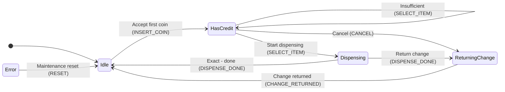

# StaTable 教程 - 用自动售货机学习三层状态机

Version: 1.0
Date: 2026-09-23
对象: StaTable v2.5.2 或更高版本

---

## 1. 简介

本教程将带您完成 **StaTable** 的完整工作流程：设计自动售货机的控制逻辑、
生成 C 代码，并使用多个工具链进行编译验证。

### 1.1 您将构建的内容

| 项目 | 内容 |
|------|------|
| 主题 | 自动售货机控制逻辑 |
| 层次 | Driver / Middleware / Application（3层） |
| 状态数 | 共16个（Driver 5 + Middleware 6 + Application 5） |
| 事件数 | 共19个 |
| 迁移数 | 共40个 |
| 生成代码 | C99，大量使用 static 函数，符合 MISRA C:2012 |
| 验证 | gcc + arm-none-eabi-gcc，均通过 -Wall -Wextra |

### 1.2 前提条件

- StaTable 已安装且 python -m statable_gui.main 可启动
- 存在 docs/tutorial/vending_machine.xml

---

## 2. 自动售货机模型

### 2.1 三层架构

按职责将自动售货机逻辑分为三层。

**Application 层（优先级 5）**
- 面向用户的流程
- 状态: Idle / HasCredit / Dispensing / ReturningChange / Error
- 命名空间: Vending.*

**Middleware 层（优先级 3）**
- 支付与库存管理
- 状态: Waiting / Accumulating / Ready / CheckingStock / Releasing / MwError
- 命名空间: Middleware.*

**Driver 层（优先级 1）**
- 硬件抽象
- 状态: Waiting / CoinPulse / ButtonPressed / MotorRunning / HardwareFault
- 命名空间: Driver.*

优先级数值越小越先执行。这保持了“读取硬件、判断支付、更新显示”
的自然顺序。

### 2.2 状态图（Application 层）



---

## 3. 在 GUI 中打开 XML

### 3.1 启动

```powershell
cd C:\...\StaTable\code
python -m statable_gui.main
```

> **环境变量注意**: 若设置了 `QT_QPA_PLATFORM=offscreen`，窗口将不会显示。
> 用 `Remove-Item Env:QT_QPA_PLATFORM` 清除。

### 3.2 打开 XML

**File > Open Project...** 并选择 `docs/tutorial/vending_machine.xml`。

**三个标签页**（Driver / Middleware / Application）将出现。

### 3.3 各标签页显示的内容

| 区域 | 内容 |
|------|------|
| 矩阵（上方） | 状态 x 事件 的迁移单元格 |
| Mermaid 图（中间） | 状态图 |
| SettingsPanel（右侧） | 状态列表 / 角色函数列表 |

---

## 4. Driver 层（硬件抽象）

### 4.1 状态

| 状态 | 类型 | 说明 |
|------|------|------|
| `Waiting` | initial | 等待硬件事件 |
| `CoinPulse` | normal | 检测到硬币传感器边沿 |
| `ButtonPressed` | normal | 按下商品按钮 |
| `MotorRunning` | normal | 出货电机运行中 |
| `HardwareFault` | normal | 硬件故障 |

### 4.2 事件

| 事件 | 配送方式 | 附加数据 |
|------|----------|----------|
| `COIN_SENSOR` | queue | `coin_value` (uint32_t) |
| `BUTTON_SENSOR` | queue | `item_id` (uint8_t) |
| `MOTOR_COMPLETE` | direct | - |
| `HW_FAULT` | queue | `err_code` (uint8_t)，优先级 9 |
| `CLEAR_FAULT` | direct | - |

### 4.3 设计要点

- **队列配送**: 传感器事件使用 `queue` 避免丢失
- **优先级 9 的 FAULT**: 比普通事件更早处理
- **单元格动作**: `Waiting + COIN_SENSOR` 演示 Pre/Post

---

## 5. Middleware 层（支付与库存）

### 5.1 状态

| 状态 | 类型 | 说明 |
|------|------|------|
| `Waiting` | initial | 等待请求 |
| `Accumulating` | normal | 累积硬币 |
| `Ready` | normal | 余额充足 |
| `CheckingStock` | normal | 验证库存 |
| `Releasing` | normal | 出货中 |
| `MwError` | normal | Middleware 错误 |

### 5.2 排他关系示例

`Accumulating + ITEM_SELECT` 单元格有**排他关系**:

```xml
<Relation kind="exclusive" members="T1,T2" />
```

这保证 T1（余额充足）和 T2（余额不足）中最多只有一个可以触发。

### 5.3 嵌套 group 示例

`Releasing + RELEASE_DONE` 单元格有**嵌套 group**:

```xml
<Relation kind="group" members="T1,T2"
          shared_condition="RoleFunc_Middleware_CheckStock(transition, ctx) != 0">
  <Children>
    <Relation kind="exclusive" members="T1,T2" />
  </Children>
</Relation>
```

**生成的 C 代码:**

```c
if (RoleFunc_Middleware_CheckStock(transition, ctx) != 0) {
    if (cond_with_change) {
        /* T1: 有找零 */
    } else if (cond_exact) {
        /* T2: 恰好 */
    }
}
```

---

## 6. Application 层（用户流程）

### 6.1 状态

| 状态 | 类型 | 说明 |
|------|------|------|
| `Idle` | initial | 等待投币 |
| `HasCredit` | normal | 已投币 |
| `Dispensing` | normal | 出货中 |
| `ReturningChange` | normal | 找零中 |
| `Error` | final | 致命错误 |

### 6.2 单元格动作

`Idle + INSERT_COIN` 单元格有**单元格动作**:

```xml
<Actions>
  <Action role_function="Vending.PreCheck"
          trigger="before_transitions" />
  <Action role_function="Vending.PostCommit"
          trigger="after_transitions" />
</Actions>
```

**生成的 C 代码（顺序）:**

```c
static STATE_Vending_t t_Idle_INSERT_COIN(...)
{
    STATE_Vending_t next_state = transition->from_state;

    /* Cell actions (before_transitions) */
    (void)RoleFunc_Vending_PreCheck(transition, ctx);

    /* Transition[T1] (Commit) */
    if (1) {
        next_state = STATE_Vending_HasCredit;
    }

    /* Cell actions (after_transitions) */
    (void)RoleFunc_Vending_PostCommit(transition, ctx);

    return next_state;
}
```

- **Pre**: 迁移评估**前**（即使没有迁移触发也运行）
- **Post**: 迁移评估**后**（即使 early return 也运行）

### 6.3 嵌套 group 实例

`Dispensing + DISPENSE_DONE` 单元格:

```xml
<Relation kind="group" members="T1,T2"
          shared_condition="ctx->data.stock > 0">
  <Children>
    <Relation kind="exclusive" members="T1,T2" />
  </Children>
</Relation>
```

“仅在有余量时，执行找零**或**完成处理中的其中一个”。

---

## 7. 代码生成

### 7.1 通过 GUI 生成

1. **Generate > Code Generation...**
2. 确认输出目录、生成方式、OS 类型
3. 点击 **Generate**

### 7.2 通过 CLI 生成（推荐）

```powershell
cd C:\...\StaTable\code

python tools\gen_output_from_xml.py `
    --xml docs\tutorial\vending_machine.xml `
    --out output_vending
```

**预期输出:**

```
Loading: docs\tutorial\vending_machine.xml
  tabs:  ['Driver', 'Middleware', 'Application']
  gd:    variables=8, flags=2, interrupts=1
  roles: 27
  layers: 3
  config: folder_structure=by_layer, project_name=VendingMachineTutorial

Generating C code ...
  generated 24 files
  saved 24 files to ...\output_vending

Result: 12 .c / 12 .h under output_vending
```

### 7.3 生成文件结构

```
output_vending/
  statable_all.h
  statable_types_common.h
  statable_init.c
  statable_interrupt.c
  statable_timer.c
  statable_event_queue.c
  osal.c / osal.h
  VendingMachineTutorial_run.c
  Driver/
    statable_types_Driver.h
    statable_role_functions_Driver.h / .c
    statable_transitions_Driver.h / .c
  Middleware/  (相同布局)
  Vending/     (layer_name="Vending")
    statable_types_Vending.h
    statable_role_functions_Vending.h / .c
    statable_transitions_Vending.h / .c
```

---

## 8. 编译验证

### 8.1 单一工具链

```powershell
python tools\verify_c_syntax.py --root output_vending --compiler gcc
python tools\verify_c_syntax.py --root output_vending --compiler arm
```

### 8.2 同时使用两个工具链（推荐）

```powershell
python tools\verify_c_syntax.py --root output_vending --compiler both
```

**预期输出:**

```
==============================================================================
  Summary
==============================================================================
  gcc      PASS     (12/12)
  arm      PASS     (12/12)

  Overall:  ALL PASS
==============================================================================
  Log saved to: ...verify_report\verify_c_syntax_YYYYMMDD_HHMMSS.log
==============================================================================
```

### 8.3 证据日志

每次运行都会写入 `verify_report/verify_c_syntax_YYYYMMDD_HHMMSS.log`，
包含时间戳、git 提交和环境信息。可作为发布时的证据使用。

---

## 9. 常见陷阱

### 9.1 C-50: namespace 必须与 layer_name 前缀一致（v2.5.1 之前）

**症状:**

```
error: implicit declaration of function 'RoleFunc_Vending_PreCheck'
```

**原因**: 当 `layer_name="Application"` 且 `namespace="Vending"` 时，
调用会被生成但声明缺失。

**解决方法:**

- v2.5.1 之前: 使用 `namespace="App"`（`Application` 的前缀）
- **v2.5.2 之后**: 任意 namespace 均可使用（C-50 已解决）

### 9.2 (void) 抑制可由用户编辑（v2.5.2 起）

生成的角色函数声明指向 `ctx->data.*` 的局部指针，
并用 `(void)` 显式丢弃未使用的指针以避免警告。

```c
uint32_t *const balance = &ctx->data.balance;
...
/* [[STABLE_USER_CODE_START:...]] */
/* --- auto-generated: unused-variable suppression --- */
(void)balance;
...
/* [[STABLE_USER_CODE_END:...]] */
```

**自 v2.5.2 起，(void) 块位于用户可编辑标记内。**

- 首次生成: (void) 行出现在标记内
- 用户删除不需要的行后，重新生成不会恢复它们

### 9.3 合并机制

StaTable 在重新生成时会保留用户编辑。

| 标记 | 用途 |
|------|------|
| `[[STABLE_USER_CODE_START]]` ... `END` | 文件级用户区域 |
| `[[STABLE_USER_CODE_START:Driver_Init]]` ... `END:Driver_Init` | 函数级用户区域 |
| `[[STABLE_USER_CODE_TAIL_START]]` ... `END` | 文件尾部用户区域 |

**标记内保留，标记外覆盖。**

---

## 10. 练习题

### 练习1: 添加新状态

在 Application 层添加 `Refunding` 状态，并创建
`ReturningChange -> Refunding -> Idle` 迁移。

### 练习2: 超时处理

添加一个迁移，使 `HasCredit` 在 60 秒后自动取消。

**提示**: 使用 `EventKind.TIME`。

### 练习3: 缺货显示

当 Middleware 层收到 `STOCK_EMPTY` 时，添加一个事件
提示 Application 层显示“缺货”。

---

## 11. 参考资料

| 资源 | 位置 |
|------|------|
| 完整规范 | `docs/SPEC_OVERVIEW_ja.md`（日语） |
| Issue 记录 | `docs/ISSUES_v2_5.md` |
| 教程 XML | `docs/tutorial/vending_machine.xml` |
| Vending 标签页版 XML | `docs/tutorial/vending_machine_vending_tab.xml` |
| 编译验证工具 | `tools/verify_c_syntax.py` |
| 生成工具 | `tools/gen_output_from_xml.py` |

---

以上为 `docs/tutorial/TUTORIAL_zh.md` v1.0 完整版。
