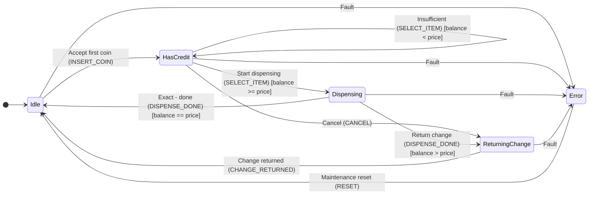

# StaTable 教程 — 通过自动售货机学习三层状态机

Version: 1.2
Date: 2026-09-26
适用版本：StaTable v2.6.0 及以上
---

## 1. 简介

本教程将学习使用 **StaTable** 设计自动售货机控制逻辑、
生成 C 代码并通过编译验证生成代码的完整流程。

### 1.1 最终成果

| 项目 | 内容 |
|------|------|
| 主题 | 自动售货机控制逻辑 |
| 层结构 | 三层：Driver / Middleware / Application |
| 状态数 | 共 16 个（Driver 5 + Middleware 6 + Application 5） |
| 事件数 | 共 19 个 |
| 迁移数 | 共 40 个 |
| 生成代码 | 符合 C99，大量使用 `static` 函数，支持 MISRA C:2012 |
| 验证 | gcc 和 arm-none-eabi-gcc 均通过 `-Wall -Wextra` |

### 1.2 前提条件

- 已完成 StaTable 设置（`python -m statable_gui.main` 可以正常启动）
- 存在 `docs/tutorial/vending_machine.xml`
---

## 2. 示例主题：自动售货机

### 2.1 三层架构

将自动售货机的控制按照职责划分为三个层。

```

┌──────────────────────────────────────────────────┐
│  Application 层（优先级 5）                      │
│  - 面向用户的流程                                 │
│  - 状态：Idle / HasCredit / Dispensing /        │
│         ReturningChange / Error                  │
│  - 命名空间：Vending.*                            │
├──────────────────────────────────────────────────┤
│  Middleware 层（优先级 3）                       │
│  - 支付与库存管理                                 │
│  - 状态：Waiting / Accumulating / Ready /       │
│         CheckingStock / Releasing / MwError      │
│  - 命名空间：Middleware.*                         │
├──────────────────────────────────────────────────┤
│  Driver 层（优先级 1）                           │
│  - 硬件抽象                                       │
│  - 状态：Waiting / CoinPulse / ButtonPressed /  │
│         MotorRunning / HardwareFault             │
│  - 命名空间：Driver.*                             │
└──────────────────────────────────────────────────┘

```

**优先级数值越小的层越先执行。** 这样可以保证
“硬件读取 → 支付判断 → 用户显示”的自然处理顺序。


### 2.2 状态迁移图（Application 层）



---

## 3. 在 GUI 中打开 XML

### 3.1 启动

```powershell

cd C:...\StaTable\code
python -m statable_gui.main

```

> **环境变量注意事项**：如果设置了 `QT_QPA_PLATFORM=offscreen`，
> GUI 将不会显示。请使用 `Remove-Item Env:QT_QPA_PLATFORM` 解除该设置。

### 3.2 打开 XML

通过 **File > Open Project...** 选择 `docs/tutorial/vending_machine.xml`。
此时会显示 **三个标签页**（Driver / Middleware / Application）。

### 3.3 各标签页中可以确认的内容

| 区域 | 内容 |
|------|------|
| 矩阵（上方） | 状态 × 事件的迁移单元格 |
| Mermaid 图（中间） | 状态迁移图 |
| SettingsPanel（右侧） | 状态列表 / Role 函数列表 |

---

## 4. Driver 层（硬件抽象）

### 4.1 状态

| 状态 | 类型 | 说明 |
|------|------|------|
| `Waiting` | initial | 等待硬件事件 |
| `CoinPulse` | normal | 检测到投币传感器边沿 |
| `ButtonPressed` | normal | 商品按钮被按下 |
| `MotorRunning` | normal | 出货电机运行中 |
| `HardwareFault` | normal | 硬件故障 |

### 4.2 事件

| 事件 | 传递方式 | 附带数据 | Trigger（发生条件） |
|---------|---------|-----------|-------------------------|
| `COIN_SENSOR` | queue | `coin_value`（uint32_t） | edge: `GPIO_COIN`, falling, 50ms |
| `BUTTON_SENSOR` | queue | `item_id`（uint8_t） | edge: `GPIO_BUTTON_1`, falling, 20ms |
| `MOTOR_COMPLETE` | direct | – | manual |
| `HW_FAULT` | queue | `err_code`（`uint8_t`），优先级 9 | edge: `GPIO_FAULT`, falling, 5ms |
| `CLEAR_FAULT` | direct | – | manual |

### 4.3 记录 Trigger（发生条件）

从 C-51 Step 3 开始，可以以结构化方式记录事件的发生条件。
展开事件编辑对话框中的 **Trigger detail** 区域并输入相关信息。

#### 支持的 Type

| Type | 用途 | 设置项目 |
|------|------|---------|
| `manual` | 手动触发（默认） | 无 |
| `edge` | GPIO 边沿检测 | Edge / Debounce / Source |
| `polling` | 周期轮询 | Period / Source |
| `timer` | 定时器到期 | Period / Auto reload / Source |
| `call` | 函数调用 | Caller |
| `comparison` | 条件比较 | Condition / Poll period |

#### 输入示例：商品按钮

1. 选择并编辑 `BUTTON_SENSOR` 事件
2. 勾选 Trigger detail 区域
3. 选择 Type：`edge`
4. 选择 Source：`GPIO_BUTTON_1`（根据中断定义自动提供候选项）
5. 选择 Edge：`falling`
6. 输入 Debounce：`20` ms

生成的 XML：

```xml
<Event name="BUTTON_SENSOR" ...>
  <Trigger type="edge" source="GPIO_BUTTON_1"
           edge="falling" debounce_ms="20" />
</Event>
```

#### 关于 Source 候选项

- `edge`：中断定义（`GlobalDefinitions.interrupts`）中的 GPIO 名称
- `timer` / `polling`：定时器定义（`timer_base` / `extra_timers`）中的名称
- `call`：Role 函数名称
- 如果候选项中没有，也可以直接输入文本。

### 4.4 设计要点

- **队列传递**：传感器事件使用 `queue`，防止事件丢失
- **优先级 9 的 FAULT**：在普通事件之前处理
- **Cell action**：通过 `Waiting + COIN_SENSOR` 演示 Pre/Post
---

## 5. Middleware 层（支付与库存）

### 5.1 状态

| 状态 | 类型 | 说明 |
|------|------|------|
| `Waiting` | initial | 等待请求 |
| `Accumulating` | normal | 累积硬币 |
| `Ready` | normal | 可以进行支付 |
| `CheckingStock` | normal | 检查库存 |
| `Releasing` | normal | 释放中 |
| `MwError` | normal | Middleware 错误 |

### 5.2 排他关系示例

`Accumulating + ITEM_SELECT` 单元格包含一个**排他关系**：

```xml

<Relation kind="exclusive" members="T1,T2" />

```

这样可以保证 T1（余额充足）和 T2（余额不足）
**最多只能有一个被触发**。

### 5.3 嵌套 group 示例

`Releasing + RELEASE_DONE` 单元格包含一个**嵌套 group**：

```xml

<Relation kind="group" members="T1,T2"
          shared_condition="RoleFunc_Middleware_CheckStock(transition, ctx) != 0">
  <Children>
    <Relation kind="exclusive" members="T1,T2" />
  </Children>
</Relation>

```

**生成的 C 代码：**

```c

if (RoleFunc_Middleware_CheckStock(transition, ctx) != 0) {
    if (cond_with_change) {
        /* T1：有找零 */
    } else if (cond_exact) {
        /* T2：金额刚好 */
    }
}

```

---

## 6. Application 层（面向用户的流程）

### 6.1 状态

| 状态 | 类型 | 说明 |
|------|------|------|
| `Idle` | initial | 等待投币 |
| `HasCredit` | normal | 有可用余额 |
| `Dispensing` | normal | 出货中 |
| `ReturningChange` | normal | 退还找零中 |
| `Error` | final | 致命错误 |

### 6.2 Cell Action

`Idle + INSERT_COIN` 单元格包含 **Cell Action**：

```xml

<Actions>
  <Action role_function="Vending.PreCheck"
          trigger="before_transitions" />
  <Action role_function="Vending.PostCommit"
          trigger="after_transitions" />
</Actions>

```

**生成的 C 代码（执行顺序）：**

```c

static STATE_Vending_t t_Idle_INSERT_COIN(...)
{
    STATE_Vending_t next_state = transition->from_state;
    /* Cell actions (before_transitions) */
    (void)RoleFunc_Vending_PreCheck(transition, ctx);
    /* Transition[T1] (Commit) */
    if (1) {
        next_state = STATE_Vending_HasCredit;
    }
    /* Cell actions (after_transitions) */
    (void)RoleFunc_Vending_PostCommit(transition, ctx);
    return next_state;
}

```

- **Pre**：在迁移评估**之前**执行（即使没有迁移被触发也会执行）
- **Post**：在迁移评估**之后**执行（即使 Commit 导致 early return 也会执行）

### 6.3 嵌套 group 示例

`Dispensing + DISPENSE_DONE` 单元格：

```xml

<Relation kind="group" members="T1,T2"
          shared_condition="ctx->data.stock > 0">
  <Children>
    <Relation kind="exclusive" members="T1,T2" />
  </Children>
</Relation>

```

“仅当有库存时，执行退还找零或完成处理中的**其中一个**。”
---

## 7. 周期处理与事件源

### 7.1 StaTable 是事件驱动的

StaTable 生成的代码**仅在事件到达时**调用状态迁移函数。
超级循环的结构如下：

```c
while (1) {
    Event_t ev = StateMachine_GetNextEvent_<Layer>(&ctx);
    if (ev != EVENT_NONE) {
        StateMachine_Process_<Layer>(ev, &ctx);
    }
    /* EVENT_NONE 时不执行任何操作（空闲） */
}
```

**StaTable 按纯事件驱动方式设计，不采用 UML 状态机中的
do activity（状态停留期间持续处理）的概念。**
状态进入和退出的瞬间可以用 entry / exit 表示，但
相当于“停留期间持续执行”的处理必须**明确设计为周期处理**。

### 7.2 三种事件源

事件的来源大致可以分为三类。
**StaTable 不区分这三种来源**，全部统一为“事件到达 → 调用迁移函数”


| # | 来源 | 示例 | 触发方法 |
|---|-------|-----|---------|
| 1 | 硬件中断 | GPIO 边沿、UART 接收完成、ADC 转换完成 | 在 ISR 中调用 `FIRE_EVENT_QUEUE_<Layer>()` |
| 2 | 定时器（周期） | 1ms tick、10ms tick、软件定时器 | 在定时器 ISR 中调用 `FIRE_EVENT_QUEUE_<Layer>()` |
| 3 | 轮询（无中断） | 传感器阈值、标志监视、软件条件 | 在超级循环或 RoleFunc 中调用 `FIRE_EVENT_<Layer>()` |

### 7.3 周期监视模式：TIME 事件 + 自迁移

示例：在 `Running` 状态下每 10 ms 监视一次传感器

```xml
<Event name="TICK_10MS" kind="time" .../>
<Transition source="Running" event="TICK_10MS" target="Running"
            pre_actions="Driver.PollSensor" .../>
```

这样每 10 ms 会调用一次 `Driver.PollSensor()`。
由于目标状态与当前状态相同，因此状态不会改变。

**提示**：在 `GlobalDefinitions` 中定义定时器，并在 Trigger detail 中使用
`type="timer"` 将其选择为 Source（参见 §4.3）。

### 7.4 GUI 设置步骤（模式 A）

本节介绍如何在 StaTable GUI 中设置模式 A（TIME 事件 + 条件自迁移）。
示例中，我们将在 `Running` 状态下每 10 ms 监视温度，并在
温度超过 80°C 时调用 `SetOverheatFlag`。

#### Step 1：定义 TIME 事件 `TICK_10MS`

1. 打开 **Edit > Event Definitions...**
2. 使用 **[Add]** 创建新事件：
   - Name: `TICK_10MS`
   - Kind: `time`
   - Delivery：`direct`（对于周期处理通常已经足够）
3. 展开 **Trigger detail** 区域并启用：
   - Type: `timer`
   - Source：`TIMER_10MS`（从 `GlobalDefinitions` 的定时器定义中选择）
   - Period: `10`（ms）
   - Auto reload: ✅ ON
4. 点击 **[OK]** 确认

> **提示**：如果事先通过 **Edit > Global Definitions...** 添加
> `TIMER_10MS` 作为定时器定义，它将出现在 Source 候选项中。
> 如果候选项中没有，也可以直接输入文本（参见 §4.3）。

#### Step 2：为 `Running` 状态添加自迁移

1. 切换到 **Application** 标签页（或目标层）
2. 在矩阵中**双击** **(Running, TICK_10MS)** 单元格
3. 打开 **ActionEditorDialog**
4. 在 **Transitions** 标签页中点击 **[+ Add]**：
   - Label: `T1`（デフォルト）
   - Source: `Running`（自動）
   - Event: `TICK_10MS`（自動）
   - Target: **`Running`**（同じ状態を選択）
   - Condition: `ctx->data.temperature > 80`
   - Early return (Commit): 任意（通常は ON 推奨）
5. 在 **Pre / Post Actions** 标签页中将其添加到 Pre 组：
   - Role function: `Driver.SetOverheatFlag`
   - Trigger: `before_transitions`
6. 点击 **[OK]** 确认

#### Step 3：在 XML 中确认

通过 **File > Save Project...** 保存后，在文本编辑器中确认相应部分：

```xml
<Events>
  <Event name="TICK_10MS" kind="time" delivery_type="direct" ...>
    <Trigger type="timer" source="TIMER_10MS"
             period_ms="10" auto_reload="true"/>
  </Event>
</Events>
...
<Transitions>
  <Transition source="Running" event="TICK_10MS" target="Running"
              condition="ctx->data.temperature &gt; 80"
              early_return="true" label="T1">
    <PreAction action="Driver.SetOverheatFlag"/>
  </Transition>
</Transitions>
```

#### Step 4：确认生成的代码

通过 **Generate > Code Generation...** 或 CLI（§8.2）生成后，
确认 `statable_transitions_<Layer>.c` 中对应的单元格函数：

```c
static STATE_Vending_t t_Running_TICK_10MS(...)
{
    STATE_Vending_t next_state = transition->from_state;
    if (ctx->data.temperature > 80) {
        (void)RoleFunc_Driver_SetOverheatFlag(transition, ctx);
        next_state = STATE_Vending_Running;   /* 自迁移 */
    }
    return next_state;
}
```

由于 `next_state` 被设置为相同状态，因此**状态不会改变，
只有 Action 会周期性执行**。

#### 常见错误

| # | 现象 | 原因 | 对策 |
|---|------|------|------|
| 1 | 迁移从未触发 | Event `kind` 不是 `time`，或 Timer ISR 没有调用 `FIRE_EVENT_QUEUE_<Layer>(TICK_10MS)` | 按 §7.8 的对应表实现定时器 ISR |
| 2 | 条件始终为 false | `condition` 写法错误（忘记 `ctx->` 前缀或忘记对 `>` 做 XML 转义） | XML 中使用 `&gt;` / `&lt;` |
| 3 | `pre_actions` 未执行 | 条件为 false 时，`pre_actions` 也不会执行（它属于迁移主体的一部分） | 如果希望与条件无关地执行，请使用 **Cell action**（`before_transitions`）（参见 §6.2） |
| 4 | 执行频率高于预期 | Timer 的 `period_ms` 或 `auto_reload` 设置错误 | 重新确认 Trigger detail |

### 7.5 处理非中断产生的事件

如果没有中断但需要定期检查，可以采用三种实现方式。

#### 模式 A（推荐）：条件自迁移

```xml
<Transition source="Monitoring" event="TICK_10MS" target="Monitoring"
            condition="temperature > 80"
            pre_actions="Driver.SetOverheatFlag" .../>
```

→ 不额外触发事件，在单元格内部完成。**最易读**（设置步骤参见 §7.4）。

#### 模式 B（不推荐）：从 RoleFunc 触发其他事件

```c
int RoleFunc_Driver_CheckTemp(...) {
    if (ctx->temperature > 80) {
        FIRE_EVENT_Application(OVERHEAT);   /* ← 触发其他事件 */
    }
    return 0;
}
```

→ 事件触发变得分散，**难以追踪在哪里发生了什么**。
除非有特殊理由，否则请避免使用。

#### 模式 C：从超级循环直接注入事件

```c
/* 在 {project}_run.c 的 [[STABLE_USER_CODE]] 内 */
if (ctx.temperature > 80) {
    FIRE_EVENT_QUEUE_Application(OVERHEAT);
}
```

→ 在状态机外进行轮询，**仅注入事件**。
适用于复杂判断或跨越多个状态的条件。

### 7.6 如何选择（判断表）

| 目的 | 模式 |
|------|---------|
| 周期执行 + 简单条件判断 | A（条件自迁移） |
| 周期执行 + 复杂判断 → 其他迁移 | C（从超级循环注入） |
| ISR 起点（边沿、接收） | ISR + `FIRE_EVENT_QUEUE_<Layer>` |
| 每周期必须执行的处理（不可遗漏） | 从超级循环直接调用 RoleFunc |

### 7.7 注意事项

| # | 注意事项 | 对策 |
|---|------|------|
| 1 | **事件队列溢出**：如果轮询周期 < 处理时间，队列可能溢出并导致事件丢失 | 监视 `EventQueueState_t.dropped` 计数器（C-54）。发生溢出时延长周期或使用 `delivery_type="direct"` |
| 2 | **保证“每周期恰好执行一次”**：通过队列可能产生延迟或丢失 | 如果必须保证每周期执行，应从超级循环直接调用 `RoleFunc_*`，而不是使用 TIME 事件 |
| 3 | **按周期处理进行设计**：StaTable 不采用 UML do activity，因此“停留期间持续处理”必须使用本节模式明确设计为周期处理 | 参见 §7.3–7.5 的模式 |

### 7.8 嵌入式现场对应表

| 现场实现 | StaTable 对应方式 |
|-----------|-----------------|
| 硬件定时器 ISR 每 1 ms 设置一次标志 | 从 ISR 触发 `EventKind.TIME` 的 `TICK_1MS` 事件 |
| RTOS 软件定时器回调 | 同上（在回调中调用 `FIRE_EVENT_QUEUE_<Layer>`） |
| 在主循环开头检查 `if (tick_flag)` | 用上述 TIME 事件 + 自迁移替换 |
| 周期读取传感器 | TIME 事件 + 条件自迁移（模式 A，参见 §7.4） |

---

## 8. 代码生成

### 8.1 从 GUI 生成

1. **Generate > Code Generation...**
2. 确认输出目录、生成方式和 OS 类型
3. 点击 **Generate** 按钮

### 8.2 从 CLI 生成（推荐）

```powershell

cd C:...\StaTable\code
python tools\gen_output_from_xml.py `
    --xml docs\tutorial\vending_machine.xml `
    --out output_vending

```

**预期结果：**

```

Loading: docs\tutorial\vending_machine.xml
  tabs:  ['Driver', 'Middleware', 'Application']
  gd:    variables=8, flags=2, interrupts=1
  roles: 27
  layers: 3
  config: folder_structure=by_layer, project_name=VendingMachineTutorial
Generating C code ...
  generated 24 files
  saved 24 files to ...\output_vending
Result: 12 .c / 12 .h under output_vending

```

### 8.3 生成文件结构

```

output_vending/
├── statable_all.h
├── statable_types_common.h
├── statable_init.c
├── statable_interrupt.c
├── statable_timer.c
├── statable_event_queue.c
├── osal.c / osal.h
├── VendingMachineTutorial_run.c
├── Driver/
│   ├── statable_types_Driver.h
│   ├── statable_role_functions_Driver.h / .c
│   └── statable_transitions_Driver.h / .c
├── Middleware/
│   └── （相同结构）
└── Vending/               ← layer_name="Vending"
    ├── statable_types_Vending.h
    ├── statable_role_functions_Vending.h / .c
    └── statable_transitions_Vending.h / .c

```

---

## 9. 编译验证

### 9.1 单一工具链

```powershell

python tools\verify_c_syntax.py --root output_vending --compiler gcc
python tools\verify_c_syntax.py --root output_vending --compiler arm

```

### 9.2 两种工具链同时验证（推荐）

```powershell

python tools\verify_c_syntax.py --root output_vending --compiler both

```

**预期结果：**

```

==============================================================================
  Summary
==============================================================================
  gcc      PASS     (12/12)
  arm      PASS     (12/12)
  Overall:  ALL PASS
==============================================================================
  Log saved to: ...verify_report\verify_c_syntax_YYYYMMDD_HHMMSS.log
==============================================================================

```

### 9.3 证据日志

每次执行都会自动保存 `verify_report/verify_c_syntax_YYYYMMDD_HHMMSS.log`。
其中包含**时间戳、git commit 和环境信息**，
因此可作为发布时的证据记录。
---

## 10. 常见问题

### 10.1 C-50：namespace 必须与 layer_name 前缀匹配（v2.5.1 以前）

**现象：**

```

error: implicit declaration of function 'RoleFunc_Vending_PreCheck'

```

**原因：** 当 `layer_name="Application"` 使用 `namespace="Vending"` 时，
会生成调用，但**声明会缺失**。
**对策：**
- v2.5.1 以前：使用与前缀匹配的名称，例如 `namespace="App"`
- **v2.5.2 及以上**：可以使用任意 namespace（C-50 已解决）

### 10.2 (void) 抑制的用户编辑（v2.5.2 及以上）

生成的 Role 函数会声明指向 `ctx->data.*` 的局部指针，并
使用 `(void)` 显式丢弃它们，以避免未使用变量警告。

```c

uint32_t *const balance = &ctx->data.balance;
...
/* [[STABLE_USER_CODE_START:...]] */
/* --- auto-generated: unused-variable suppression --- */
(void)balance;
...
/* [[STABLE_USER_CODE_END:...]] */

```

**从 v2.5.2 开始，`(void)` 语句已移动到用户可编辑区域（标记内部）。**
- 初次生成：`(void)` 语句显示在标记内部
- 用户删除不需要的行后，重新生成时**不会恢复**

### 10.3 理解合并行为

StaTable 在重新生成时会**保留用户编辑内容**。

| 标记 | 用途 |
|---------|------|
| `[[STABLE_USER_CODE_START]]` ... `END` | 整个文件的用户区域 |
| `[[STABLE_USER_CODE_START:Driver_Init]]` ... `END:Driver_Init` | 单个函数的用户区域 |
| `[[STABLE_USER_CODE_TAIL_START]]` ... `END` | 文件末尾的用户区域 |

**标记内部的编辑会保留；标记外的内容会被覆盖。**
---

## 11. 练习

### 练习 1：添加新状态

在 Application 层添加 `Refunding` 状态，并
创建迁移 `ReturningChange → Refunding → Idle`。

### 练习 2：超时处理

在 Application 层添加一个迁移，使“`HasCredit` 状态持续 60 秒后自动取消”。

**提示：** 使用 `EventKind.TIME` 和 §7.3 的周期监视模式。

### 练习 3：缺货时显示

当 Middleware 层收到 `STOCK_EMPTY` 时，
添加一个事件，促使 Application 层显示“缺货”。
---

## 12. 参考资料

| 资料 | 位置 |
|------|------|
| 总体规格书 | `docs/SPEC_OVERVIEW_ja.md` |
| Issue 记录 | `docs/ISSUES_v2_5.md` / `docs/ISSUES_v2_6.md` |
| TUTORIAL XML | `docs/tutorial/vending_machine.xml` |
| Vending 标签页版 XML | `docs/tutorial/vending_machine_vending_tab.xml` |
| 编译验证工具 | `tools/verify_c_syntax.py` |
| 生成工具 | `tools/gen_output_from_xml.py` |
