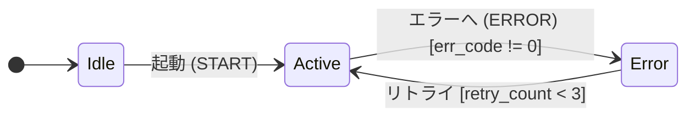

# StaTable プロジェクト 全体仕様書

組み込みシステム向け状態遷移表エディタ **StaTable** の統合仕様書。  
`初期仕様.md` および `フォルダ構成反映 実装 引継ぎ資料.txt` を統合したもの。

---

## 目次

1. [プロジェクト概要](#1-プロジェクト概要)
2. [アーキテクチャ / フォルダ構成](#2-アーキテクチャ--フォルダ構成)
3. [データモデル仕様](#3-データモデル仕様)
4. [GUI 仕様](#4-gui-仕様)
5. [コード生成仕様](#5-コード生成仕様)
6. [完成済み機能](#6-完成済み機能)
7. [★ 本タスク（B）: フォルダ構成反映](#7--本タスクb-フォルダ構成反映)
8. [既知の問題 / 未解決課題](#8-既知の問題--未解決課題)
9. [ロードマップ](#9-ロードマップ)
10. [新スレッドでの着手手順](#10-新スレッドでの着手手順)
11. [付録: 現行コード](#11-付録-現行コード)

---

## 1. プロジェクト概要

**StaTable** は、組み込みシステム向けの**状態遷移表エディタ**。  
状態遷移の設計・編集・コード生成・検証を統合的に行う GUI アプリケーション。

### 1.1 技術スタック

| 項目 | 技術 |
|------|------|
| 言語 | Python 3.13 |
| GUI | PySide6 (Qt for Python) |
| Web 描画 | QWebEngine + Mermaid.js |
| データ永続化 | XML (ElementTree) |
| データモデル | Python dataclasses |

### 1.2 主要機能

| 機能 | 説明 |
|------|------|
| 状態遷移表編集 | 状態×イベントのマトリクスで遷移を管理 |
| アクションエディタ | D&D で遷移条件・ロール関数を編集 |
| コード生成 | C 言語のステートマシンコードを自動生成（全 11 ファイル） |
| Mermaid 図生成 | 状態遷移図を動的にレンダリング |
| 共有ライブラリ | ロール関数・遷移条件・リテラルを再利用 |
| 検証・AI 診断 | コード生成前の整合性チェック |
| XML 保存/読込 | プロジェクト全体を XML で永続化 |

---

## 2. アーキテクチャ / フォルダ構成

```
StaTable/
├── code/
│   ├── gui_main.py                    # アプリ起動エントリポイント
│   ├── Resources/
│   │   └── mermaidwin.js              # Mermaid.js ライブラリ
│   ├── logs/                          # ログ出力先
│   ├── specs/                         # 保存されたプロジェクト XML
│   │   └── project.xml
│   │
│   ├── statable/                      # コアデータモデル
│   │   ├── __init__.py
│   │   ├── model.py                   # State, Event, Transition, RoleFunction
│   │   ├── state_machine.py           # StateMachine クラス
│   │   ├── global_defs.py             # GlobalDefinitions
│   │   ├── xml_io.py                  # XML 保存/読込
│   │   ├── mermaid_gen.py             # Mermaid 図生成
│   │   └── sample_data.py             # サンプルデータ生成
│   │
│   ├── statable_gui/                  # GUI レイヤ
│   │   ├── __init__.py
│   │   ├── main_window.py             # MainWindow
│   │   ├── widgets.py                 # StateMachineTab / SettingsPanel / MermaidWidget
│   │   ├── matrix_table.py            # MatrixTableWidget（状態遷移表）
│   │   ├── config.py                  # 画面設定定数
│   │   ├── preferences.py             # ユーザー環境設定
│   │   ├── logger.py                  # StaTableLogger
│   │   ├── traceball.py               # TraceBall ログ表示
│   │   ├── global_defs.py             # GlobalDefinitions（GUI 側）
│   │   ├── global_defs_dialog.py
│   │   ├── event_definition_dialog.py
│   │   ├── event_delivery_settings_dialog.py
│   │   ├── interrupt_handler_edit_dialog.py
│   │   ├── role_function_dialog.py
│   │   ├── action_edit_dialog.py
│   │   ├── common_widgets.py
│   │   ├── condition_builder_dialog.py
│   │   ├── validation_dialog.py
│   │   ├── code_generation_dialog.py
│   │   ├── code_generation_settings_dialog.py
│   │   │
│   │   ├── libcntrl/                  # 共有ライブラリ
│   │   │   ├── __init__.py
│   │   │   ├── role_function_library.py
│   │   │   ├── condition_library.py
│   │   │   ├── literal_library.py
│   │   │   ├── role_function_edit_dialog.py
│   │   │   └── literal_management_dialog.py
│   │   │
│   │   └── transition_editor_direct/  # アクションエディタ
│   │       ├── __init__.py
│   │       ├── dialog.py              # ActionEditorDialog
│   │       ├── canvas_widget.py       # FlowCanvas, FlowNodeItem
│   │       ├── palette_widget.py      # PaletteWidget
│   │       ├── draft.py               # ActionDraft, FlowItem
│   │       ├── code_widget.py         # CodeWidget
│   │       ├── edit_dialogs.py        # ノード編集ダイアログ
│   │       └── system_global_dialog.py
│   │
│   ├── codegen/                       # コード生成
│   │   ├── __init__.py
│   │   ├── c_code_generator.py        # CCodeGenerator（メイン）★
│   │   ├── transition_generator.py    # TransitionGenerator
│   │   ├── role_function_generator.py # RoleFunctionGenerator
│   │   ├── type_mapper.py             # CTypeMapper
│   │   ├── naming_convention.py       # CNamingConvention
│   │   ├── struct_generator.py        # CStructGenerator
│   │   ├── enum_generator.py          # CEnumGenerator
│   │   ├── variable_generator.py      # VariableGenerator
│   │   ├── event_queue_generator.py   # EventQueueGenerator
│   │   ├── interrupt_generator.py     # InterruptGenerator
│   │   ├── timer_generator.py         # TimerGenerator
│   │   ├── osal_generator.py          # OSALGenerator
│   │   ├── code_templates.py          # CodeTemplates
│   │   ├── code_merger.py             # CodeMerger ★
│   │   ├── config.py                  # ConfigManager, CodeGenerationConfig
│   │   └── sample_data.py             # SampleDataGenerator
│   │
│   └── tests/
│       ├── test_c_code_generator.py         (30件)
│       ├── test_role_function_generator.py  (89件)
│       ├── test_transition_config.py        (12件)
│       ├── test_warning_collector.py        (15件)
│       ├── test_code_merger.py
│       ├── test_all_dialogs_gui.py
│       ├── test_drop_indicator_overlap.py
│       ├── test_transition_editor_direct.py
│       ├── test_condition_builder_gui.py
│       └── test_folder_structure.py         ★ 新規
│
└── README.md
```

> ★ = 本タスク（フォルダ構成反映）での変更/追加対象

---

## 3. データモデル仕様

### 3.1 列挙型

```python
class StateType(Enum):
    NORMAL = "normal"
    CONCURRENT = "concurrent"
    REGION = "region"
    INITIAL = "initial"
    FINAL = "final"
    CHOICE = "choice"
    JUNCTION = "junction"

class EventKind(Enum):
    SIGNAL = "signal"
    CALL = "call"
    TIME = "time"
    CHANGE = "change"

class EventDeliveryType(Enum):
    DIRECT = "direct"    # 直接配送
    QUEUE = "queue"      # キュー配送
    DOUBLE = "double"    # 二重配送

class EventSourceLayer(Enum):
    DRIVER = "driver"        # ドライバ層
    MIDDLEWARE = "middleware" # ミドル層
```

### 3.2 主要データクラス

#### `State`
```python
@dataclass
class State:
    name: str
    type: StateType = StateType.NORMAL
    parent: Optional[str] = None
    entry: str = ""       # エントリーアクション
    exit: str = ""        # イグジットアクション
    do: str = ""          # do アクション
    description: str = ""
```

#### `Event`
```python
@dataclass
class Event:
    name: str
    id: Optional[int] = None
    kind: EventKind = EventKind.SIGNAL
    params: List[str] = field(default_factory=list)
    priority: int = 0
    description: str = ""
    delivery_type: EventDeliveryType = EventDeliveryType.DIRECT
    source_layer: EventSourceLayer = EventSourceLayer.DRIVER
    data_type: str = ""    # イベントデータ型
    data_name: str = ""    # イベントデータ名（例: err_code）
    title: str = ""
```

#### `Transition`
```python
@dataclass
class Transition:
    source: str
    event: str
    condition: str = ""
    pre_actions: List[str] = field(default_factory=list)      # 遷移直前処理
    target: str = ""
    has_else: bool = True
    else_target: str = ""
    else_actions: List[str] = field(default_factory=list)     # else アクション
    action: str = ""                                          # 旧フィールド（未使用）
    transition_type: str = "external"
    title: str = ""
```

#### `RoleFunction`
```python
@dataclass
class RoleFunction:
    name: str
    description: str = ""
    return_type: str = "void"
    arg1_type: str = ""
    arg1_name: str = ""
    arg2_type: str = ""
    arg2_name: str = ""
    title: str = ""
```

### 3.3 `StateMachine` 主要メソッド

| メソッド | 説明 |
|---------|------|
| `add_state(state)` | 状態を追加 |
| `add_event(event)` | イベントを追加 |
| `add_transition(transition)` | 遷移を追加 |
| `add_role_function(rf)` | ロール関数を追加 |
| `remove_transition(trans)` | 遷移を削除 |
| `get_transitions_for_cell(state, event)` | 特定セルの遷移を取得 |
| `get_transitions_by_source(state)` | 特定状態からの遷移を取得 |
| `set_initial(state_name)` | 初期状態を設定 |

### 3.4 `GlobalDefinitions`

```python
@dataclass
class SystemVariable:
    name: str
    type: str = "uint16_t"
    unit: str = ""
    default_value: str = "0"
    group: str = ""
    description: str = ""
    title: str = ""
    array_size: int = 0

@dataclass
class EventFlag:
    name: str
    min_value: int = 0
    max_value: int = 1
    group: str = ""
    description: str = ""
    title: str = ""

@dataclass
class CustomTypeDef:
    name: str
    description: str = ""
    members: List[StructMemberDef] = field(default_factory=list)
    title: str = ""

@dataclass
class StructMemberDef:
    name: str
    data_type: str = ""
    bit_width: int = 0
    description: str = ""
    title: str = ""
    array_size: int = 0

@dataclass
class InterruptHandlerDef:
    name: str
    description: str = ""
    event_names: List[str] = field(default_factory=list)
    is_timer: bool = False
    actions: List[InterruptAction] = field(default_factory=list)
    title: str = ""

@dataclass
class DevicePlaceholderDef:
    name: str
    description: str = ""
    title: str = ""

@dataclass
class TimerBaseDef:
    variable_name: str
    unit: str = "1ms"
    data_type: str = "volatile uint32_t"
    derived: List[TimerDerivedDef] = field(default_factory=list)
    title: str = ""
    interrupt_name: str = ""

@dataclass
class EventQueueDef:
    name: str
    size: int = 8
    element_type: str = "uint8_t"
    event_ids: List[str] = field(default_factory=list)
    priority_enabled: bool = False
    interrupt_safe: bool = True
    rtos_enabled: bool = False
    description: str = ""
    title: str = ""

class GlobalDefinitions:
    variables: List[SystemVariable]
    flags: List[EventFlag]
    custom_types: List[CustomTypeDef]
    interrupts: List[InterruptHandlerDef]
    placeholders: List[DevicePlaceholderDef]
    timer_base: TimerBaseDef
    extra_timers: List[TimerBaseDef]
    event_queues: List[EventQueueDef]

    def add_timer_variables(self): ...
```

### 3.5 `xml_io.py` 主要関数

| 関数 | 説明 |
|------|------|
| `state_machine_to_element(sm)` | StateMachine → XML Element |
| `state_machine_from_element(elem)` | XML Element → StateMachine |
| `global_defs_to_element(defs)` | GlobalDefinitions → XML Element |
| `global_defs_from_element(elem)` | XML Element → GlobalDefinitions |
| `project_to_xml(tabs, global_defs, filepath, role_lib, cond_lib, lit_lib)` | プロジェクト保存 |
| `project_from_xml(filepath)` | プロジェクト読込（**5 値タプル**返却） |
| `_normalize_actions(value)` | 文字列→リスト正規化（1 文字分解の自動結合） |

#### XML フォーマット

```xml
<Project>
  <GlobalDefinitions>
    <CustomTypes>...</CustomTypes>
    <SystemVariables>...</SystemVariables>
    <EventFlags>...</EventFlags>
    <Interrupts>...</Interrupts>
    <DevicePlaceholders>...</DevicePlaceholders>
    <TimerBase>...</TimerBase>
    <ExtraTimers>...</ExtraTimers>
    <EventQueues>...</EventQueues>
  </GlobalDefinitions>
  <SharedLibraries>
    <RoleFunctionLibrary>
      <RoleFunction name="Sensor_Init" title="センサ初期化" ... />
    </RoleFunctionLibrary>
    <ConditionLibrary>
      <Condition name="ERROR" condition="err_code != 0" />
    </ConditionLibrary>
    <LiteralLibrary>
      <Literal name="RETRY_THRESHOLD" value="3" literal_type="int" />
    </LiteralLibrary>
  </SharedLibraries>
  <Tab name="Application">
    <StateMachine initial="Idle">
      <States>...</States>
      <Events>...</Events>
      <RoleFunctions>...</RoleFunctions>
      <Transitions>
        <Transition source="Error" event="" condition="retry_count < 3"
                    target="Active" has_else="true" else_target="">
          <PreAction action="retry_count++" />
          <ElseAction action="Error_Log" />
        </Transition>
      </Transitions>
    </StateMachine>
  </Tab>
</Project>
```

### 3.6 `mermaid_gen.py`

`generate_mermaid(sm)`: StateMachine → Mermaid 図の文字列



---

## 4. GUI 仕様

### 4.1 メインウィンドウ（`main_window.py`）

**クラス**: `MainWindow(QMainWindow)`

**主要コンポーネント**
- タブウィジェット（複数の状態遷移タブ）
- ツールバー（グローバル定義、イベント定義、コード生成など）
- メニューバー（File, Edit, 検証, コード生成, View）
- TraceBall（ログ表示ドック）

**共有ライブラリ（起動時に初期化）**
```python
self.role_function_library = RoleFunctionLibrary()
self.condition_library = ConditionLibrary()
self.literal_library = LiteralLibrary()
```

**サンプルデータ登録**
```python
for rf in sample_sm.role_functions.values():
    self.role_function_library.add(RoleFunction(
        name=rf.name, title=rf.title, description=rf.description
    ))

self.condition_library.add(ConditionTemplate(name="ERROR", condition="err_code != 0"))
self.condition_library.add(ConditionTemplate(name="RETRY", condition="retry_count < RETRY_THRESHOLD"))
self.literal_library.add(LiteralDefinition(name="RETRY_THRESHOLD", value="3", literal_type="int"))
```

**プロジェクト保存/読込**
```python
# 保存
project_to_xml(
    tabs, self.global_defs, filepath,
    role_function_library=self.role_function_library,
    condition_library=self.condition_library,
    literal_library=self.literal_library,
)

# 読込（5 値タプル）
tabs, global_defs, role_lib, cond_lib, lit_lib = project_from_xml(filepath)
```

### 4.2 状態遷移タブ（`widgets.py`）

**クラス構成**
- `StateMachineTab(QWidget)`: タブ 1 つ分のコンテンツ
- `MermaidWidget(QWidget)`: Mermaid 図表示
- `SettingsPanel(QWidget)`: 状態一覧・ロール関数一覧

**レイアウト**
```
┌─────────────────────────────────────────┐
│ ┌────────────────────┐ ┌──────────────┐ │
│ │ MatrixTableWidget  │ │              │ │
│ │ (状態遷移表)       │ │ SettingsPanel│ │
│ ├────────────────────┤ │ (状態一覧/   │ │
│ │ MermaidWidget      │ │  ロール関数) │ │
│ │ (状態遷移図)       │ │              │ │
│ └────────────────────┘ └──────────────┘ │
└─────────────────────────────────────────┘
```

### 4.3 状態遷移表（`matrix_table.py`）

**クラス**: `MatrixTableWidget(QTableWidget)`

**機能**
- 状態×イベントのマトリクス表示
- セルダブルクリックで `ActionEditorDialog` 起動
- セルに遷移タイトル・条件を表示（省略あり）
- ツールチップで詳細表示
- `[Q]` / `[D]` プレフィックス（配送タイプ）を除去して処理

```python
def open_transition_dialog(self, row, col):
    state = self.horizontalHeaderItem(col).text()
    event_name = self.verticalHeaderItem(row).text()

    draft = ActionDraft(source=state, event=event_name)
    for trans in existing_list:
        fi = transition_to_flow_item(trans)
        draft.flow_items.append(fi)

    dialog = ActionEditorDialog(
        draft,
        role_function_library=self.role_function_library,
        condition_library=self.condition_library,
        literal_library=self.literal_library,
        ...
    )
    if dialog.exec() == QDialog.Accepted:
        ...
```

### 4.4 条件ビルダー（`condition_builder_dialog.py`）

**クラス**: `ConditionBuilderDialog(QDialog)`

```
┌─────────────────────────────────────────────┐
│ イベント名: [_____________________]          │
│ 遷移先:     [▼ コンボボックス]              │
│ else遷移先: [▼ コンボボックス]              │
├──────────────┬──────────────────────────────┤
│ 挿入するシンボル │ 条件式（シンボル名で記述）  │
│ ┌──────────┐ │ [リテラル化]                 │
│ │ グローバル変数│ │ ┌──────────────────────┐   │
│ │ イベントフラグ│ │ │                      │   │
│ │ イベント変数  │ │ │                      │   │
│ │ ロール関数   │ │ │                      │   │
│ │ リテラル     │ │ └──────────────────────┘   │
│ │ 定数シンボル  │ │ [クリア]                    │
│ └──────────┘ │                              │
├──────────────┴──────────────────────────────┤
│ 生成されるCコード（ctx->形式）              │
│ ┌──────────────────────────────────────────┐│
│ │ (retry_count < 3)                        ││
│ └──────────────────────────────────────────┘│
│                            [OK] [キャンセル]  │
└─────────────────────────────────────────────┘
```

**主要メソッド**

| メソッド | 説明 |
|---------|------|
| `get_condition_text()` | 条件式を取得 |
| `get_event_name()` | イベント名を取得 |
| `get_target_state()` | 遷移先を取得 |
| `get_else_target_state()` | else 遷移先を取得 |
| `set_current_targets()` | 既存の遷移先をコンボボックスに反映 |
| `_convert_to_c_code(text)` | 条件式を C 形式（`ctx->data.xxx`）に変換 |

### 4.5 アクションエディタ（`transition_editor_direct/`）

#### `dialog.py` - `ActionEditorDialog`

```
┌───────────────────────────────────────────────┐
│ [自動整列]                                    │
├──────────┬────────────────────────────────────┤
│ パレット │ フロー編集  |  コード              │
│ (ロール  │ ┌───────────────────────────────┐ │
│  関数・  │ │ ┌──────────────────────┐      │ │
│  遷移条件)│ │ │ transition ノード      │      │ │
│          │ │ │ 🟦 ERROR               │      │ │
│          │ │ │ 条件: err_code != 0   │      │ │
│          │ │ │ → Error               │      │ │
│          │ │ ├──────────────────────┤      │ │
│          │ │ │ pre_action ノード     │      │ │
│          │ │ ├──────────────────────┤      │ │
│          │ │ │ else ノード           │      │ │
│          │ │ ├──────────────────────┤      │ │
│          │ │ │ else_action ノード    │      │ │
│          │ │ └──────────────────────┘      │ │
│          │ └───────────────────────────────┘ │
├──────────┴────────────────────────────────────┤
│ [システムグローバル...]        [OK] [キャンセル]│
└───────────────────────────────────────────────┘
```

#### `canvas_widget.py` - `FlowCanvas` / `FlowNodeItem`

| ノードタイプ | 色 | サイズ | 表示内容 |
|-------------|----|----|---------|
| transition | 青 (70,130,180) | 240×68 | イベント名\n条件: xxx\n→ 遷移先 |
| function | オレンジ (255,165,0) | 240×40 | 🟧 関数名 |
| pre_action | 黄 (255,200,100) | 240×40 | 🟨 アクション名 |
| else | 赤 (220,80,80) | 240×40 | 🟥 else → 遷移先 |
| else_action | ピンク (255,150,150) | 240×40 | 🟪 アクション名 |

**制約**
- `ItemIsMovable = False`（キャンバス内移動不可）
- ドラッグ試行時はメッセージ表示
- ダブルクリックで編集ダイアログ起動
- 右クリックメニュー（編集/上へ/下へ/複製/削除）

#### `palette_widget.py` - `PaletteWidget`

```
┌──────────────────┐
│ イベント選択画面 │
├──────────────────┤
│ ロール関数       │
│ ┌──────────────┐ │
│ │ Sensor_Init  │ │
│ │ Error_Log    │ │
│ └──────────────┘ │
│ [+ ロール関数追加]│
├──────────────────┤
│ 遷移条件         │
│ ┌──────────────┐ │
│ │ ERROR        │ │
│ │ RETRY        │ │
│ └──────────────┘ │
│ [+ 遷移条件追加] │
└──────────────────┘
```

#### `draft.py` - `ActionDraft` / `FlowItem`

```python
@dataclass
class FlowItem:
    item_type: str = ""          # "transition" / "function" / "pre_action" / "else" / "else_action"
    name: str = ""
    edited_text: str = ""
    params: Dict[str, Any] = field(default_factory=dict)
    pos_x: Optional[float] = None
    pos_y: Optional[float] = None
```

**`ensure_list` の動作**
```python
ensure_list("init()")           # → ["init()"]
ensure_list(["init()", "stop()"])  # → ["init()", "stop()"]
ensure_list(None)               # → []
ensure_list("")                 # → []
```

#### `code_widget.py` - `CodeWidget`

**コード生成機能**
- `pre_actions` / `else_actions` を反映
- プロトタイプ宣言の重複除去（`set()`）
- 遷移先・else 遷移先のフォールバック（`draft.default_target`）
- 空条件対応（`if (1) { ... }`）

**生成コード例**
```c
void RoleFunc_CheckSensor(SystemContext_t *ctx, const TransitionContext_t *transition);
void RoleFunc_StartMotor(SystemContext_t *ctx, const TransitionContext_t *transition);

if (err_code != 0) {
    RoleFunc_CheckSensor(ctx, transition);
    next_state = Error;
}
else {
    RoleFunc_StartMotor(ctx, transition);
    // else遷移先（未設定）
}
```

### 4.6 共有ライブラリ（`libcntrl/`）

```python
class RoleFunctionLibrary:
    def add(self, rf: RoleFunction): ...
    def remove(self, name: str): ...
    def get(self, name: str) -> Optional[RoleFunction]: ...
    def list_all(self) -> List[RoleFunction]: ...

@dataclass
class RoleFunction:
    name: str
    title: str = ""
    description: str = ""
    # 以下は hasattr チェック後に setattr
    # return_type, arg1_type, arg1_name, arg2_type, arg2_name

@dataclass
class ConditionTemplate:
    name: str
    condition: str = ""

@dataclass
class LiteralDefinition:
    name: str
    value: str
    literal_type: str = "int"
    description: str = ""
```

---

## 5. コード生成仕様

### 5.1 生成ファイル一覧（11 ファイル）

| ファイル名 | 説明 | ガード名 |
|----------|------|---------|
| `statable_types.h` | 型定義 | `STATABLE_TYPES_H` |
| `statable_transitions.h` | 遷移関数宣言 | `STATABLE_TRANSITIONS_H` |
| `statable_transitions.c` | 状態遷移ロジック | – |
| `statable_role_functions.h` | ロール関数宣言 | `STATABLE_ROLE_FUNCTIONS_H` |
| `statable_role_functions.c` | ロール関数実装 | – |
| `statable_init.c` | 初期化処理 | – |
| `statable_event_queue.c` | イベントキュー実装 | – |
| `statable_interrupt.c` | 割り込み処理 ISR | – |
| `statable_timer.c` | タイマ処理 | – |
| `osal.h` | OSAL ヘッダ | `OSAL_H` |
| `osal.c` | OSAL ソース | – |

### 5.2 生成される型定義

```c
// statable_types.h
typedef enum {
    STATE_Idle = 0,
    STATE_Active,
    STATE_Error,
    STATE_Halt,
    STATE_MAX
} STATE_t;

typedef enum {
    EVENT_START = 1,
    EVENT_STOP,
    EVENT_ERROR,
    EVENT_TIMER0_OVERFLOW,
    EVENT_NONE,  // 完了遷移
    EVENT_MAX
} EVENT_t;

typedef struct {
    uint16_t battery_voltage;
    uint8_t payload[64];
    SystemStatus_t system_status;
    // ...
} SystemData_t;

typedef struct {
    uint8_t EVT_START_REQ;
    uint8_t EVT_MODE;
    // ...
} EventFlags_t;

typedef struct {
    SystemData_t data;
    EventFlags_t flags;
} SystemContext_t;

typedef struct {
    STATE_t from_state;
    EVENT_t event;
    STATE_t to_state;
} TransitionContext_t;
```

### 5.3 状態遷移関数

```c
// statable_transitions.c
STATE_t StateMachine_Process(
    STATE_t current_state,
    EVENT_t event,
    SystemContext_t *ctx
) {
    STATE_t next_state = current_state;
    TransitionContext_t transition;

    switch (current_state) {
    case STATE_Error:
        switch (event) {
        case EVENT_NONE:
            RoleFunc_Retry_Count(ctx, &transition);
            if (retry_count < 3) {
                next_state = STATE_Active;
            } else {
                RoleFunc_Error_Log(ctx, &transition);
                next_state = STATE_Halt;
            }
            break;
        }
        break;
    }
    return next_state;
}
```

### 5.4 コード生成の設定項目

```python
@dataclass
class CodeGenerationConfig:
    table_type: str = "array"              # "array" / "switch" / "dictionary"
    generation_style: str = "table_driven" # "table_driven" / "switch_case"
    os_type: str = "non_rtos"              # "non_rtos" / "freertos" / "threadx"
    output_directory: str = ""
    save_with_merge: bool = True

    # フォルダ構成関連（既に config.py に定義済み）
    folder_structure: str = "by_type"      # flat / by_layer / by_type
    include_dir_name: str = "include"
    source_dir_name: str = "src"
    common_dir_name: str = "common"
    project_dir_name: str = "project"
```

---

## 6. 完成済み機能

| # | 機能 | ファイル | 状態 |
|---|------|---------|------|
| 1 | ステップテーブル化 | `c_code_generator.py` | ✅ |
| 2 | セル関数統合 | `transition_generator.py` | ✅ |
| 3 | `table_type` dispatch | `transition_generator.py` | ✅ |
| 4 | `generation_style` dispatch | `transition_generator.py` | ✅ |
| 5 | 未実装値の警告 + フォールバック | 同上 | ✅ |
| 6 | `WarningCollector` | `code_generation_dialog.py` | ✅ |
| 7 | GUI 警告表示 | 同上 + `main_window.py` | ✅ |
| 8 | `RoleFunctionLibrary` 統合 | `c_code_generator.py` | ✅ |
| 9 | ファイル末尾ユーザー領域 | `role_function_generator.py` | ✅ |
| 10 | `transition_id` ローカル変数 | 同上 | ✅ |
| 11 | `ctx->data` ポインタ展開 | 同上 | ✅ |

---

## 7. ★ 本タスク（B）: フォルダ構成反映

### 7.1 目的

生成された C コードを、設定 `folder_structure` に従って**フォルダ分けして保存**する。  
現在は全 11 ファイルがフラットに出力される。設定項目は既に `config.py` に定義済みだが、生成側が未対応。

### 7.2 対象機能（B）

#### 設定値（`config.py` より）

```python
folder_structure: str = "by_type"  # flat / by_layer / by_type
include_dir_name: str = "include"
source_dir_name: str = "src"
common_dir_name: str = "common"
project_dir_name: str = "project"
```

#### 期待される出力

**`folder_structure = "flat"`（現状）**
```
<output_dir>/
├── statable_types.h
├── statable_transitions.h
├── statable_transitions.c
├── statable_role_functions.h
├── statable_role_functions.c
├── statable_init.c
├── statable_event_queue.c
├── statable_interrupt.c
├── statable_timer.c
├── osal.h
└── osal.c
```

**`folder_structure = "by_type"`（今回の主対象）**
```
<output_dir>/
├── include/
│   ├── statable_types.h
│   ├── statable_transitions.h
│   └── statable_role_functions.h
├── src/
│   ├── statable_transitions.c
│   ├── statable_role_functions.c
│   ├── statable_init.c
│   ├── statable_event_queue.c
│   ├── statable_interrupt.c
│   └── statable_timer.c
└── common/
    ├── osal.h
    └── osal.c
```

**`folder_structure = "by_layer"`（将来対応）**
```
<output_dir>/
└── Application/
    ├── statable_types.h
    ├── statable_transitions.h
    ├── statable_transitions.c
    ├── statable_role_functions.h
    ├── statable_role_functions.c
    ├── statable_init.c
    ├── statable_event_queue.c
    ├── statable_interrupt.c
    ├── statable_timer.c
    ├── osal.h
    └── osal.c
```

### 7.3 実装方針

#### 変更対象ファイル

| # | ファイル | 変更内容 |
|---|---------|---------|
| 1 | `code/codegen/c_code_generator.py` | `save_generated_code` / `save_generated_code_with_merge` にフォルダ振り分けロジック追加 |
| 2 | `code/codegen/config.py` | 変更不要（既に定義済み） |
| 3 | `code/codegen/code_merger.py` | `merge_all_files` がフォルダを考慮するよう修正 |
| 4 | GUI | 変更不要（既存設定から読み取り） |

#### 追加するテーブル（`c_code_generator.py` のクラス定数）

```python
# ファイル名 → カテゴリ（by_type 用）
FILE_CATEGORY: Dict[str, str] = {
    'statable_types.h':          'include',
    'statable_transitions.h':    'include',
    'statable_role_functions.h': 'include',
    'statable_transitions.c':    'src',
    'statable_role_functions.c': 'src',
    'statable_init.c':           'src',
    'statable_event_queue.c':    'src',
    'statable_interrupt.c':      'src',
    'statable_timer.c':          'src',
    'osal.h':                    'common',
    'osal.c':                    'common',
}

# folder_structure → 相対パス計算関数
FOLDER_STRUCTURE_RESOLVERS: Dict[str, Callable] = {
    'flat':     '_resolve_path_flat',
    'by_type':  '_resolve_path_by_type',
    'by_layer': '_resolve_path_by_layer',
}
```

#### ヘルパーメソッド追加

```python
def _resolve_output_path(self, filename: str, layer_name: str = '') -> str:
    """
    ファイル名から保存先の相対パスを返す

    Args:
        filename:   生成ファイル名（例: 'statable_types.h'）
        layer_name: 層名（by_layer 用、省略時は ''）

    Returns:
        相対パス（例: 'include/statable_types.h'）
    """
    structure = self.config.folder_structure
    resolver_name = self.FOLDER_STRUCTURE_RESOLVERS.get(
        structure, '_resolve_path_flat'
    )
    resolver = getattr(self, resolver_name)
    return resolver(filename, layer_name)

def _resolve_path_flat(self, filename: str, layer_name: str = '') -> str:
    """flat: 全ファイルを同じフォルダに"""
    return filename

def _resolve_path_by_type(self, filename: str, layer_name: str = '') -> str:
    """by_type: include / src / common に分類"""
    category = self.FILE_CATEGORY.get(filename, '')
    if category == 'include':
        return os.path.join(self.config.include_dir_name, filename)
    elif category == 'src':
        return os.path.join(self.config.source_dir_name, filename)
    elif category == 'common':
        return os.path.join(self.config.common_dir_name, filename)
    return filename  # 未分類は flat

def _resolve_path_by_layer(self, filename: str, layer_name: str = '') -> str:
    """by_layer: 層名フォルダに格納（将来対応）"""
    if layer_name:
        return os.path.join(layer_name, filename)
    return filename
```

#### `save_generated_code` 修正

```python
def save_generated_code(self, generated_files, output_dir,
                        layer_name: str = ''):
    """生成コードの保存（マージなし・フォルダ構成反映）"""
    self._log_debug(
        f"Saving generated code to: {output_dir} "
        f"(structure={self.config.folder_structure})"
    )
    saved_files = []
    os.makedirs(output_dir, exist_ok=True)

    for filename, content in generated_files.items():
        rel_path = self._resolve_output_path(filename, layer_name)
        filepath = os.path.join(output_dir, rel_path)

        # 親ディレクトリを作成
        parent = os.path.dirname(filepath)
        if parent:
            os.makedirs(parent, exist_ok=True)

        with open(filepath, 'w', encoding='utf-8') as f:
            f.write(content)
        saved_files.append(filepath)
        self._log_debug(f"Saved: {filepath}")

    return saved_files
```

#### `save_generated_code_with_merge` 修正

```python
def save_generated_code_with_merge(self, generated_files,
                                   output_dir, layer_name: str = ''):
    """ユーザーコードを保持しながら保存（フォルダ構成反映）"""
    self._log_debug(
        f"Merging and saving to: {output_dir} "
        f"(structure={self.config.folder_structure})"
    )
    # マージ処理もフォルダ考慮が必要
    merged_files = self.merger.merge_all_files(
        generated_files, output_dir,
        path_resolver=self._resolve_output_path,
        layer_name=layer_name,
    )
    return self.save_generated_code(
        merged_files, output_dir, layer_name
    )
```

#### `code_merger.py` 修正

```python
def merge_all_files(self, generated_files: Dict[str, str],
                    existing_dir: str,
                    path_resolver=None,
                    layer_name: str = '') -> Dict[str, str]:
    """全ファイルをマージ（フォルダ構成対応）"""
    self._log_debug(f"全ファイルマージ開始: {existing_dir}")
    merged_files = {}

    for filename, generated_content in generated_files.items():
        # パス解決
        if path_resolver is not None:
            rel_path = path_resolver(filename, layer_name)
        else:
            rel_path = filename

        existing_path = os.path.join(existing_dir, rel_path)

        if os.path.exists(existing_path):
            self._log_debug(f"既存ファイルあり: {existing_path}")
            with open(existing_path, 'r', encoding='utf-8') as f:
                existing_content = f.read()
        else:
            self._log_debug(f"既存ファイルなし: {existing_path}")
            existing_content = None

        merged_files[filename] = self.merge_file(
            generated_content, existing_content
        )

    return merged_files
```

### 7.4 呼び出し側の影響

#### GUI 側（`code_generation_dialog.py` の `_save_code`）

```python
if config.save_with_merge:
    saved_files = generator.save_generated_code_with_merge(
        self.generated_files, output_dir
    )
else:
    saved_files = generator.save_generated_code(
        self.generated_files, output_dir
    )
```

**変更不要**。デフォルト `layer_name=''` で動作。

#### `main_window.py`

`save_generated_code_direct` も **変更不要**。

#### by_layer 対応時（将来）

```python
layer_name = self.tab_widget.tabText(current_index)
saved_files = generator.save_generated_code(
    generated_files, output_dir,
    layer_name=layer_name,
)
```

### 7.5 テスト計画

**新規テストファイル**: `code/tests/test_folder_structure.py`

| # | 内容 |
|---|------|
| 1 | `_resolve_output_path` の flat 動作 |
| 2 | `_resolve_output_path` の by_type 動作（include/src/common） |
| 3 | `_resolve_output_path` の by_layer 動作 |
| 4 | 未分類ファイルは flat 扱い |
| 5 | `save_generated_code` で 3 フォルダ作成 |
| 6 | 各ファイルが正しい場所に保存 |
| 7 | `save_generated_code_with_merge` でユーザーコード保持 |
| 8 | マージ後のパス解決が正しい |

**テストの骨子**

```python
class TestFolderStructure(unittest.TestCase):
    def setUp(self):
        import tempfile, shutil
        self.tmpdir = tempfile.mkdtemp()
        self.gen = CCodeGenerator()
        self.sm, self.gd = make_sample()

    def tearDown(self):
        import shutil
        shutil.rmtree(self.tmpdir, ignore_errors=True)

    def test_by_type_creates_folders(self):
        self.gen.config.folder_structure = 'by_type'
        files = self.gen.generate_all(self.sm, self.gd)
        self.gen.save_generated_code(files, self.tmpdir)

        # 期待フォルダ
        self.assertTrue(os.path.isdir(
            os.path.join(self.tmpdir, 'include')))
        self.assertTrue(os.path.isdir(
            os.path.join(self.tmpdir, 'src')))
        self.assertTrue(os.path.isdir(
            os.path.join(self.tmpdir, 'common')))

        # 期待ファイル
        self.assertTrue(os.path.isfile(
            os.path.join(self.tmpdir, 'include',
                         'statable_types.h')))
        self.assertTrue(os.path.isfile(
            os.path.join(self.tmpdir, 'src',
                         'statable_transitions.c')))
        self.assertTrue(os.path.isfile(
            os.path.join(self.tmpdir, 'common', 'osal.h')))
```

### 7.6 実装時の注意点

| 項目 | 内容 |
|------|------|
| 後方互換 | `layer_name` はオプション引数（default `''`） |
| 既存ユーザー | `flat` 設定なら従来と同じ動作 |
| マージ処理 | フォルダ分け後もユーザーコード保持 |
| パス区切り | `os.path.join` 使用（Windows/Unix 両対応） |
| フォルダ作成 | `os.makedirs(..., exist_ok=True)` |
| ログ | 各ファイルのフルパスを `_log_debug` 出力 |

---

## 8. 既知の問題 / 未解決課題

### 8.1 コード生成側

| 問題 | 対象ファイル |
|------|-------------|
| `transition_generator.py` が `pre_actions`/`else_actions` を無視 | `codegen/transition_generator.py` |
| ロール関数のシグネチャ不一致 | `codegen/role_function_generator.py` |
| `TransitionContext_t` が未定義 | `codegen/code_templates.py`, `codegen/struct_generator.py` |
| `RoleFunctionLibrary` と `StateMachine.role_functions` の分離 | `codegen/c_code_generator.py` |
| プロトタイプ宣言の重複 | `codegen/c_code_generator.py` |
| 条件式が空の場合の未対応 | `codegen/transition_generator.py` |
| enum 値生成とライブラリ名の不一致 | `codegen/transition_generator.py` |

### 8.2 その他（対処済みを含む）

| 問題 | 原因 | 対処 |
|------|------|------|
| `pre_actions` が 1 文字ずつ分解される | `state_machine_to_element` で文字列を `for` で回していた | `_normalize_actions` で正規化、読込時も結合 |
| `RoleFunction.__init__` 引数エラー | `libcntrl.RoleFunction` は `name`/`title`/`description` のみ受付 | `hasattr` チェック後に `setattr` |
| `too many values to unpack` | `project_from_xml` が 5 値返却、呼び出し側が 2 値受取 | 呼び出し側を 5 値受取に修正 |
| `QGraphicsView::dragLeaveEvent` 警告 | Qt の既知の挙動 | 動作に影響なし、無視可 |
| ロール関数がパレットに出ない | 共有ライブラリが空 | `main_window.py` でサンプルデータ登録 |

---

## 9. ロードマップ

### 9.1 現在地

```
現在地: タスク B（フォルダ構成反映）
推奨順: B（本タスク） → A → D → C
```

### 9.2 次のステップ（本タスク完了後）

| # | 項目 | 内容 |
|---|------|------|
| A | `statable_all.h` 生成 | スーパーインクルード |
| D | スーパーループ生成 | `{project}_run.c` |
| C | 外部インクルード対応 | `external_includes` 反映 |
| F | `switch_case` 実装 | 将来拡張 |
| G | `dictionary` 実装 | 将来拡張 |

**推奨順**: B（本タスク） → A → D → C

---

## 10. 新スレッドでの着手手順

### 10.1 共有するファイル

1. `code/codegen/c_code_generator.py`
2. `code/codegen/code_merger.py`
3. `code/codegen/config.py`（変更なしでも念のため）

### 10.2 方針確認

- `by_layer` は今回実装するか？
  - (a) 今回実装（層名の受け渡しも改修）
  - (b) 将来対応（今回はスタブのみ）
- デフォルト値の確認
  - `folder_structure='by_type'` のまま？
  - ユーザーが GUI で切り替え可能？

### 10.3 `test_folder_structure.py` の設計合意

### 10.4 実装 → テスト → 既存回帰テスト

```powershell
cd C:\Users\user\OneDrive\ドキュメント\GitHub\StaTable\code

python -m tests.test_c_code_generator          # 30件
python -m tests.test_role_function_generator   # 89件
python -m tests.test_transition_config         # 12件
python -m tests.test_warning_collector         # 15件
python -m tests.test_folder_structure          # 新規
```

---

## 11. 付録: 現行コード

### 11.1 現在の `save_generated_code`（修正前）

```python
def save_generated_code(self, generated_files, output_dir):
    """生成コードの保存（マージなし）"""
    self._log_debug(
        f"Saving generated code to: {output_dir}"
    )
    saved_files = []
    os.makedirs(output_dir, exist_ok=True)
    for filename, content in generated_files.items():
        filepath = os.path.join(output_dir, filename)
        with open(filepath, 'w', encoding='utf-8') as f:
            f.write(content)
        saved_files.append(filepath)
        self._log_debug(f"Saved: {filepath}")
    return saved_files
```

> この `os.path.join(output_dir, filename)` 部分が `_resolve_output_path` 経由になる。

### 11.2 起動時ログ確認ポイント

```text
MainWindow initialization started
MainWindow.global_defs: id=..., vars=9, flags=2, interrupts=1, placeholders=1
Attempting to register role function: name=Sensor_Init, title=センサ初期化
Registered role function to shared library: Sensor_Init
After role registration: roles=2
MainWindow shared libraries initialized: roles=2, conditions=2, literals=2
add_state_machine_tab: name=Application, roles=2, conditions=2, literals=2
StateMachineTab shared libraries: roles=2, conditions=2, literals=2
MatrixTableWidget.__init__: roles=2, conditions=2, literals=2
Tab 'Application' added at index 0
MainWindow initialization completed
```

### 11.3 アクションエディタ起動ログ

```text
=== MatrixTableWidget.open_transition_dialog ===
state=Error, event=
existing transitions count = 2
  existing[0]: condition='retry_count < 3', pre_actions=..., target=Active, title=リトライ
  converted flow_item: FlowItem(...)
open_transition_dialog: roles=2, conditions=2, literals=2
```

### 11.4 プロジェクト保存/読込ログ

```text
=== project_to_xml START ===
  filepath=...
  tabs=1
  role_function_library=True
=== project_to_xml END: saved to ... ===

=== project_from_xml START ===
  SharedLibraries found: True
  role_function_library: 2 items
=== project_from_xml END ===
```

---

以上、StaTable プロジェクトの統合仕様書（Markdown 版）。  
**現在の焦点はタスク B（フォルダ構成反映）** であり、その完了後に A → D → C の順で機能拡張を進めるのが推奨です。