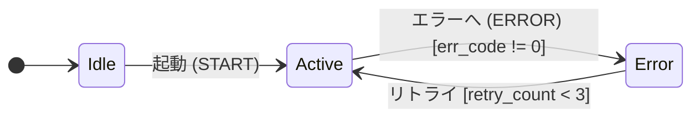

# StaTable プロジェクト全体仕様書

---

## 1. プロジェクト概要

**StaTable** は、組み込みシステム向けの**状態遷移表エディタ**。  
状態遷移の設計・編集・コード生成・検証を統合的に行うGUIアプリケーション。

### 1.1 主要機能

| 機能 | 説明 |
|------|------|
| 状態遷移表編集 | 状態×イベントのマトリクスで遷移を管理 |
| アクションエディタ | D&Dで遷移条件・ロール関数を編集 |
| コード生成 | C言語のステートマシンコードを自動生成 |
| Mermaid図生成 | 状態遷移図を動的にレンダリング |
| 共有ライブラリ | ロール関数・遷移条件・リテラルを再利用 |
| 検証・AI診断 | コード生成前の整合性チェック |
| XML保存/読込 | プロジェクト全体をXMLで永続化 |

### 1.2 技術スタック

| 項目 | 技術 |
|------|------|
| 言語 | Python 3.13 |
| GUI | PySide6 (Qt for Python) |
| Web描画 | QWebEngine + Mermaid.js |
| データ永続化 | XML (ElementTree) |
| データモデル | Python dataclasses |

---

## 2. プロジェクト全体ファイル構成

```
StaTable/
├── code/
│   ├── gui_main.py                          # アプリ起動エントリポイント
│   ├── Resources/
│   │   └── mermaidwin.js                    # Mermaid.js ライブラリ
│   ├── logs/                                # ログ出力先
│   ├── specs/                               # 保存されたプロジェクトXML
│   │   └── project.xml
│   │
│   ├── statable/                            # コアデータモデル
│   │   ├── __init__.py
│   │   ├── model.py                         # State, Event, Transition, RoleFunction
│   │   ├── state_machine.py                 # StateMachine クラス
│   │   ├── global_defs.py                   # GlobalDefinitions
│   │   ├── xml_io.py                        # XML保存/読込
│   │   ├── mermaid_gen.py                   # Mermaid図生成
│   │   └── sample_data.py                   # サンプルデータ生成
│   │
│   ├── statable_gui/                        # GUIレイヤ
│   │   ├── __init__.py
│   │   ├── main_window.py                   # メインウィンドウ
│   │   ├── widgets.py                       # StateMachineTab, SettingsPanel, MermaidWidget
│   │   ├── matrix_table.py                  # MatrixTableWidget（状態遷移表）
│   │   ├── config.py                        # 画面設定定数
│   │   ├── preferences.py                   # ユーザー環境設定
│   │   ├── logger.py                        # StaTableLogger
│   │   ├── traceball.py                     # TraceBallログ表示
│   │   ├── global_defs.py                   # GlobalDefinitions（GUI側）
│   │   │
│   │   ├── global_defs_dialog.py            # グローバル定義ダイアログ
│   │   ├── event_definition_dialog.py       # イベント定義ダイアログ
│   │   ├── event_delivery_settings_dialog.py # イベント配送設定ダイアログ
│   │   ├── interrupt_handler_edit_dialog.py # 割り込み設定ダイアログ
│   │   ├── role_function_dialog.py          # ロール関数ダイアログ
│   │   ├── action_edit_dialog.py            # アクション編集ダイアログ
│   │   ├── common_widgets.py                # 共通ウィジェット（TypeManagerDialog等）
│   │   ├── condition_builder_dialog.py      # 条件ビルダーダイアログ
│   │   ├── validation_dialog.py             # 検証・AI診断ダイアログ
│   │   ├── code_generation_dialog.py        # コード生成ダイアログ
│   │   ├── code_generation_settings_dialog.py # コード生成設定ダイアログ
│   │   │
│   │   ├── libcntrl/                        # 共有ライブラリ
│   │   │   ├── __init__.py
│   │   │   ├── role_function_library.py     # RoleFunctionLibrary
│   │   │   ├── condition_library.py         # ConditionLibrary
│   │   │   ├── literal_library.py           # LiteralLibrary
│   │   │   ├── role_function_edit_dialog.py # ロール関数編集ダイアログ
│   │   │   └── literal_management_dialog.py # リテラル管理ダイアログ
│   │   │
│   │   └── transition_editor_direct/        # アクションエディタ
│   │       ├── __init__.py
│   │       ├── dialog.py                    # ActionEditorDialog
│   │       ├── canvas_widget.py             # FlowCanvas, FlowNodeItem
│   │       ├── palette_widget.py            # PaletteWidget
│   │       ├── draft.py                     # ActionDraft, FlowItem
│   │       ├── code_widget.py               # CodeWidget
│   │       ├── edit_dialogs.py              # ノード編集ダイアログ
│   │       └── system_global_dialog.py      # システムグローバルダイアログ
│   │
│   ├── codegen/                             # コード生成
│   │   ├── __init__.py
│   │   ├── c_code_generator.py              # CCodeGenerator（メイン）
│   │   ├── transition_generator.py          # TransitionGenerator
│   │   ├── role_function_generator.py       # RoleFunctionGenerator
│   │   ├── type_mapper.py                   # CTypeMapper
│   │   ├── naming_convention.py             # CNamingConvention
│   │   ├── struct_generator.py              # CStructGenerator
│   │   ├── enum_generator.py                # CEnumGenerator
│   │   ├── variable_generator.py            # VariableGenerator
│   │   ├── event_queue_generator.py         # EventQueueGenerator
│   │   ├── interrupt_generator.py           # InterruptGenerator
│   │   ├── timer_generator.py               # TimerGenerator
│   │   ├── osal_generator.py                # OSALGenerator
│   │   ├── code_templates.py                # CodeTemplates
│   │   ├── code_merger.py                   # CodeMerger
│   │   ├── config.py                        # ConfigManager, CodeGenerationConfig
│   │   └── sample_data.py                   # SampleDataGenerator
│   │
│   └── tests/                               # テスト
│       ├── test_all_dialogs_gui.py
│       ├── test_drop_indicator_overlap.py
│       ├── test_transition_editor_direct.py
│       └── test_condition_builder_gui.py
│
└── README.md
```

---

## 3. データモデル仕様（`statable/`）

### 3.1 `model.py`

**主要データクラス:**

```python
class StateType(Enum):
    NORMAL = "normal"
    CONCURRENT = "concurrent"
    REGION = "region"
    INITIAL = "initial"
    FINAL = "final"
    CHOICE = "choice"
    JUNCTION = "junction"

class EventKind(Enum):
    SIGNAL = "signal"
    CALL = "call"
    TIME = "time"
    CHANGE = "change"

class EventDeliveryType(Enum):
    DIRECT = "direct"    # 直接配送
    QUEUE = "queue"      # キュー配送
    DOUBLE = "double"    # 二重配送

class EventSourceLayer(Enum):
    DRIVER = "driver"        # ドライバ層
    MIDDLEWARE = "middleware" # ミドル層

@dataclass
class State:
    name: str
    type: StateType = StateType.NORMAL
    parent: Optional[str] = None
    entry: str = ""       # エントリーアクション
    exit: str = ""        # イグジットアクション
    do: str = ""          # doアクション
    description: str = ""

@dataclass
class Event:
    name: str
    id: Optional[int] = None
    kind: EventKind = EventKind.SIGNAL
    params: List[str] = field(default_factory=list)
    priority: int = 0
    description: str = ""
    delivery_type: EventDeliveryType = EventDeliveryType.DIRECT
    source_layer: EventSourceLayer = EventSourceLayer.DRIVER
    data_type: str = ""    # イベントデータ型
    data_name: str = ""    # イベントデータ名（例: err_code）
    title: str = ""

@dataclass
class Transition:
    source: str
    event: str
    condition: str = ""
    pre_actions: List[str] = field(default_factory=list)      # 遷移直前処理
    target: str = ""
    has_else: bool = True
    else_target: str = ""
    else_actions: List[str] = field(default_factory=list)     # elseアクション
    action: str = ""                                          # 旧フィールド（未使用）
    transition_type: str = "external"
    title: str = ""

@dataclass
class RoleFunction:
    name: str
    description: str = ""
    return_type: str = "void"
    arg1_type: str = ""
    arg1_name: str = ""
    arg2_type: str = ""
    arg2_name: str = ""
    title: str = ""
```

### 3.2 `state_machine.py`

**主要メソッド:**

| メソッド | 説明 |
|---------|------|
| `add_state(state)` | 状態を追加 |
| `add_event(event)` | イベントを追加 |
| `add_transition(transition)` | 遷移を追加 |
| `add_role_function(rf)` | ロール関数を追加 |
| `remove_transition(trans)` | 遷移を削除 |
| `get_transitions_for_cell(state, event)` | 特定セルの遷移を取得 |
| `get_transitions_by_source(state)` | 特定状態からの遷移を取得 |
| `set_initial(state_name)` | 初期状態を設定 |

### 3.3 `global_defs.py`

**主要データクラス:**

```python
@dataclass
class SystemVariable:
    name: str
    type: str = "uint16_t"
    unit: str = ""
    default_value: str = "0"
    group: str = ""
    description: str = ""
    title: str = ""
    array_size: int = 0

@dataclass
class EventFlag:
    name: str
    min_value: int = 0
    max_value: int = 1
    group: str = ""
    description: str = ""
    title: str = ""

@dataclass
class CustomTypeDef:
    name: str
    description: str = ""
    members: List[StructMemberDef] = field(default_factory=list)
    title: str = ""

@dataclass
class StructMemberDef:
    name: str
    data_type: str = ""
    bit_width: int = 0
    description: str = ""
    title: str = ""
    array_size: int = 0

@dataclass
class InterruptHandlerDef:
    name: str
    description: str = ""
    event_names: List[str] = field(default_factory=list)
    is_timer: bool = False
    actions: List[InterruptAction] = field(default_factory=list)
    title: str = ""

@dataclass
class DevicePlaceholderDef:
    name: str
    description: str = ""
    title: str = ""

@dataclass
class TimerBaseDef:
    variable_name: str
    unit: str = "1ms"
    data_type: str = "volatile uint32_t"
    derived: List[TimerDerivedDef] = field(default_factory=list)
    title: str = ""
    interrupt_name: str = ""

@dataclass
class EventQueueDef:
    name: str
    size: int = 8
    element_type: str = "uint8_t"
    event_ids: List[str] = field(default_factory=list)
    priority_enabled: bool = False
    interrupt_safe: bool = True
    rtos_enabled: bool = False
    description: str = ""
    title: str = ""

class GlobalDefinitions:
    variables: List[SystemVariable]
    flags: List[EventFlag]
    custom_types: List[CustomTypeDef]
    interrupts: List[InterruptHandlerDef]
    placeholders: List[DevicePlaceholderDef]
    timer_base: TimerBaseDef
    extra_timers: List[TimerBaseDef]
    event_queues: List[EventQueueDef]
    
    def add_timer_variables(self): ...
```

### 3.4 `xml_io.py`

**主要関数:**

| 関数 | 説明 |
|------|------|
| `state_machine_to_element(sm)` | StateMachine → XML Element |
| `state_machine_from_element(elem)` | XML Element → StateMachine |
| `global_defs_to_element(defs)` | GlobalDefinitions → XML Element |
| `global_defs_from_element(elem)` | XML Element → GlobalDefinitions |
| `project_to_xml(tabs, global_defs, filepath, role_lib, cond_lib, lit_lib)` | プロジェクト保存 |
| `project_from_xml(filepath)` | プロジェクト読込（5値タプル返却） |
| `_normalize_actions(value)` | 文字列→リスト正規化（1文字分解の自動結合） |

**XMLフォーマット:**

```xml
<Project>
  <GlobalDefinitions>
    <CustomTypes>...</CustomTypes>
    <SystemVariables>...</SystemVariables>
    <EventFlags>...</EventFlags>
    <Interrupts>...</Interrupts>
    <DevicePlaceholders>...</DevicePlaceholders>
    <TimerBase>...</TimerBase>
    <ExtraTimers>...</ExtraTimers>
    <EventQueues>...</EventQueues>
  </GlobalDefinitions>
  <SharedLibraries>
    <RoleFunctionLibrary>
      <RoleFunction name="Sensor_Init" title="センサ初期化" ... />
    </RoleFunctionLibrary>
    <ConditionLibrary>
      <Condition name="ERROR" condition="err_code != 0" />
    </ConditionLibrary>
    <LiteralLibrary>
      <Literal name="RETRY_THRESHOLD" value="3" literal_type="int" />
    </LiteralLibrary>
  </SharedLibraries>
  <Tab name="Application">
    <StateMachine initial="Idle">
      <States>...</States>
      <Events>...</Events>
      <RoleFunctions>...</RoleFunctions>
      <Transitions>
        <Transition source="Error" event="" condition="retry_count < 3" 
                    target="Active" has_else="true" else_target="">
          <PreAction action="retry_count++" />
          <ElseAction action="Error_Log" />
        </Transition>
      </Transitions>
    </StateMachine>
  </Tab>
</Project>
```

### 3.5 `mermaid_gen.py`

**`generate_mermaid(sm)`**: StateMachine → Mermaid図の文字列



---

## 4. GUI レイヤ仕様（`statable_gui/`）

### 4.1 メインウィンドウ（`main_window.py`）

**クラス**: `MainWindow(QMainWindow)`

**主要コンポーネント:**
- タブウィジェット（複数の状態遷移タブ）
- ツールバー（グローバル定義、イベント定義、コード生成など）
- メニューバー（File, Edit, 検証, コード生成, View）
- TraceBall（ログ表示ドック）

**共有ライブラリ（起動時に初期化）:**
```python
self.role_function_library = RoleFunctionLibrary()
self.condition_library = ConditionLibrary()
self.literal_library = LiteralLibrary()
```

**サンプルデータ登録:**
```python
# sample_sm からロール関数を登録
for rf in sample_sm.role_functions.values():
    self.role_function_library.add(RoleFunction(
        name=rf.name, title=rf.title, description=rf.description
    ))

# 条件テンプレート・リテラルを追加
self.condition_library.add(ConditionTemplate(name="ERROR", condition="err_code != 0"))
self.condition_library.add(ConditionTemplate(name="RETRY", condition="retry_count < RETRY_THRESHOLD"))
self.literal_library.add(LiteralDefinition(name="RETRY_THRESHOLD", value="3", literal_type="int"))
```

**プロジェクト保存:**
```python
project_to_xml(
    tabs, self.global_defs, filepath,
    role_function_library=self.role_function_library,
    condition_library=self.condition_library,
    literal_library=self.literal_library,
)
```

**プロジェクト読込:**
```python
tabs, global_defs, role_lib, cond_lib, lit_lib = project_from_xml(filepath)
# 各タブのライブラリ参照を更新
```

### 4.2 状態遷移タブ（`widgets.py`）

**クラス構成:**
- `StateMachineTab(QWidget)`: タブ1つ分のコンテンツ
- `MermaidWidget(QWidget)`: Mermaid図表示
- `SettingsPanel(QWidget)`: 状態一覧・ロール関数一覧

**`StateMachineTab` のレイアウト:**
```
┌─────────────────────────────────────────┐
│ ┌────────────────────┐ ┌──────────────┐ │
│ │ MatrixTableWidget  │ │              │ │
│ │ (状態遷移表)       │ │ SettingsPanel│ │
│ ├────────────────────┤ │ (状態一覧/   │ │
│ │ MermaidWidget      │ │  ロール関数) │ │
│ │ (状態遷移図)       │ │              │ │
│ └────────────────────┘ └──────────────┘ │
└─────────────────────────────────────────┘
```

### 4.3 状態遷移表（`matrix_table.py`）

**クラス**: `MatrixTableWidget(QTableWidget)`

**機能:**
- 状態×イベントのマトリクス表示
- セルダブルクリックで `ActionEditorDialog` 起動
- セルに遷移タイトル・条件を表示（省略あり）
- ツールチップで詳細表示

**セルダブルクリック時の処理:**
```python
def open_transition_dialog(self, row, col):
    state = self.horizontalHeaderItem(col).text()
    event_name = self.verticalHeaderItem(row).text()
    # [Q] / [D] プレフィックスを除去
    
    # ActionDraft 構築
    draft = ActionDraft(source=state, event=event_name)
    for trans in existing_list:
        fi = transition_to_flow_item(trans)
        draft.flow_items.append(fi)
    
    # ActionEditorDialog 起動
    dialog = ActionEditorDialog(
        draft,
        role_function_library=self.role_function_library,
        condition_library=self.condition_library,
        literal_library=self.literal_library,
        ...
    )
    if dialog.exec() == QDialog.Accepted:
        # FlowItem → Transition 変換、StateMachine に反映
        ...
```

### 4.4 条件ビルダー（`condition_builder_dialog.py`）

**クラス**: `ConditionBuilderDialog(QDialog)`

**UI構成:**
```
┌─────────────────────────────────────────────┐
│ イベント名: [_____________________]          │
│ 遷移先:     [▼ コンボボックス]              │
│ else遷移先: [▼ コンボボックス]              │
├──────────────┬──────────────────────────────┤
│ 挿入するシンボル │ 条件式（シンボル名で記述）  │
│ ┌──────────┐ │ [リテラル化]                 │
│ │ グローバル変数│ │ ┌──────────────────────┐   │
│ │ イベントフラグ│ │ │                      │   │
│ │ イベント変数  │ │ │                      │   │
│ │ ロール関数   │ │ │                      │   │
│ │ リテラル     │ │ └──────────────────────┘   │
│ │ 定数シンボル  │ │ [クリア]                    │
│ └──────────┘ │                              │
├──────────────┴──────────────────────────────┤
│ 生成されるCコード（ctx->形式）              │
│ ┌──────────────────────────────────────────┐│
│ │ (retry_count < 3)                        ││
│ └──────────────────────────────────────────┘│
│                            [OK] [キャンセル]  │
└─────────────────────────────────────────────┘
```

**主要メソッド:**

| メソッド | 説明 |
|---------|------|
| `get_condition_text()` | 条件式を取得 |
| `get_event_name()` | イベント名を取得 |
| `get_target_state()` | 遷移先を取得 |
| `get_else_target_state()` | else遷移先を取得 |
| `set_current_targets()` | 既存の遷移先をコンボボックスに反映 |
| `_convert_to_c_code(text)` | 条件式をC形式（`ctx->data.xxx`）に変換 |

### 4.5 アクションエディタ（`transition_editor_direct/`）

#### `dialog.py` - `ActionEditorDialog`

**UI構成:**
```
┌───────────────────────────────────────────────┐
│ [自動整列]                                    │
├──────────┬────────────────────────────────────┤
│ パレット │ フロー編集  |  コード              │
│ (ロール  │ ┌───────────────────────────────┐ │
│  関数・  │ │ ┌──────────────────────┐      │ │
│  遷移条件)│ │ │ transition ノード      │      │ │
│          │ │ │ 🟦 ERROR               │      │ │
│          │ │ │ 条件: err_code != 0   │      │ │
│          │ │ │ → Error               │      │ │
│          │ │ ├──────────────────────┤      │ │
│          │ │ │ pre_action ノード     │      │ │
│          │ │ ├──────────────────────┤      │ │
│          │ │ │ else ノード           │      │ │
│          │ │ ├──────────────────────┤      │ │
│          │ │ │ else_action ノード    │      │ │
│          │ │ └──────────────────────┘      │ │
│          │ └───────────────────────────────┘ │
├──────────┴────────────────────────────────────┤
│ [システムグローバル...]        [OK] [キャンセル]│
└───────────────────────────────────────────────┘
```

#### `canvas_widget.py` - `FlowCanvas`, `FlowNodeItem`

**`FlowNodeItem` の表示仕様:**

| ノードタイプ | 色 | サイズ | 表示内容 |
|-------------|----|----|---------|
| transition | 青 (70,130,180) | 240×68 | イベント名\n条件: xxx\n→ 遷移先 |
| function | オレンジ (255,165,0) | 240×40 | 🟧 関数名 |
| pre_action | 黄 (255,200,100) | 240×40 | 🟨 アクション名 |
| else | 赤 (220,80,80) | 240×40 | 🟥 else → 遷移先 |
| else_action | ピンク (255,150,150) | 240×40 | 🟪 アクション名 |

**`FlowNodeItem` の制約:**
- `ItemIsMovable = False`（キャンバス内移動不可）
- ドラッグ試行時はメッセージ表示
- ダブルクリックで編集ダイアログ起動
- 右クリックメニュー（編集/上へ/下へ/複製/削除）

#### `palette_widget.py` - `PaletteWidget`

**パレット構成:**
```
┌──────────────────┐
│ イベント選択画面 │
├──────────────────┤
│ ロール関数       │
│ ┌──────────────┐ │
│ │ Sensor_Init  │ │
│ │ Error_Log    │ │
│ └──────────────┘ │
│ [+ ロール関数追加]│
├──────────────────┤
│ 遷移条件         │
│ ┌──────────────┐ │
│ │ ERROR        │ │
│ │ RETRY        │ │
│ └──────────────┘ │
│ [+ 遷移条件追加] │
└──────────────────┘
```

#### `draft.py` - `ActionDraft`, `FlowItem`

**`FlowItem` のデータ構造:**
```python
@dataclass
class FlowItem:
    item_type: str = ""          # "transition" / "function" / "pre_action" / "else" / "else_action"
    name: str = ""
    edited_text: str = ""
    params: Dict[str, Any] = field(default_factory=dict)
    pos_x: Optional[float] = None
    pos_y: Optional[float] = None
```

**`ensure_list` の動作:**
```python
ensure_list("init()")  # → ["init()"]
ensure_list(["init()", "stop()"])  # → ["init()", "stop()"]
ensure_list(None)  # → []
ensure_list("")  # → []
```

#### `code_widget.py` - `CodeWidget`

**コード生成機能:**
- `pre_actions` / `else_actions` を反映
- プロトタイプ宣言の重複除去（`set()`）
- 遷移先・else遷移先のフォールバック（`draft.default_target`）
- 空条件対応（`if (1) { ... }`）

**生成コード例:**
```c
void RoleFunc_CheckSensor(SystemContext_t *ctx, const TransitionContext_t *transition);
void RoleFunc_StartMotor(SystemContext_t *ctx, const TransitionContext_t *transition);

if (err_code != 0) {
    RoleFunc_CheckSensor(ctx, transition);
    next_state = Error;
}
else {
    RoleFunc_StartMotor(ctx, transition);
    // else遷移先（未設定）
}
```

### 4.6 共有ライブラリ（`libcntrl/`）

**`RoleFunctionLibrary`:**
```python
class RoleFunctionLibrary:
    def add(self, rf: RoleFunction): ...
    def remove(self, name: str): ...
    def get(self, name: str) -> Optional[RoleFunction]: ...
    def list_all(self) -> List[RoleFunction]: ...
```

**`RoleFunction`:**
```python
@dataclass
class RoleFunction:
    name: str
    title: str = ""
    description: str = ""
    # 以下は hasattr チェック後に setattr
    # return_type, arg1_type, arg1_name, arg2_type, arg2_name
```

**`ConditionTemplate`:**
```python
@dataclass
class ConditionTemplate:
    name: str
    condition: str = ""
```

**`LiteralDefinition`:**
```python
@dataclass
class LiteralDefinition:
    name: str
    value: str
    literal_type: str = "int"
    description: str = ""
```

---

## 5. コード生成仕様（`codegen/`）

### 5.1 生成ファイル一覧（11ファイル）

| ファイル名 | 説明 | ガード名 |
|----------|------|---------|
| `statable_types.h` | 型定義 | `STATABLE_TYPES_H` |
| `statable_transitions.h` | 遷移関数宣言 | `STATABLE_TRANSITIONS_H` |
| `statable_transitions.c` | 状態遷移ロジック | - |
| `statable_role_functions.h` | ロール関数宣言 | `STATABLE_ROLE_FUNCTIONS_H` |
| `statable_role_functions.c` | ロール関数実装 | - |
| `statable_init.c` | 初期化処理 | - |
| `statable_event_queue.c` | イベントキュー実装 | - |
| `statable_interrupt.c` | 割り込み処理ISR | - |
| `statable_timer.c` | タイマ処理 | - |
| `osal.h` | OSALヘッダ | `OSAL_H` |
| `osal.c` | OSALソース | - |

### 5.2 生成される型定義

```c
// statable_types.h
typedef enum {
    STATE_Idle = 0,
    STATE_Active,
    STATE_Error,
    STATE_Halt,
    STATE_MAX
} STATE_t;

typedef enum {
    EVENT_START = 1,
    EVENT_STOP,
    EVENT_ERROR,
    EVENT_TIMER0_OVERFLOW,
    EVENT_NONE,  // 完了遷移
    EVENT_MAX
} EVENT_t;

typedef struct {
    // グローバル変数
    uint16_t battery_voltage;
    uint8_t payload[64];
    SystemStatus_t system_status;
    // ...
} SystemData_t;

typedef struct {
    uint8_t EVT_START_REQ;
    uint8_t EVT_MODE;
    // ...
} EventFlags_t;

typedef struct {
    SystemData_t data;
    EventFlags_t flags;
} SystemContext_t;

typedef struct {
    STATE_t from_state;
    EVENT_t event;
    STATE_t to_state;
} TransitionContext_t;
```

### 5.3 状態遷移関数

```c
// statable_transitions.c
STATE_t StateMachine_Process(
    STATE_t current_state,
    EVENT_t event,
    SystemContext_t *ctx
) {
    STATE_t next_state = current_state;
    TransitionContext_t transition;
    
    switch (current_state) {
    case STATE_Error:
        switch (event) {
        case EVENT_NONE:
            RoleFunc_Retry_Count(ctx, &transition);
            if (retry_count < 3) {
                next_state = STATE_Active;
            } else {
                RoleFunc_Error_Log(ctx, &transition);
                next_state = STATE_Halt;
            }
            break;
        }
        break;
    }
    return next_state;
}
```

### 5.4 コード生成の設定項目

```python
@dataclass
class CodeGenerationConfig:
    table_type: str = "array"              # "array" / "switch" / "dictionary"
    generation_style: str = "table_driven" # "table_driven" / "switch_case"
    os_type: str = "non_rtos"              # "non_rtos" / "freertos" / "threadx"
    output_directory: str = ""
    save_with_merge: bool = True
```

### 5.5 **未解決の課題（別スレッドで対応）**

| 問題 | 対象ファイル |
|------|-------------|
| `transition_generator.py` が `pre_actions`/`else_actions` を無視 | `codegen/transition_generator.py` |
| ロール関数のシグネチャ不一致 | `codegen/role_function_generator.py` |
| `TransitionContext_t` が未定義 | `codegen/code_templates.py`, `codegen/struct_generator.py` |
| `RoleFunctionLibrary` と `StateMachine.role_functions` の分離 | `codegen/c_code_generator.py` |
| プロトタイプ宣言の重複 | `codegen/c_code_generator.py` |
| 条件式が空の場合の未対応 | `codegen/transition_generator.py` |
| enum値生成とライブラリ名の不一致 | `codegen/transition_generator.py` |

---

## 6. データフロー

### 6.1 起動から編集まで

```
gui_main.py
    ↓
MainWindow.__init__()
    ├─ サンプルデータ生成
    ├─ 共有ライブラリ初期化 + サンプルデータ登録
    ├─ ツールバー・メニュー作成
    └─ add_state_machine_tab("Application", sample_sm)
           ↓
       StateMachineTab
           ├─ MatrixTableWidget（状態遷移表）
           ├─ MermaidWidget（状態遷移図）
           └─ SettingsPanel（設定パネル）
```

### 6.2 アクションエディタの流れ

```
ユーザーがセルをダブルクリック
    ↓
MatrixTableWidget.open_transition_dialog()
    ├─ StateMachine から遷移を取得
    ├─ transition_to_flow_item() で ActionDraft 構築
    └─ ActionEditorDialog 起動
           ↓
       ┌─────────────────────────────────────┐
       │ ユーザー操作:                        │
       │ ・パレットからD&Dでノード追加        │
       │ ・ノードダブルクリックで編集          │
       │ ・ノード右クリックで上へ/下へ/複製/削除│
       │ ・遷移条件ダイアログで条件・遷移先編集  │
       └─────────────────────────────────────┘
           ↓
       OK で閉じる
           ↓
    flow_item_to_transition() で StateMachine に反映
           ↓
    MatrixTable と Mermaid を再描画
```

### 6.3 プロジェクト保存・読込

```
保存:
    MainWindow.save_project()
        ├─ 全タブの StateMachine を収集
        └─ project_to_xml(tabs, global_defs, filepath, role_lib, cond_lib, lit_lib)
               ↓
           XML ファイル出力

読込:
    MainWindow.open_project()
        ├─ project_from_xml(filepath)
        │      ↓
        │  (tabs, global_defs, role_lib, cond_lib, lit_lib)
        │
        ├─ close_all_tabs()
        ├─ add_state_machine_tab(name, sm) × N
        └─ 共有ライブラリを差し替え、各タブの参照を更新
```

---

## 7. 既知の問題と対処

| 問題 | 原因 | 対処 |
|------|------|------|
| `pre_actions` が1文字ずつ分解される | `state_machine_to_element` で文字列を `for` で回していた | `_normalize_actions` で正規化、読込時も結合 |
| `RoleFunction.__init__` 引数エラー | `libcntrl.RoleFunction` は `name`/`title`/`description` のみ受付 | `hasattr` チェック後に `setattr` |
| `too many values to unpack` | `project_from_xml` が5値返却、呼び出し側が2値受取 | 呼び出し側を5値受取に修正 |
| `QGraphicsView::dragLeaveEvent` 警告 | Qtの既知の挙動 | 動作に影響なし、無視可 |
| ロール関数がパレットに出ない | 共有ライブラリが空 | `main_window.py` でサンプルデータ登録 |

---

## 8. テスト構成

### 8.1 `test_all_dialogs_gui.py`
- 全ダイアログの表示テスト
- 共有ライブラリの初期化確認
- ActionEditorDialog の起動確認

### 8.2 `test_drop_indicator_overlap.py`
- 挿入位置インジケータの評価
- D&D時のノード重なり解消ロジック

### 8.3 `test_transition_editor_direct.py`
- `draft.py` のユニットテスト
- `transition_to_flow_item` / `flow_item_to_transition` の変換テスト

### 8.4 `test_condition_builder_gui.py`
- 条件ビルダーのGUIテスト
- リテラル化機能のテスト

---

## 9. ログ確認ポイント

### 9.1 起動時
```
MainWindow initialization started
MainWindow.global_defs: id=..., vars=9, flags=2, interrupts=1, placeholders=1
Attempting to register role function: name=Sensor_Init, title=センサ初期化
Registered role function to shared library: Sensor_Init
After role registration: roles=2
MainWindow shared libraries initialized: roles=2, conditions=2, literals=2
add_state_machine_tab: name=Application, roles=2, conditions=2, literals=2
StateMachineTab shared libraries: roles=2, conditions=2, literals=2
MatrixTableWidget.__init__: roles=2, conditions=2, literals=2
Tab 'Application' added at index 0
MainWindow initialization completed
```

### 9.2 アクションエディタ起動
```
=== MatrixTableWidget.open_transition_dialog ===
state=Error, event=
existing transitions count = 2
  existing[0]: condition='retry_count < 3', pre_actions=..., target=Active, title=リトライ
  converted flow_item: FlowItem(...)
open_transition_dialog: roles=2, conditions=2, literals=2
```

### 9.3 プロジェクト保存/読込
```
=== project_to_xml START ===
  filepath=...
  tabs=1
  role_function_library=True
=== project_to_xml END: saved to ... ===

=== project_from_xml START ===
  SharedLibraries found: True
  role_function_library: 2 items
=== project_from_xml END ===
```

---

## 10. 次のスレッドへの引継ぎ事項

### 10.1 コード生成の修正（最優先）

**対象ファイル:**
- `codegen/transition_generator.py`
- `codegen/role_function_generator.py`
- `codegen/c_code_generator.py`
- `codegen/code_templates.py`

**修正内容:**
1. `transition_generator.py` で `pre_actions`/`else_actions`/`has_else`/`else_target` を反映
2. `role_function_generator.py` のシグネチャを `(SystemContext_t *ctx, const TransitionContext_t *transition)` に統一
3. `TransitionContext_t` 型を追加
4. `c_code_generator.py` で `RoleFunctionLibrary` をマージ
5. プロトタイプ宣言の重複除去
6. 空条件対応
7. 関数名の `RoleFunc_` 統一

### 10.2 その他の改善候補

- 完了遷移（`event=""`）のenum名を `EVENT_NONE` に統一
- `QGraphicsView::dragLeaveEvent` 警告の抑制
- アクションエディタの順序リストウィジェット追加（案C）

---

この資料がプロジェクト全体の仕様書兼引継ぎ資料として機能します。  
新スレッドでは、まず **コード生成の修正** から着手することをお勧めします。